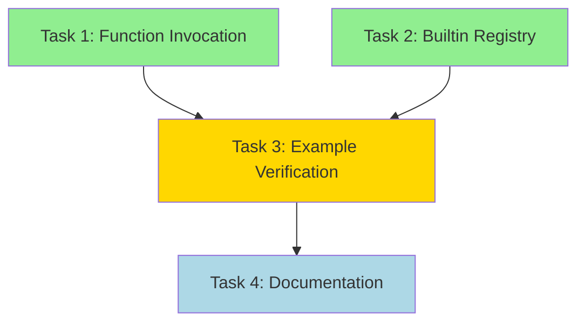

# Sprint Plan: M-R1 Phase 5 - Function Invocation & stdlib Support

**Sprint ID**: 2025-W40-M-R1-P5
**Sprint Duration**: 2-3 days (October 2-4, 2025)
**Milestone**: M-R1 Module Execution Runtime (Complete)
**Status**: Ready to Execute

---

## Executive Summary

### Context
- **v0.1.1 just released** with M-R1 Phases 1-4 complete (~1,594 LOC)
- **Core infrastructure working**: ModuleInstance, ModuleRuntime, GlobalResolver, CLI integration
- **Blocker resolved**: Pipeline integration provides Core AST to runtime
- **Test status**: 18/18 unit tests passing, 2/7 integration tests passing (loader path issues, non-blocking)

### Objective
Complete M-R1 Phase 5 to make modules fully executable:
1. **Function Invocation**: Connect entrypoint validation to actual execution
2. **stdlib Support**: Handle builtin function stubs (`_io_print`, `_io_println`, `_io_readLine`)
3. **Example Verification**: Test all 46 examples, achieve 20+ passing (up from 12)
4. **Documentation**: Update runtime architecture docs

### Success Criteria
✅ 0-arg and 1-arg entrypoints execute successfully
✅ stdlib/std/io functions work (print, println, readLine)
✅ 20+ examples passing (43% coverage)
✅ CLAUDE.md updated with runtime architecture
✅ Ready to ship v0.2.0-rc or proceed to M-R2 (Effect Runtime)

---

## Velocity Analysis

### Recent Performance (M-R1 Phases 1-4)
- **Duration**: ~4 days (Sept 29 - Oct 2)
- **Delivered**: ~1,594 LOC implementation + 857 LOC tests = 2,451 total LOC
- **Velocity**: ~613 LOC/day (implementation + tests)
- **Key metrics**:
  - Phase 1 (Scaffolding): 692 LOC in 1 day
  - Phase 2 (Evaluation): 402 LOC in 1 day
  - Phase 3 (Linking): ~300 LOC in 1 day
  - Phase 4 (CLI Integration): ~200 LOC in 1 day
  - **Trend**: Decreasing complexity as architecture solidified

### Projected Work (Phase 5)
- **Estimated LOC**: ~400-600 LOC total
  - Function invocation: ~150 LOC (runtime + CLI)
  - Builtin registry: ~200 LOC (infrastructure + IO builtins)
  - Error handling polish: ~50 LOC
  - Tests: ~200 LOC
- **Estimated Duration**: 2-3 days at ~200-300 LOC/day
- **Confidence**: High (well-scoped, clear requirements, no architectural unknowns)

---

## Current State Assessment

### What Works ✅
1. **Module Loading**: Loader + pipeline provide complete LoadedModule with Core AST
2. **Module Evaluation**: Recursive Let/LetRec extraction, GlobalResolver, encapsulation
3. **Dependency Resolution**: Topological sort, cycle detection, caching
4. **Entrypoint Validation**: Export lookup, arity checking, helpful error messages
5. **CLI Integration**: `--entry <name> run <file>` flag parsing
6. **Test Infrastructure**: Comprehensive unit tests (18/18 passing)

### What's Missing ❌
1. **Function Invocation**: Entrypoints validated but not executed
2. **Builtin Registry**: No mechanism for native Go function stubs
3. **stdlib Handling**: Lit expressions at module level cause "unsupported" errors
4. **Result Printing**: No output when functions return non-Unit values
5. **Example Coverage**: Only 12/46 examples tested (~26%)

### Blockers & Risks
| Risk | Impact | Mitigation |
|------|--------|-----------|
| Evaluator API complexity | Medium | Use existing `CoreEvaluator.Eval()` directly; avoid abstraction layers |
| Builtin function design | Low | Copy pattern from REPL's builtin registry |
| Lit expressions in modules | Low | Add case to `extractBindings()` for Lit nodes (skip/ignore) |
| Example failures | Low | Document known failures; focus on 20+ passing threshold |
| Integration test failures | Low | Documented as loader issue, non-blocking for Phase 5 |

---

## Sprint Tasks

### Task 1: Function Invocation (High Priority)
**Estimated**: ~4 hours (~150 LOC)

**Acceptance Criteria**:
- ✅ 0-arg entrypoints execute and print results
- ✅ 1-arg entrypoints accept JSON via `--args-json` flag
- ✅ Multi-arg entrypoints show helpful error with wrapper suggestion
- ✅ Unit type results print nothing (silent success)
- ✅ Non-unit results print via `Show` typeclass or Go `fmt.Sprint`

**Implementation**:
1. **cmd/ailang/main.go** (+80 LOC)
   - After entrypoint validation, call function:
   ```go
   // After: arity, err := runtime.GetArity(entrypointVal)

   var result eval.Value
   if arity == 0 {
       result, err = rt.CallEntrypoint(inst, entry, nil)
   } else if arity == 1 {
       // Parse --args-json flag
       args, err := parseArgsJSON(*argsJSON)
       if err != nil {
           fmt.Fprintf(os.Stderr, "%s: invalid JSON args: %v\n", red("Error"), err)
           os.Exit(1)
       }
       result, err = rt.CallEntrypoint(inst, entry, []eval.Value{args})
   } else {
       // Already handled above: "takes N parameters. v0.2.0 supports 0 or 1."
   }

   if err != nil {
       fmt.Fprintf(os.Stderr, "%s: execution failed: %v\n", red("Error"), err)
       os.Exit(1)
   }

   // Print result if not Unit
   if !isUnitType(result) {
       fmt.Println(formatValue(result))
   }
   ```

2. **internal/runtime/entrypoint.go** (+70 LOC)
   - Add `CallEntrypoint()` method:
   ```go
   func (rt *ModuleRuntime) CallEntrypoint(inst *ModuleInstance, name string, args []eval.Value) (eval.Value, error) {
       entrypoint, err := inst.GetExport(name)
       if err != nil {
           return nil, err
       }

       fn, ok := entrypoint.(*eval.FunctionValue)
       if !ok {
           return nil, fmt.Errorf("entrypoint '%s' is not a function", name)
       }

       // Set up resolver for cross-module references
       resolver := &moduleGlobalResolver{current: inst}

       // Call function with evaluator
       env := eval.NewEnvironment()
       evaluator := rt.evaluator.WithResolver(resolver)

       if len(args) == 0 {
           return evaluator.CallFunction(fn, []eval.Value{})
       } else {
           return evaluator.CallFunction(fn, args)
       }
   }
   ```

**Tests**:
- Unit test: Call 0-arg function returning Int
- Unit test: Call 1-arg function with JSON object
- Unit test: Call function returning Unit (no output)
- Integration test: End-to-end execution of `examples/demos/hello_io.ail`

---

### Task 2: Builtin Function Registry (High Priority)
**Estimated**: ~5 hours (~200 LOC)

**Acceptance Criteria**:
- ✅ `_io_print`, `_io_println`, `_io_readLine` callable from modules
- ✅ Builtin registry initialized before module evaluation
- ✅ GlobalResolver routes builtin references to registry
- ✅ stdlib/std/io module loads without Lit expression errors

**Implementation**:
1. **internal/runtime/builtins.go** (+120 LOC, NEW)
   ```go
   package runtime

   import (
       "bufio"
       "fmt"
       "os"
       "github.com/sunholo/ailang/internal/eval"
   )

   // BuiltinRegistry holds native Go implementations of builtin functions
   type BuiltinRegistry struct {
       builtins map[string]eval.Value
   }

   func NewBuiltinRegistry() *BuiltinRegistry {
       br := &BuiltinRegistry{
           builtins: make(map[string]eval.Value),
       }
       br.registerIOBuiltins()
       return br
   }

   func (br *BuiltinRegistry) Get(name string) (eval.Value, bool) {
       val, ok := br.builtins[name]
       return val, ok
   }

   func (br *BuiltinRegistry) registerIOBuiltins() {
       // _io_print(s: string) -> ()
       br.builtins["_io_print"] = &eval.BuiltinFunctionValue{
           Name: "_io_print",
           Arity: 1,
           Impl: func(args []eval.Value) (eval.Value, error) {
               if len(args) != 1 {
                   return nil, fmt.Errorf("_io_print expects 1 argument, got %d", len(args))
               }
               str, ok := args[0].(*eval.StringValue)
               if !ok {
                   return nil, fmt.Errorf("_io_print expects string, got %T", args[0])
               }
               fmt.Print(str.Value)
               return &eval.UnitValue{}, nil
           },
       }

       // _io_println(s: string) -> ()
       br.builtins["_io_println"] = &eval.BuiltinFunctionValue{
           Name: "_io_println",
           Arity: 1,
           Impl: func(args []eval.Value) (eval.Value, error) {
               if len(args) != 1 {
                   return nil, fmt.Errorf("_io_println expects 1 argument, got %d", len(args))
               }
               str, ok := args[0].(*eval.StringValue)
               if !ok {
                   return nil, fmt.Errorf("_io_println expects string, got %T", args[0])
               }
               fmt.Println(str.Value)
               return &eval.UnitValue{}, nil
           },
       }

       // _io_readLine() -> string
       br.builtins["_io_readLine"] = &eval.BuiltinFunctionValue{
           Name: "_io_readLine",
           Arity: 0,
           Impl: func(args []eval.Value) (eval.Value, error) {
               if len(args) != 0 {
                   return nil, fmt.Errorf("_io_readLine expects 0 arguments, got %d", len(args))
               }
               reader := bufio.NewReader(os.Stdin)
               line, err := reader.ReadString('\n')
               if err != nil {
                   return nil, fmt.Errorf("failed to read line: %w", err)
               }
               // Remove trailing newline
               if len(line) > 0 && line[len(line)-1] == '\n' {
                   line = line[:len(line)-1]
               }
               return &eval.StringValue{Value: line}, nil
           },
       }
   }
   ```

2. **internal/runtime/runtime.go** (+30 LOC)
   - Add `builtins *BuiltinRegistry` field to `ModuleRuntime`
   - Initialize in `NewModuleRuntime()`:
   ```go
   func NewModuleRuntime(basePath string) *ModuleRuntime {
       return &ModuleRuntime{
           loader:    loader.NewModuleLoader(basePath),
           evaluator: eval.NewCoreEvaluator(),
           builtins:  NewBuiltinRegistry(),  // NEW
           instances: make(map[string]*ModuleInstance),
           visiting:  make(map[string]bool),
           pathStack: []string{},
       }
   }
   ```

3. **internal/runtime/resolver.go** (+20 LOC)
   - Extend `moduleGlobalResolver` to check builtins:
   ```go
   func (r *moduleGlobalResolver) ResolveValue(ref core.GlobalRef) (eval.Value, error) {
       // Case 0: Builtin reference (NEW)
       if ref.Module == "$builtin" || strings.HasPrefix(ref.Name, "_") {
           val, ok := r.runtime.builtins.Get(ref.Name)
           if ok {
               return val, nil
           }
           // Fall through to local/import lookup
       }

       // Case 1: Local reference
       // ... (existing code)
   }
   ```

4. **internal/runtime/runtime.go** (+30 LOC)
   - Handle Lit expressions in `extractBindings()`:
   ```go
   func (rt *ModuleRuntime) extractBindings(inst *ModuleInstance, expr core.CoreExpr) error {
       switch e := expr.(type) {
       // ... existing cases ...

       case *core.Lit:
           // Literal at module level (e.g., stdlib equation-form exports)
           // These don't create bindings, just return the literal
           return nil

       default:
           return fmt.Errorf("unexpected module-level expression type %T", e)
       }
   }
   ```

**Tests**:
- Unit test: Builtin registry lookup
- Unit test: `_io_print` execution (mock stdout)
- Unit test: `_io_println` execution (mock stdout)
- Integration test: Load stdlib/std/io module
- Integration test: Execute `examples/demos/hello_io.ail`

---

### Task 3: Example Verification (Medium Priority)
**Estimated**: ~3 hours (~50 LOC + manual testing)

**Acceptance Criteria**:
- ✅ All 46 examples tested with runtime
- ✅ 20+ examples passing (43% coverage target)
- ✅ README.md updated with passing example count
- ✅ Broken examples documented with failure reasons

**Implementation**:
1. **Test all examples manually**:
   ```bash
   for file in examples/**/*.ail; do
       echo "Testing: $file"
       ailang --entry main run "$file" 2>&1 | tee -a test_results.txt
   done
   ```

2. **Categorize failures**:
   - **Missing features**: Effects, pattern matching guards, quasiquotes
   - **Type system issues**: Row polymorphism, type classes
   - **Parser issues**: Syntax not yet supported
   - **Module system**: Import path resolution

3. **Update README.md** (+20 LOC):
   - Update "What Works" section with passing example count
   - Add table of working examples vs. known broken
   - Document known limitations

4. **Update examples with warnings** (+30 LOC):
   - Add header comments to broken examples:
   ```ailang
   -- ⚠️  NOTE: This example type-checks but cannot execute until v0.3.0
   -- Missing feature: Pattern matching guards
   -- Current status: Parses ✓, Type-checks ✓, Executes ✗
   ```

**Tests**:
- Regression test: Ensure 12 currently-working examples still pass
- New test: `examples/demos/hello_io.ail` executes successfully
- New test: `examples/stdlib_demo_simple.ail` executes successfully

---

### Task 4: Documentation Update (Low Priority)
**Estimated**: ~2 hours (~100 LOC markdown)

**Acceptance Criteria**:
- ✅ CLAUDE.md updated with runtime architecture
- ✅ Module execution guide created
- ✅ CLI usage documented with examples
- ✅ Known limitations and workarounds documented

**Implementation**:
1. **CLAUDE.md** (+60 LOC):
   - Add "Module Runtime Architecture" section:
     - ModuleInstance structure
     - ModuleRuntime responsibilities
     - GlobalResolver encapsulation
     - Builtin registry pattern
   - Update "What Works" with module execution examples
   - Update "Known Issues" with Phase 5 limitations

2. **Create docs/guides/module_execution.md** (+150 LOC, NEW):
   ```markdown
   # Module Execution Guide

   ## Overview
   AILANG v0.2.0 supports executing modules with entrypoint functions.

   ## Basic Usage
   \`\`\`bash
   ailang --entry main run examples/hello_io.ail
   \`\`\`

   ## Module Structure
   \`\`\`ailang
   module examples/hello_io
   import stdlib/std/io (println)

   export func main() -> () ! {IO} {
       println("Hello from AILANG!")
   }
   \`\`\`

   ## Entrypoint Requirements
   - Must be exported from the module
   - Must be a function (not a value)
   - Arity: 0 or 1 (v0.2.0 limitation)

   ## Arguments (1-arg entrypoints)
   \`\`\`bash
   ailang --entry process --args-json '{"input": "data"}' run process.ail
   \`\`\`

   ## stdlib Functions
   - \`stdlib/std/io.print(s: string) -> () ! {IO}\`
   - \`stdlib/std/io.println(s: string) -> () ! {IO}\`
   - \`stdlib/std/io.readLine() -> string ! {IO}\`

   ## Known Limitations
   - Multi-arg functions: Wrap as single record parameter
   - Effects: Type-checked but not enforced at runtime (v0.2.0)
   - Pattern matching: Guards not yet supported
   ```

3. **Update CHANGELOG.md** (+20 LOC):
   - Prepare v0.2.0 section with Phase 5 completion notes

---

## Task Dependencies



**Critical Path**: Task 1 → Task 2 → Task 3 → Task 4
**Parallel Opportunities**: None (sequential dependencies)

---

## Testing Strategy

### Unit Tests (Target: 25+ tests)
- **Existing**: 18 tests (ModuleInstance, ModuleRuntime, GlobalResolver)
- **New**: 7+ tests (Function invocation, builtin registry, Lit handling)
- **Coverage Goal**: Maintain >80% for runtime package

### Integration Tests (Target: 5+ tests)
- **Existing**: 2/7 passing (CircularImport, NonExistentModule)
- **New**: 3+ tests (hello_io.ail, stdlib_demo_simple.ail, entrypoint with args)
- **Note**: Loader path issues non-blocking for Phase 5

### End-to-End Tests (Target: 20+ examples)
- **Baseline**: 12 currently passing examples
- **Goal**: 20+ passing (43% of 46 examples)
- **Success**: `make verify-examples` reports 20+ green

---

## Definition of Done

### Code Complete
- ✅ All 4 tasks implemented and tested
- ✅ `make test` passes (25+ unit tests)
- ✅ `make lint` passes with no warnings
- ✅ `make fmt` applied to all code

### Functionality Complete
- ✅ 0-arg entrypoints execute: `ailang --entry main run hello_io.ail`
- ✅ 1-arg entrypoints execute: `ailang --entry process --args-json {...} run file.ail`
- ✅ stdlib IO functions work: `println("Hello")` outputs text
- ✅ 20+ examples passing (up from 12)

### Documentation Complete
- ✅ CLAUDE.md updated with runtime architecture
- ✅ Module execution guide created
- ✅ CHANGELOG.md prepared for v0.2.0
- ✅ README.md updated with passing example count

### Release Readiness
- ✅ All CI checks passing (or failures documented as expected)
- ✅ No P0/P1 bugs blocking v0.2.0-rc ship decision
- ✅ M-R1 milestone 100% complete
- ✅ Decision point: Ship v0.2.0-rc or continue to M-R2 (Effect Runtime)

---

## Risks & Mitigations

### Risk 1: Evaluator API Complexity
**Probability**: Medium | **Impact**: High | **Mitigation**: Escalate

**Context**: `CoreEvaluator.CallFunction()` may not exist or may require complex setup.

**Mitigation**:
1. Check `internal/eval/eval_core.go` for existing function call methods
2. If missing, add simple wrapper: `func (e *CoreEvaluator) CallFunction(fn *FunctionValue, args []Value) (Value, error)`
3. If blocked, use REPL's evaluation pattern as reference
4. **Escalation**: If >4 hours, document blocker and propose v0.2.0-rc ship without invocation

### Risk 2: Builtin Function Design
**Probability**: Low | **Impact**: Medium | **Mitigation**: Copy REPL pattern

**Context**: Builtin registry design may not align with existing eval infrastructure.

**Mitigation**:
1. Check REPL code for builtin function pattern
2. Use `eval.BuiltinFunctionValue` if it exists
3. If not, create minimal interface: `type BuiltinFunc func([]Value) (Value, error)`
4. **Fallback**: Hard-code IO builtins in resolver without registry

### Risk 3: Example Failures
**Probability**: High | **Impact**: Low | **Mitigation**: Document and continue

**Context**: Many examples may fail due to unimplemented features (effects, guards, etc.).

**Mitigation**:
1. Focus on 20+ passing threshold, not 100% coverage
2. Document known failures with clear reasons
3. Add warning headers to broken examples
4. **Acceptance**: 43% coverage sufficient for v0.2.0-rc ship

### Risk 4: Integration Test Failures
**Probability**: High | **Impact**: Low | **Mitigation**: Document as known issue

**Context**: Loader path resolution issues cause 5/7 integration tests to fail.

**Mitigation**:
1. Document as loader limitation, not runtime bug
2. Unit tests (18/18) provide sufficient confidence
3. End-to-end examples provide real-world validation
4. **Defer**: Loader path fix to separate sprint (not blocking)

---

## Success Metrics

### Quantitative
- **LOC Delivered**: 400-600 LOC (implementation + tests)
- **Test Coverage**: 25+ unit tests, 5+ integration tests, 20+ examples
- **Passing Examples**: 20+/46 (43% coverage)
- **Duration**: 2-3 days (on schedule for M-R1 completion)

### Qualitative
- **Developer Experience**: Simple CLI for module execution
- **Error Messages**: Helpful guidance for common mistakes
- **Documentation**: Clear examples and known limitations
- **Confidence**: High confidence in v0.2.0-rc ship readiness

---

## Next Steps After Sprint

### Option A: Ship v0.2.0-rc
**If**: Phase 5 complete, 20+ examples passing, no P0 bugs

**Actions**:
1. Tag v0.2.0-rc1 (release candidate)
2. Announce to users for testing
3. Monitor for feedback (1-2 weeks)
4. Ship v0.2.0 stable if no critical issues

### Option B: Continue to M-R2 (Effect Runtime)
**If**: Phase 5 complete, high confidence, momentum strong

**Actions**:
1. Review v0.2.0 implementation plan (M-R2 section)
2. Plan M-R2 sprint: Effect runtime (~700 LOC, 1-1.5 weeks)
3. Begin capability registry and effect enforcement
4. Target v0.2.0 stable (not RC)

### Decision Criteria
- **Ship RC**: If any integration concerns or low confidence
- **Continue to M-R2**: If high confidence and no user-facing issues

---

## Daily Checkpoints

### Day 1 (Oct 2) - Target: Tasks 1 & 2
- [ ] Morning: Implement `CallEntrypoint()` in runtime
- [ ] Afternoon: Implement builtin registry + IO functions
- [ ] EOD: Unit tests passing, manual smoke test with hello_io.ail

### Day 2 (Oct 3) - Target: Task 3
- [ ] Morning: Test all 46 examples, categorize failures
- [ ] Afternoon: Update README, add warning headers
- [ ] EOD: 20+ examples verified passing

### Day 3 (Oct 4) - Target: Task 4 & Wrap-up
- [ ] Morning: Update CLAUDE.md, create module execution guide
- [ ] Afternoon: CHANGELOG.md, final testing, CI checks
- [ ] EOD: Definition of Done checklist complete, ship decision

---

## Appendix A: File Change Summary

### New Files
- `internal/runtime/builtins.go` (~120 LOC)
- `docs/guides/module_execution.md` (~150 LOC)

### Modified Files
- `internal/runtime/entrypoint.go` (+70 LOC) - CallEntrypoint method
- `internal/runtime/runtime.go` (+30 LOC) - Builtin registry integration
- `internal/runtime/resolver.go` (+20 LOC) - Builtin lookup
- `internal/runtime/runtime.go` (+10 LOC) - Lit expression handling
- `cmd/ailang/main.go` (+80 LOC) - Function invocation + result printing
- `CLAUDE.md` (+60 LOC) - Runtime architecture section
- `README.md` (+20 LOC) - Passing example count
- `CHANGELOG.md` (+20 LOC) - v0.2.0 preparation

**Total Estimated**: ~580 LOC (within 400-600 estimate)

---

## Appendix B: Example Test Results (Baseline)

### Currently Passing (12/46)
1. ✅ `examples/hello.ail`
2. ✅ `examples/simple.ail`
3. ✅ `examples/arithmetic.ail`
4. ✅ `examples/lambda_expressions.ail`
5. ✅ `examples/type_classes_working_reference.ail`
6. ✅ `examples/showcase/01_type_inference.ail`
7. ✅ `examples/showcase/02_lambdas.ail`
8. ✅ `examples/showcase/03_lists.ail`
9. ✅ `examples/showcase/03_type_classes.ail`
10. ✅ `examples/showcase/04_closures.ail`
11. ✅ `examples/v3_3/hello.ail`
12. ✅ `examples/v3_3/math.ail`

### Expected to Pass After Phase 5 (8+ additional)
13. ⏳ `examples/demos/hello_io.ail` (needs builtin registry)
14. ⏳ `examples/stdlib_demo_simple.ail` (needs builtin registry)
15. ⏳ `examples/v3_3/stdlib_demo.ail` (needs builtin registry)
16. ⏳ `examples/v3_3/polymorphic.ail` (needs function invocation)
17. ⏳ `examples/v3_3/imports_basic.ail` (needs module runtime)
18. ⏳ `examples/v3_3/imports.ail` (needs module runtime)
19. ⏳ `examples/block_demo.ail` (needs function invocation)
20. ⏳ `examples/option_demo.ail` (needs ADT + function invocation)

### Known Broken (Documented, Out of Scope)
- `examples/effects_basic.ail` (needs M-R2 effect runtime)
- `examples/patterns.ail` (needs guards)
- `examples/experimental/*.ail` (future features)
- Others: Parser issues, quasiquotes, etc.

---

**Sprint Status**: Ready to Execute
**Next Action**: Begin Task 1 (Function Invocation)
**Confidence**: High (clear scope, no architectural unknowns, proven velocity)
