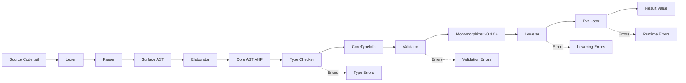

# M-DX6: Pipeline Visualization & Transformation Documentation

**Status**: Planned
**Target**: v0.3.18
**Priority**: P1 (High)
**Estimated**: 2-3 hours
**Dependencies**: None
**Related**: M-DX2 (Debug CLI), M-DX4 (CoreTypeInfo Validation)

## AI-First Alignment Check

**Score this feature against AILANG's core principles:**

| Principle | Impact | Score | Notes |
|-----------|--------|-------|-------|
| Reduce Syntactic Noise | Neutral | 0 | Documentation, doesn't affect language syntax |
| Preserve Semantic Clarity | Positive | +2 | **Makes semantics visible** - AI sees transformations |
| Increase Determinism | Positive | +1 | Clear transformation rules → predictable behavior |
| Lower Token Cost | Positive | +1 | AI reads docs instead of source code |
| **Net Score** | | **+4** | **Decision: Move forward** |

**Decision rule:** Net score > +1 → Move forward | ≤ 0 → Reject or redesign

**Rationale**: This is pure documentation - no code changes except examples. Huge impact on AI understanding with minimal implementation cost.

## Problem Statement

**Discovered during**: AILANG Ease of Use Assessment (October 2025)

**Current State:**
AI developers don't understand the full pipeline without reading source code:
- Pipeline exists: Parsing → Elaboration → Type Checking → Validation → Lowering → Evaluation
- Each phase is implemented correctly
- But transformations are **opaque** - no visual documentation

**Pain Points:**
1. **No visual overview**: AI can't see the full pipeline at a glance
2. **No transformation examples**: AI doesn't know what Surface → Core looks like
3. **No data flow diagram**: AI doesn't know what gets passed between phases
4. **No error recovery map**: AI doesn't know which phase catches which errors

**Impact:**
- **Who**: AI agents (and humans) developing AILANG features
- **Significance**: AI wastes time reading source code to understand transformations
- **Example**: "How does `let x = 1 + 2` become ANF?" requires reading elaborate.go

**Metrics:**
- Architecture docs: Only 2 files (`types.md`, `ANF.md`)
- Pipeline mentions: Only 11 across both docs
- Transformation examples: 0 (none!)

## Goals

**Primary Goal:** Make the compilation pipeline transparent to AI developers.

**Success Metrics:**
- AI can describe the pipeline from memory (no source reading)
- AI knows which phase handles which transformations
- AI knows where to look for transformation bugs
- New contributors understand the pipeline in <15 minutes

## Solution Design

### Overview

Create comprehensive pipeline documentation with:
1. **Visual diagram** (Mermaid) of all phases
2. **Transformation examples** for each phase
3. **Data flow** between phases
4. **Error recovery** points

**Strategy**: Documentation-only (no code changes).

### Architecture

**Single comprehensive doc**: `docs/architecture/PIPELINE.md`

**Structure**:
1. **TL;DR** - One-sentence summary
2. **Visual Overview** - Mermaid diagram
3. **Phase Details** - For each phase:
   - Input format
   - Output format
   - Example transformation
   - Error handling
4. **Data Structures** - What gets passed between phases
5. **Debugging Guide** - Which phase to check for which bugs
6. **Common Patterns** - Typical transformation scenarios

### Content Plan

#### 1. Visual Overview (Mermaid Diagram)



#### 2. Transformation Examples

**Example 1: Simple Expression**

Surface:
```ailang
let x = 1 + 2
```

After Parsing (Surface AST):
```
LetDecl(name="x", value=BinaryExpr(op="+", left=IntLit(1), right=IntLit(2)))
```

After Elaboration (Core ANF):
```
Let($t1 = Lit(1),
  Let($t2 = Lit(2),
    Let($t3 = Intrinsic(OpAdd, [$t1, $t2]),
      Let(x = Var($t3),
        Var(x)))))
```

After Type Checking (CoreTypeInfo):
```
CoreTI[#1] = Int  -- Lit(1)
CoreTI[#2] = Int  -- Lit(2)
CoreTI[#3] = Int  -- OpAdd result
CoreTI[#4] = Int  -- x binding
```

After Lowering:
```
Let($t3 = App(VarGlobal("std/math._int_add"), [$t1, $t2]), ...)
```

**Example 2: Polymorphic Function**

Surface:
```ailang
let id = \x. x in id(42)
```

After Elaboration:
```
Let(id = Lambda(["x"], Var("x")),
  Let($t1 = Lit(42),
    App(Var("id"), [Var($t1)])))
```

After Type Checking:
```
CoreTI[id] = forall a. a -> a
CoreTI[$t1] = Int
CoreTI[App(...)] = Int  -- instantiated to Int -> Int
```

After Monomorphization (v0.4.0+):
```
Let(id_Int = Lambda(["x"], Var("x")),  -- Specialized to Int -> Int
  App(Var("id_Int"), [Lit(42)]))
```

#### 3. Phase Details

**Phase 1: Lexing**
- **Input**: Source code string
- **Output**: Token stream
- **Errors**: Unexpected character, unterminated string
- **Implementation**: `internal/lexer/lexer.go`

**Phase 2: Parsing**
- **Input**: Token stream
- **Output**: Surface AST
- **Errors**: Syntax errors, unexpected token
- **Implementation**: `internal/parser/parser.go`

**Phase 3: Elaboration**
- **Input**: Surface AST
- **Output**: Core AST (ANF)
- **Transformations**:
  - Desugar operators to intrinsics
  - Normalize to A-Normal Form (bind sub-expressions)
  - Resolve imports
- **Errors**: Unknown import, unbound variable
- **Implementation**: `internal/elaborate/`

**Phase 4: Type Checking**
- **Input**: Core AST
- **Output**: CoreTypeInfo (NodeID → Type map)
- **Algorithm**: Hindley-Milner with constraints
- **Transformations**:
  - Infer types for all nodes
  - Resolve type classes (hardcoded: Num, Eq, Ord, Show)
  - Check effect subsumption
- **Errors**: Type mismatch, unbound type variable, missing instance
- **Implementation**: `internal/types/typechecker_core.go`

**Phase 5: Validation** (M-DX4)
- **Input**: Core AST + CoreTypeInfo
- **Output**: Validated CoreTypeInfo (or error)
- **Checks**: Every Core node has a type entry
- **Errors**: Missing type for node (with diagnostic)
- **Implementation**: `internal/pipeline/validate_coretypeinfo.go`

**Phase 6: Monomorphization** (v0.4.0+)
- **Input**: Core AST + CoreTypeInfo (polymorphic)
- **Output**: Core AST + CoreTypeInfo (specialized)
- **Transformations**:
  - Specialize polymorphic functions to concrete types
  - Duplicate functions per instantiation
  - Update CoreTypeInfo with concrete types
- **Errors**: Recursion depth exceeded, too many specializations
- **Implementation**: `internal/pipeline/specialize.go`

**Phase 7: Lowering**
- **Input**: Core AST + CoreTypeInfo
- **Output**: Core AST (with builtins)
- **Transformations**:
  - Select builtin variants by type (e.g., OpConcat → _str_concat or _list_concat)
  - Inline primitives
- **Errors**: Unknown builtin, type-guided selection failed
- **Implementation**: `internal/pipeline/op_lowering.go`

**Phase 8: Evaluation**
- **Input**: Core AST (lowered)
- **Output**: Value
- **Execution**: Interpret Core AST with effect context
- **Errors**: Runtime errors (division by zero, file not found, etc.)
- **Implementation**: `internal/eval/`

#### 4. Data Structures Passed Between Phases

| Phase Transition | Data Structure | Key Fields |
|-----------------|---------------|------------|
| Lexer → Parser | `[]lexer.Token` | Type, Literal, Line, Column |
| Parser → Elaborator | `*ast.Program` | Decls ([]ast.Decl) |
| Elaborator → Type Checker | `*core.Program` | Decls ([]core.CoreExpr) |
| Type Checker → Validator | `CoreTypeInfo` | map[NodeID]Type |
| Validator → Monomorphizer | Validated `CoreTypeInfo` | Same |
| Monomorphizer → Lowerer | Specialized `CoreTypeInfo` | Same |
| Lowerer → Evaluator | `*core.Program` (lowered) | Decls with builtin calls |
| Evaluator → User | `eval.Value` | IntValue, StringValue, ListValue, etc. |

#### 5. Debugging Guide

**Symptom → Phase to Check:**

| Problem | Check Phase | Tool |
|---------|------------|------|
| Syntax error | Parsing | `ailang run file.ail` |
| Unbound variable | Elaboration | `ailang debug ast file.ail` |
| Type error | Type Checking | `ailang debug ast --show-types file.ail` |
| Missing type annotation | Validation | `ailang run file.ail` (automatic) |
| Wrong builtin selected | Lowering | `ailang debug ast --show-types file.ail` |
| Runtime panic | Evaluation | Stack trace + `ailang debug ast` |

#### 6. Common Patterns

**Pattern 1: Operator Desugaring**
- Surface: `a + b`
- Elaborate: `Intrinsic(OpAdd, [Var("a"), Var("b")])`
- Lower: `App(VarGlobal("std/math._int_add"), [Var("a"), Var("b")])`

**Pattern 2: Let Polymorphism**
- Surface: `let id = \x. x in id(1)`
- Type Check: `id :: forall a. a -> a`, instantiate to `Int -> Int`
- Monomorphize: Specialize `id` to `id_Int :: Int -> Int`

**Pattern 3: Effect Checking**
- Surface: `println("hello")`
- Type Check: Infer `! {IO} unit`
- Evaluate: Check capability at runtime, fail if not granted

### Implementation Plan

**Phase 1: Create PIPELINE.md** (~2-3 hours)
- [ ] Write TL;DR and Visual Overview (Mermaid)
- [ ] Document each phase with examples
- [ ] Add data structure table
- [ ] Add debugging guide
- [ ] Add common patterns

**Phase 2: Link from existing docs** (~15 minutes)
- [ ] Add link from `docs/architecture/types.md`
- [ ] Add link from `docs/architecture/ANF.md`
- [ ] Add link from `CLAUDE.md`
- [ ] Add link from `CONTRIBUTING.md`

**Phase 3: Validation** (~30 minutes)
- [ ] Review with AI: Can AI describe pipeline from memory?
- [ ] Test: Ask AI where to look for type errors → should reference PIPELINE.md
- [ ] Test: Ask AI how operators are lowered → should describe phases

### Files to Create

**New files:**
- `docs/architecture/PIPELINE.md` (~300-400 LOC)

**Modified files:**
- `docs/architecture/types.md` - Add link to PIPELINE.md (~5 LOC)
- `docs/architecture/ANF.md` - Add link to PIPELINE.md (~5 LOC)
- `CLAUDE.md` - Add link to PIPELINE.md (~5 LOC)
- `docs/CONTRIBUTING.md` - Add link to PIPELINE.md (~5 LOC)

**Total new code:** ~300-400 LOC (documentation)
**Total modified code:** ~20 LOC (links)

## Success Criteria

- [ ] `docs/architecture/PIPELINE.md` exists with Mermaid diagram
- [ ] All 8 phases documented with examples
- [ ] Data structure table complete
- [ ] Debugging guide covers common issues
- [ ] Linked from 4 existing docs
- [ ] AI can describe pipeline from memory (validated via test)

## Testing Strategy

**Validation tests:**
- Ask AI: "How does AILANG compile code?" → Should reference PIPELINE.md
- Ask AI: "Where do type errors come from?" → Should reference Type Checking phase
- Ask AI: "How are operators lowered?" → Should describe Lowering phase
- Ask AI: "What is ANF?" → Should reference Elaboration phase

**Manual review:**
- New contributor reads PIPELINE.md → understands pipeline in <15 minutes
- Check Mermaid renders correctly on GitHub

## Non-Goals

**Not in this feature:**
- Code changes (this is docs-only)
- Interactive pipeline visualization (out of scope for CLI tool)
- Step-by-step debugger (deferred to future work)
- Performance profiling per phase (deferred to future work)

**Why deferred:**
- Interactive viz requires GUI (not AI-first)
- Debugger requires major runtime changes
- Profiling is optimization, not understanding

## Timeline

**Week 1** (2-3 hours):
- Day 1: Write PIPELINE.md (2h)
- Day 1: Add links (15 min)
- Day 1: Validation (30 min)

**Total: ~2-3 hours in 1 day**

**Buffer:** Already applied (raw estimate was 2h)

## Risks & Mitigations

| Risk | Impact | Mitigation |
|------|--------|-----------|
| Mermaid syntax errors | Low | Test rendering on GitHub before commit |
| Examples get stale | Medium | Link from code so it's used frequently |
| Too much detail | Low | Use TL;DR section + progressive disclosure |
| Missing edge cases | Low | Iterate based on AI feedback |

## References

- **Prior art**: M-DX2 Debug CLI (v0.3.16)
  - [Design doc](../v0_3_16/m-dx2-operator-development-experience.md)
- **Related**: AILANG Ease of Use Assessment
  - [Assessment](./AILANG_EASE_OF_USE_ASSESSMENT.md)
- **Existing docs**:
  - `docs/architecture/types.md` - Type system
  - `docs/architecture/ANF.md` - ANF explanation

## Future Work

**Potential extensions (not in v0.3.18):**

1. **Interactive pipeline visualizer** (v0.4.0+)
   - Web UI showing transformations step-by-step
   - Useful for learning, not for AI development

2. **Pipeline profiler** (v0.4.0+)
   - Measure time spent in each phase
   - Useful for optimization

3. **Transformation tests** (v0.3.19+)
   - Golden tests for each phase
   - Example: Surface → Core transformation suite

4. **Pipeline replay** (v0.4.0+)
   - Save intermediate representations
   - Replay from any phase (for debugging)

---

**Document created**: 2025-10-22
**Last updated**: 2025-10-22
