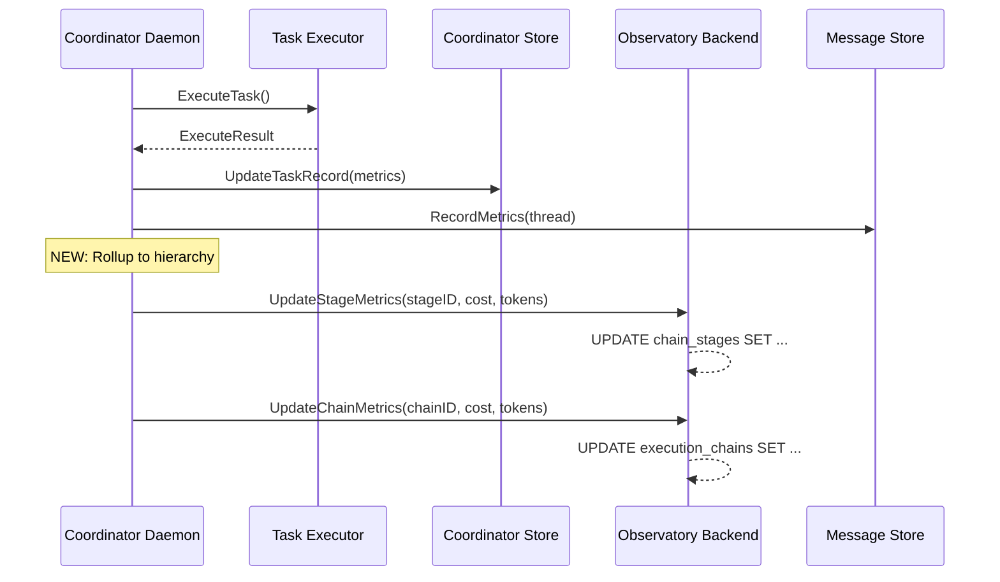

# M-CHAINS-SOURCE-OF-TRUTH Phase 3: Chain Metric Rollup

## Status
- **Status**: Planned
- **Created**: 2025-01-16
- **Author**: design-doc-creator (coordinator task)
- **Last Modified**: 2025-01-16
- **Version**: N/A
- **Target**: v0.7.3
- **Priority**: P1 (Medium)
- **Estimated**: 3 days

## Dependencies
- M-CHAINS-SIMPLIFY (implemented)
- Observatory backend with chain/stage tables (implemented)
- Coordinator daemon task execution (implemented)

## Related Documents
- [test-chain-env-propagation.md](v0_7_2/test-chain-env-propagation.md) - Chain ID propagation infrastructure
- [m-exec-hierarchy-refactor.md](v0_7_2/m-exec-hierarchy-refactor.md) - Visualization of chain/stage hierarchy
- [m-coord-taskchain-tests.md](../implemented/v0_7_0/m-coord-taskchain-tests.md) - Task chain testing infrastructure

## Problem Statement

Currently, task execution metrics are recorded in multiple places without proper rollup to the chain/stage hierarchy:

**Current State:**
- Task metrics stored in `coordinator.db` (cost, tokens, duration)
- Stage metrics exist in `observatory.db` but are not updated from task execution
- Chain metrics exist but don't aggregate from stages
- Thread-level metrics recorded in `collaboration.db` but disconnected from chains
- No data flow from `ExecuteResult → UpdateStageMetrics → UpdateChainMetrics`

**Impact:**
- Dashboard shows zero costs/tokens for chains and stages
- Cannot track cumulative cost of multi-agent workflows
- Cannot see resource usage across entire execution chains
- Orphaned metrics across three databases with no aggregation

**Key Gap:**
In `internal/coordinator/daemon_tasks.go`, after task execution:
- Lines 805-810: Result metrics available in `ExecuteResult`
- Lines 1110-1124: Metrics recorded to messaging thread
- **Missing**: No calls to `UpdateStageMetrics` or `UpdateChainMetrics`

## Goals

**Primary Goal:** Implement automatic metric rollup from task execution to chain hierarchy

**Success Metrics:**
- [ ] Stage metrics updated after each task execution
- [ ] Chain metrics aggregated from all stages
- [ ] Dashboard shows accurate costs/tokens at all hierarchy levels
- [ ] Metrics preserved across approvals and handoffs
- [ ] Zero manual aggregation required

## Non-Goals
- Real-time streaming of partial metrics (batch update on completion is fine)
- Historical backfill of existing chains (forward-only)
- Cross-database transaction consistency (eventual consistency OK)

## Solution Design

### Overview

Add metric rollup hooks at two key points in the task execution flow:

1. **After task execution completes** - Update stage metrics
2. **After stage completes** - Rollup to chain metrics

### Architecture

```
ExecuteResult (coordinator)
    ↓
UpdateStageMetrics (observatory)
    ↓
UpdateChainMetrics (observatory)
    ↓
Dashboard reflects accurate totals
```

### Data Flow



### Implementation Plan

#### Phase 1: Add Stage Metric Updates (1 day)

**Location:** `internal/coordinator/daemon_tasks.go::executeTask()`

After line 1010 (successful execution with result):
```go
// Update stage metrics in observatory if chain tracking is enabled
if task.StageID != "" && d.obsBackend != nil && result != nil {
    if err := d.obsBackend.UpdateStageMetrics(
        taskCtx,
        task.StageID,
        result.Cost,
        result.InputTokens,
        result.OutputTokens,
        1, // turns (will be updated from spans later)
        0, // toolCalls (will be updated from spans later)
        int64(result.Duration.Milliseconds()),
    ); err != nil {
        d.logger.Printf("Warning: Failed to update stage %s metrics: %v", task.StageID, err)
    } else {
        d.logger.Printf("Updated stage %s metrics: cost=$%.4f tokens=%d",
            task.StageID, result.Cost, result.InputTokens+result.OutputTokens)
    }
}
```

#### Phase 2: Add Chain Metric Rollup (1 day)

**Location:** `internal/coordinator/daemon_tasks.go`

Add new helper method:
```go
// updateChainMetrics rolls up metrics from stage to chain
func (d *Daemon) updateChainMetrics(ctx context.Context, task *TaskRecord, result *ExecuteResult) {
    if task.ChainID == "" || d.obsBackend == nil || result == nil {
        return
    }

    // Get the chain's store interface
    chainStore, ok := d.obsBackend.(*observatory.Store)
    if !ok {
        // Try composite backend
        if composite, ok := d.obsBackend.(*observatory.CompositeBackend); ok {
            chainStore = composite.Local().(*observatory.Store)
        }
    }

    if chainStore == nil {
        return
    }

    // Update denormalized chain metrics
    if err := chainStore.UpdateChainMetrics(
        ctx,
        task.ChainID,
        result.Cost,
        result.InputTokens + result.OutputTokens,
        1, // turns increment
    ); err != nil {
        d.logger.Printf("Warning: Failed to update chain %s metrics: %v", task.ChainID, err)
    } else {
        d.logger.Printf("Updated chain %s metrics: cost=$%.4f tokens=%d",
            task.ChainID, result.Cost, result.InputTokens+result.OutputTokens)
    }
}
```

Call after stage update:
```go
// After updating stage metrics
d.updateChainMetrics(taskCtx, task, result)
```

#### Phase 3: Handle Approvals and Handoffs (0.5 days)

**Location:** `internal/coordinator/daemon_approval.go`

When a task is approved and triggers handoff:
- Ensure stage metrics are finalized before handoff
- Update chain status when moving to next stage

```go
// In handleApproval() after merging
if task.StageID != "" && d.obsBackend != nil {
    // Mark stage as completed
    if err := d.obsBackend.UpdateStageStatus(ctx, task.StageID, observatory.StageStatusCompleted); err != nil {
        d.logger.Printf("Warning: Failed to update stage status: %v", err)
    }
}
```

#### Phase 4: Add Turn/Tool Metrics from Spans (0.5 days)

**Location:** `internal/coordinator/daemon_tasks.go`

After span recording (line 840):
```go
// Count turns and tool calls from span attributes
var turnCount, toolCallCount int
if eventHandler != nil && eventHandler.GetTurnCount != nil {
    turnCount = eventHandler.GetTurnCount()
    toolCallCount = eventHandler.GetToolCallCount()
}

// Update stage with accurate turn/tool counts
if task.StageID != "" && d.obsBackend != nil && result != nil {
    if err := d.obsBackend.UpdateStageMetrics(
        taskCtx,
        task.StageID,
        0, // cost already updated
        0, 0, // tokens already updated
        turnCount,
        toolCallCount,
        0, // duration already updated
    ); err != nil {
        d.logger.Printf("Warning: Failed to update stage turn metrics: %v", err)
    }
}
```

### Files to Modify

| File | Changes | LOC |
|------|---------|-----|
| `internal/coordinator/daemon_tasks.go` | Add metric rollup calls | +50 |
| `internal/coordinator/daemon_approval.go` | Update stage status on approval | +10 |
| `internal/coordinator/event_handler.go` | Add turn/tool counting | +20 |
| **Total** | | **+80** |

### Testing Strategy

1. **Unit Tests:**
   - Mock observatory backend
   - Verify UpdateStageMetrics called with correct values
   - Verify UpdateChainMetrics aggregates properly

2. **Integration Tests:**
   - Execute task with chain/stage IDs
   - Query observatory.db to verify metrics
   - Check dashboard reflects accurate totals

3. **End-to-End Test:**
   - Create multi-agent chain (design → sprint → execute)
   - Verify cumulative costs at each stage
   - Confirm chain total equals sum of stages

## Examples

### Before: Metrics Not Rolled Up

```sql
-- observatory.db after task execution
SELECT * FROM chain_stages WHERE id = 'stage-123';
-- cost: 0.00, tokens_in: 0, tokens_out: 0  ❌

SELECT * FROM execution_chains WHERE id = 'chain-456';
-- total_cost: 0.00, total_tokens: 0  ❌

-- coordinator.db has the data
SELECT * FROM tasks WHERE stage_id = 'stage-123';
-- cost: 0.17, input_tokens: 5000, output_tokens: 2000  ✓
```

### After: Automatic Rollup

```sql
-- observatory.db after task execution
SELECT * FROM chain_stages WHERE id = 'stage-123';
-- cost: 0.17, tokens_in: 5000, tokens_out: 2000  ✓

SELECT * FROM execution_chains WHERE id = 'chain-456';
-- total_cost: 0.17, total_tokens: 7000  ✓
```

### Dashboard Impact

**Before:**
```
Chain: Design → Sprint → Execute
Total Cost: $0.00  ❌
Total Tokens: 0    ❌
```

**After:**
```
Chain: Design → Sprint → Execute
├─ Design:    $0.12 (4,500 tokens)  ✓
├─ Sprint:    $0.08 (3,200 tokens)  ✓
├─ Execute:   $0.35 (12,800 tokens) ✓
Total Cost:   $0.55                 ✓
Total Tokens: 20,500                ✓
```

## Success Criteria

- [ ] Stage metrics populated after task execution
- [ ] Chain metrics aggregate from all stages
- [ ] Metrics survive approval/rejection cycles
- [ ] Dashboard shows accurate hierarchy totals
- [ ] No manual SQL updates required
- [ ] Existing tests pass
- [ ] New integration tests for rollup logic

## Risk Assessment

**Low Risk:**
- Additive changes only (no breaking changes)
- Uses existing UpdateStageMetrics/UpdateChainMetrics APIs
- Graceful degradation if observatory unavailable

**Medium Risk:**
- Cross-database consistency (coordinator → observatory)
- Potential for metric drift if updates fail

**Mitigation:**
- Log warnings but don't fail task on metric update errors
- Add monitoring for metric update failures
- Consider background reconciliation job in Phase 4

## Timeline

**Week 1:**
- Day 1: Implement stage metric updates
- Day 2: Add chain metric rollup
- Day 3: Testing and documentation

**Week 2 (if needed):**
- Background reconciliation job
- Historical backfill tooling

## Future Enhancements

1. **Real-time streaming:** Update metrics during execution, not just at end
2. **Span-based metrics:** Extract detailed turn/tool metrics from OTEL spans
3. **Cost predictions:** Estimate chain cost before execution
4. **Budget enforcement:** Halt chains that exceed cost thresholds
5. **Metric reconciliation:** Background job to fix drift between databases

## Axiom Compliance

| Axiom | Score | Rationale |
|-------|-------|-----------|
| **A1: Determinism** | +1 | Metrics are deterministic aggregations of recorded data |
| **A2: Replayability** | +1 | Rollup logic can be re-run from source data |
| **A3: Effect Legibility** | 0 | Internal bookkeeping, not user-visible effects |
| **A4: Explicit Authority** | 0 | No new capabilities required |
| **A5: Bounded Verification** | +1 | Each rollup is locally verifiable |
| **A6: Safe Concurrency** | 0 | Sequential updates, no concurrency changes |
| **A7: Machines First** | +1 | Structured metrics improve machine analysis |
| **A8: Minimal Syntax** | 0 | No syntax changes |
| **A9: Cost Visibility** | +1 | Makes costs MORE visible in hierarchy |
| **A10: Composability** | +1 | Metrics compose cleanly across stages |
| **A11: Structured Failure** | 0 | Metric failures logged but don't fail tasks |
| **A12: System Boundary** | 0 | Internal coordinator operation |

**Net Score: +6** ✅ (Well above +2 threshold)

## Implementation Notes

1. **Idempotency:** UpdateStageMetrics and UpdateChainMetrics use SQL `+=` operators, so they accumulate. Consider making them idempotent if tasks can be retried.

2. **Turn Counting:** Initial implementation uses placeholder (1 turn). Phase 4 adds accurate counting from event streams or spans.

3. **Observatory Backend Types:** Code must handle both direct Store and CompositeBackend wrappers.

4. **Error Handling:** Metric update failures should not fail tasks - log and continue.

5. **Testing:** Use `observatory.NewMemoryBackend()` for unit tests to avoid database dependencies.