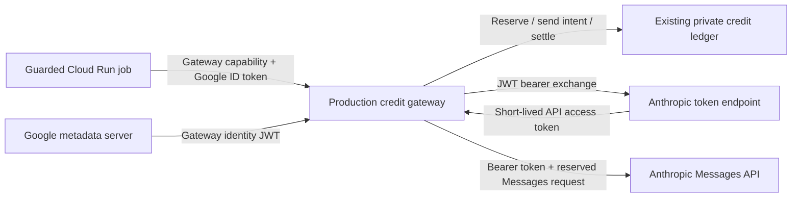

# M-CLOUD-CLAUDE-GATEWAY-FEDERATION: Anthropic Federation After the Production Credit Guard

**Status:** Planned; design requested 2026-10-10, implementation not authorized
**Created:** 2026-10-10
**Target:** Follow-up release after the credit guard is deployed and accepted in production; version assigned during sprint planning
**Priority:** P1
**Estimated:** 5–7 engineering days including integration, infrastructure review and rollout evidence; provisional until sprint planning
**Dependencies:** M-CLOUD-CLAUDE-API-CREDIT-GUARD completed through M6, evaluated and deployed to production; verified Anthropic organization/workspace and dedicated gateway Google service account
**Scope:** AILANG cloud tooling and private Multivac infrastructure. Gateway provider authentication only.

## Problem Statement

After the credit guard reaches production, every credit-backed Claude request crosses an authenticated gateway with durable reservations and settlement. The gateway alone holds the static Anthropic inference API key. This provides spending control, but the provider key still requires secure storage, rotation and revocation.

Replace that provider key with Anthropic Workload Identity Federation (WIF). The gateway authenticates as its attached Google service account, exchanges a Google identity token for a short-lived Anthropic token, and continues enforcing the same credit policy before each Messages request.

Federation changes the credential lifecycle. It does not renew credits, increase spending limits, convert API traffic to subscription usage, or authorize executors to call Anthropic directly.

## Assumed Production Baseline and Entry Gate

This document assumes the completed production credit guard. Before publication, the predecessor was archived as implemented in v0.54.1, with M0–M6 complete, independent evaluation PASS94/100 and guarded dev/prod evaluators active. See the committed [rollout record](../verification/cloud-claude-api-credit-guard/rollout-v0.54.1.json) and [independent evaluation](../verification/cloud-claude-api-credit-guard/evaluation-v0.54.1.json). Earlier observations below remain historical; reverify the deployed baseline at sprint execution.

Before sprint execution, capture the completed guard's source release, deployed gateway/job digests, Terraform state owner, service-account identities, accepted M6 evidence and evaluator result. Rebase the file map below against that release.

The required baseline is:

- One production gateway serving guarded jobs from dev/prod against one canonical credit account and a private authority project.
- A dedicated gateway Google service account, proposed by the predecessor as `ailang-claude-credit-gateway@ailang-multivac.iam.gserviceaccount.com`; confirm its deployed email and numeric unique ID.
- Jobs carry a gateway capability and a Google ID token for the gateway audience. They have neither provider-key access nor ledger-write access.
- Inherited broad secret-reader grants and paths to impersonate the gateway have been reviewed under the predecessor's deployment policy.
- Model/request allowlists, helper routing, per-request reservations, durable send intent, settlement, unresolved exposure, grant expiry, reconfirmation and operator kill switch have passed live validation.
- The initial canary has completed and provider billing has reconciled. Production is operating under the accepted grant, policy and workspace caps.

If these premises fail, return the missing work to the credit-guard rollout. Do not rebuild the guard or bypass its acceptance criteria inside this feature.

The predecessor's starting limits were a $190 operating ceiling inside a confirmed $200 grant, $6 per UTC admission day, $2 per task and two concurrent tasks. Inherit the actual accepted production policy; this feature raises none of those limits. The original October 28 credit expiry is historical evidence, not a promise that funds will still be available when this follow-up executes.

## Goals

**Primary goal:** Production credit-backed inference uses short-lived federated Anthropic credentials held only by the gateway, with unchanged spending guarantees.

**Success metrics:**

1. Zero static Anthropic inference keys mounted in the accepted WIF gateway revision; the migrated key is revoked after the rollback window.
2. Exact Google gateway identity and Anthropic workspace bindings are verified; executor and unrelated identities cannot exchange under the rule.
3. Concurrent and long-running tasks cross multiple token refreshes without duplicate Messages sends or lost accounting.
4. Authentication failure produces zero new inference sends; post-send uncertainty retains the predecessor's reserved exposure.
5. Grant ID, original amounts/expiry, settled/reserved/unresolved totals and canary-completion state survive migration, restart and rollback.

## Related Documents and Coverage

- [Credit guard](../implemented/v0_54_1/m-cloud-claude-api-credit-guard.md): predecessor owns grant authority, pricing and spending enforcement. This follow-up replaces only upstream authentication after that design ships.
- [Deployment evidence](../implemented/v0_54_1/m-cloud-claude-api-credit-guard-deployment.md): prerequisite resource ownership, IAM isolation and M6 rollout proof.
- [Operator guide](../implemented/v0_54_1/m-cloud-claude-api-credit-guard-operator-guide.md): retain confirmation, enable/disable and grant lifecycle commands.
- [CLI contract](../implemented/v0_54_1/m-cloud-claude-api-credit-guard-cli-contract.md): preserve the accepted downstream Claude protocol and helper routing.
- [Program routing](../PROGRAM.md): AILANG harness/infrastructure work; the motoko core and language semantics are outside this change.

The related-doc search on 2026-10-10 reported `embedding_model: fallback-simhash`, with zero neural embeddings computed or reused. Its scores are not neural duplicate scores. Direct search across planned/implemented design docs found federation mentions for unrelated registry, MCP, Gemini and observatory work. The top billing-responsibility and session-hook results were inspected and cover different features. No Anthropic gateway federation design was found in the inspected corpus.

## Provider Facts

Anthropic supports Google-signed identity tokens from Cloud Run's attached service account. Register the Google OIDC issuer in Anthropic; a new Google Workload Identity Pool is unnecessary for this path. Pin the gateway's exact numeric `sub`, email and audience in the rule. Use `format=full` when fetching the metadata token. [Google Cloud federation guide](https://platform.claude.com/docs/en/manage-claude/wif-providers/gcp)

The exchange is `POST https://api.anthropic.com/v1/oauth/token`, with a JWT bearer grant and explicit organization, federation-rule, service-account and workspace IDs. The resulting credential is used in `Authorization: Bearer`. Select the workspace at exchange time. [WIF request/response reference](https://platform.claude.com/docs/en/manage-claude/wif-reference)

Federated identities follow Anthropic workspace permissions, limits and usage attribution. Bearer authentication does not imply Claude subscription billing. Configure only `workspace:developer` for inference; organization administration belongs to a separate operator workflow. [Federation concepts](https://platform.claude.com/docs/en/manage-claude/workload-identity-federation)

The issued token's lifetime can be shorter than the configured rule lifetime. Respect the returned expiry. JWTs carrying `jti` can be subject to replay rejection; keep issuer replay protection enabled. [Token lifecycle](https://platform.claude.com/docs/en/manage-claude/workload-identity-federation#token-lifetime-and-refresh)

## High-Impact Decisions

| Decision | Why high impact | Chosen by | Deadline | Change cost |
|---|---|---|---|---|
| Trust the dedicated gateway Google identity only | Direct executor federation would bypass the spending boundary | Human at design approval | Design | High |
| Keep the same credit account, grant and private ledger | Credential migration must never replenish or erase exposure | Human at design approval | Design | High |
| Explicit provider auth mode, with no automatic credential fallback | SDK/env precedence can silently choose a different credential | Human at design approval | Design | Medium |
| Direct bounded token exchange; preserve existing Messages transport | Generic SDK retries could duplicate a billable send | Agent recommendation, human at design approval | Design | Medium |
| Rule lifetime 1,200 seconds, deadline-aware refresh and 30-second safety margin | The accepted gateway permits requests lasting up to ten minutes | Human at design approval | Design | Medium |
| One $2 validation task, with a temporary gateway task restriction | The predecessor's promoted canary cannot be reset for migration | Human at design approval | Before rollout | Medium |

### Design Freeze

- [ ] Approve gateway-only federation and the unchanged credit account/ledger boundary.
- [ ] Approve explicit auth modes, no automatic fallback and no Messages retry after a provider response or ambiguous send.
- [ ] Approve the lifetime/refresh policy and bounded single-task migration pilot.
- [ ] Establish the completed production predecessor release and its authoritative resource/state addresses before execution.

Writing this document does not approve these decisions or authorize implementation. Actual Anthropic IDs, service-account unique ID and current grant evidence are deployment inputs, verified before rollout; they are not fabricated design placeholders.

## Solution Design

### Architecture



There are three distinct credentials:

| Credential | Audience/use | Holder |
|---|---|---|
| Job Google ID token plus task capability | Gateway authorization | Guarded job and gateway |
| Gateway Google identity JWT | Anthropic token exchange | Gateway memory only |
| Federated Anthropic access token | Metered Messages API | Gateway memory only |

The job token cannot stand in for the gateway identity JWT. The gateway never returns either upstream token to a job, operator, trace or artifact store. The task-signing secret remains part of the existing gateway boundary; eliminating the Anthropic API key does not eliminate every secret.

### Anthropic Trust Configuration

Use the production guard's verified organization and dedicated inference workspace. Create an Anthropic service account with membership in that workspace, a Google issuer using discovery for `https://accounts.google.com`, and one rule for the production gateway identity.

Illustrative rule values, to be replaced with verified identifiers:

```json
{
  "name": "ailang-prod-credit-gateway",
  "issuer_id": "fdis_VERIFIED",
  "match": {
    "audience": "https://api.anthropic.com",
    "claims": {
      "sub": "VERIFIED_GOOGLE_SERVICE_ACCOUNT_UNIQUE_ID",
      "email": "ailang-claude-credit-gateway@ailang-multivac.iam.gserviceaccount.com"
    }
  },
  "target": {
    "type": "service_account",
    "service_account_id": "svac_VERIFIED"
  },
  "workspace_id": "wrkspc_VERIFIED",
  "oauth_scope": "workspace:developer",
  "token_lifetime_seconds": 1200
}
```

Never wildcard Google subjects. The rule cannot target an executor, coordinator, dashboard, default compute identity or deployment-wide identity. Dev jobs continue calling the shared production gateway. A separate test gateway requires its own dedicated Google identity and rule; do not widen the production rule to cover it.

Console setup is sufficient for this feature. Anthropic administration automation is deferred; do not grant `org:admin` to the inference gateway. Record resource IDs and reviewed rule configuration without credentials.

### Explicit Configuration and Authentication Seam

Introduce explicit gateway provider modes `api-key` and `wif`. Each process uses exactly one mode. For transitional compatibility, an existing explicit `--provider-key-file` invocation can select the legacy static mode; missing configuration remains an error rather than selecting a mode implicitly from ambient credentials.

WIF inputs are organization UUID, workspace ID, federation rule ID, Anthropic service-account ID, expected Google email/unique ID and the pinned audience. These are non-secret configuration. Existing organization/workspace arguments should be reused rather than duplicated. The configured identities must refer to the same verified organization/workspace as the canonical credit account; a mismatch blocks operation. Any predecessor label-to-ID normalization needs explicit reviewed migration, never account reinitialization.

WIF mode rejects a provider-key-file setting and conflicting ambient API-key, subscription-token or Anthropic profile configuration. It does not invoke AILANG's existing subscription credential resolver or accept a pre-exchanged token supplied by a task. The static-mode adapter exists only for staged migration and an explicit operator rollback.

Introduce a small provider-auth interface returning request credentials and safe metadata for the current deadline. Implement a legacy key-file adapter and a WIF adapter. The Messages path builds outbound headers from scratch, preserving its approved body, version and beta policy. WIF sends bearer auth and omits the provider `x-api-key`; it does not automatically attach the subscription-specific OAuth beta flag.

The WIF adapter uses the existing Go Google metadata/auth facilities where suitable, with explicit Cloud Run metadata identity acquisition. Do not fall back to a developer ADC account or impersonation when metadata is unavailable. Fetch from the fixed metadata identity endpoint for the selected audience with the Google metadata header and full claims. Validate expected issuer, audience, email and numeric subject before exchange; Anthropic's rule remains the authoritative signature/trust check.

Use the documented exchange JSON and a dedicated HTTP client with a ten-second overall deadline, bounded response decoding and redirects disabled. Validate a nonempty access token, bearer token type, positive bounded expiry and the allowed inference scope. Never log assertions, access tokens, authorization headers or raw error bodies. Request a metadata token for each new exchange; a replay denial is a visible failure, not a reason to disable `jti` checks.

### Token Lifetime, Concurrency and Refresh

Use an in-memory cache keyed by the complete immutable federation configuration. A change of rule, organization, service account, workspace or Google identity cannot reuse a previous cache entry. Tokens are not saved to Firestore, disk, Secret Manager or execution overrides.

A credential is usable only when its expiry covers the actual request deadline plus 30 seconds. The rule's proposed 20-minute lifetime allows a fresh token to cover the predecessor's ten-minute maximum request. If Anthropic returns a shorter lifetime that cannot cover the request, refuse it; do not shorten the request deadline silently or extend token lifetime locally.

Compute expiry conservatively from exchange start time and the returned `expires_in`. Refresh on demand before a request fails the required remaining-lifetime check. Cloud Run request-based CPU must not be assumed to run a background refresh timer.

Coalesce concurrent refreshes per gateway instance. Use a bounded refresh context and independently cancellable waiters; cancellation by one waiter must not leave others blocked indefinitely. Separate instances have separate caches and share only the existing budget authority. A failed refresh returns a visible auth error; this design does not switch credentials or continue using a rejected token. Repeated exchange failures receive bounded cooldown rather than unbounded retry loops.

On a provider authentication rejection, invalidate the cached token for the next independently admitted request. Do not refresh and resend the same Messages request. Already-open streams continue under the existing settlement contract; refresh never recreates an upstream stream.

### Reservation and Failure Ordering

Retain the predecessor's send-state machine:

1. Authenticate the job/capability and enforce the migration task restriction when active. Existing attempt binding remains mandatory.
2. Validate the request, model, pricing, lease and deadline.
3. Obtain a provider credential covering that deadline. Exchange failure at this point creates no request reservation or Messages send.
4. Reserve through the canonical authority using a fresh request ID.
5. Recheck credential lifetime immediately before durable send intent. If it has become unsuitable, release only this demonstrably unsent reservation through `ReleaseUnsent`; if release cannot be confirmed, retain the reservation and surface uncertainty.
6. Call `MarkForwarded`, which rechecks the kill switch, grant and task validity. After this point, a crash is ambiguous and exposure is retained even if the process never reaches the transport.
7. Make one Messages transport attempt. Settle only complete verified usage; preserve unresolved exposure on failure, including 401/403 and incomplete streams.

Token acquisition does not authorize spending. A token cache hit still requires a new reservation and successful send marker. Token refresh, service restart, rule replacement and rollback never alter grant confirmation, canary completion or historical exposure.

### Diagnostics and Metered Accounting

Keep the existing task billing lane metered: jobs continue using their gateway API-key/capability convention. Do not route federated tokens through `AuthOAuth` or infer billing from the `sk-ant-oat01-` prefix. Both subscription and federation use bearer-shaped tokens with different billing meaning.

Expose safe provider-auth metadata alongside gateway operational evidence: mode, organization/workspace/rule/service-account IDs, expected Google identity, cache expiry, refresh outcome and latency. Billing continues to reconcile through the predecessor's provider request IDs and usage categories.

Add an operator-only nonbillable auth probe under the existing authenticated admin boundary, proposed `POST /admin/provider-auth/check`. It verifies metadata acquisition and token exchange and returns only safe identity/expiry/status fields. Ordinary jobs and coordinator identities cannot invoke it. The probe neither enables the credit account nor reserves, forwards or settles an inference request. It proves authentication, not credit availability, endpoint billing or complete inference compatibility.

Auth failures must be machine-readable and distinct from budget refusal and post-send uncertainty. Redact credentials from Go errors, logs, traces and diagnostic responses. Report the selected provider mode explicitly so a legacy key cannot silently shadow WIF.

### IAM and Infrastructure Ownership

The private `ailang-multivac` repository owns persistent Cloud Run and IAM changes. Update its deployed gateway module through branch-driven CI and promote verified image digests through the existing source-release process. Preserve the production gateway identity, URL, invoker policy, operator/coordinator allowlists and authority project.

After cutover, remove the gateway's provider-key mount and reader binding while retaining its signing-key access and private ledger access. Keep secret resource deletion separate from key revocation and respect existing resource protection/state ownership.

Audit direct and inherited permissions that can mint a gateway identity token, impersonate it, or attach it to another workload: Token Creator/OpenID Token Creator, Workload Identity User, service-account actAs plus Cloud Run deployment rights, and equivalent custom roles. Trusted deployment automation remains a privileged controller; ordinary executor identities must not gain these paths. A process already running as the gateway identity can mint tokens, so exact service-account matching alone does not replace deployment IAM and reviewed release controls.

## Migration and Rollback

1. Record the accepted production baseline and a canonical ledger snapshot. Verify a current confirmed grant with sufficient headroom; the October grant may have expired by execution time.
2. Provision the narrow Anthropic rule in parallel with the working static mode. Deploy the compatible gateway image through the usual release pipeline while retaining explicit static mode. Verify the configured resource IDs; run the exchange probe only after the restricted WIF revision is deployed in step 5.
3. Pause ordinary guarded rotation and drain active tasks/streams through the existing operations flow. Keep historical reservations and unresolved exposure. Avoid mixed old/new gateway revisions processing inference during validation.
4. Enable a temporary gateway validation restriction for one new fixed task ID, a fixed end time and a maximum $2 task ceiling. The restriction gates both task admission and Messages forwarding; admin status/kill-switch remains available. Other task IDs and out-of-window requests are rejected. Keep the existing signed attempt binding and lease checks. Restriction values are reviewed deployment configuration, never task-supplied selectors. The coordinator generates an attempt ID during admission, so do not invent a requirement to know it before dispatch.
5. Switch this gateway revision explicitly to WIF with no provider-key mount or ambient competing credentials. Run the operator-only nonbillable probe, then admit the selected task through the existing coordinator. Its settled plus reserved/unresolved exposure remains bounded by the existing persistent task ceiling; admission/restart cannot reset it. Admission must reject any ceiling above the configured validation maximum. The domain already preserves cumulative spend across attempts; do not replace that behavior with a fresh attempt budget. No automatic retries, additional migration tasks or deadline extension are authorized.
6. Verify harmless completion/tool-loop requests, at least one refresh during the same task, identity isolation, canonical accounting and provider billing. Fake-clock tests cover longer concurrency/expiry scenarios without spending. The migration's maximum $2 exposure fits inside the current grant/account/day policy; available headroom may be smaller and must be respected.
7. Drain the validation task, compare the ledger and reconcile all provider evidence. Do not reset `CanaryComplete`, replay a grant confirmation or call the predecessor's initial `promote` action to create a new allowance. A failed or insufficient pilot needs a separate operator decision; it is not a reason to create another task automatically.
8. Review removal of the temporary restriction and resume normal guarded rotation on WIF. Record the accepted image/rule identities and a defined observation/rollback window.
9. After acceptance and the rollback window, revoke the migrated API key in Anthropic and retire its remaining reader bindings/mount references. Verify that old revisions cannot serve authorized traffic. Retain audit evidence without secret values.

Before key revocation, an operator can deliberately restore the reviewed static-mode configuration/image and its gateway-only key mount. This is an audited deployment rollback, never a runtime fallback; it preserves the same ledger and exposure. After revocation, rollback to the old key is unavailable. Stop the lane and repair WIF, or approve provisioning a replacement key through the established secret workflow.

Disabling a federation rule must not be described as immediately invalidating already-issued tokens without provider evidence. Use the existing credit kill switch to prevent new gateway sends; the token lifetime bounds residual credential exposure, and in-flight sends retain their established accounting semantics.

## Examples

### Before and After

| Aspect | Accepted predecessor | Follow-up |
|---|---|---|
| Job auth | Gateway capability + Google token | Same |
| Provider auth | Gateway-only Secret Manager key | Gateway metadata JWT exchanged for bearer token |
| Billing | Metered Anthropic API | Same |
| Credit authority | Existing private ledger/account | Same; no replenishment |
| Provider outage | Guard fails closed | Token acquisition/refresh also fails closed |
| Signing key | Gateway-only secret | Same |

### Operational Outcomes

- Cached token has 12 minutes left and request deadline is ten minutes away: reserve, durably mark and send once.
- Cached token has eight minutes left for the same deadline: refresh before reservation; if refresh fails, return auth failure with zero new inference exposure.
- Anthropic rejects bearer auth after send intent: invalidate cache, retain unresolved exposure, and do not resend automatically.
- A job requests a Google token with the Anthropic audience: the production rule rejects its executor subject/email.
- Credits expire while token exchange still works: the authority blocks inference. Federation does not renew the grant.

## Implementation Plan and Timeline

| Phase | Deliverable | Provisional effort |
|---|---|---|
| 1. Baseline and trust contract | Accepted prod release/state inventory, verified rule schema and IAM ownership | 0.5–1 day |
| 2. Provider-auth adapter | Explicit mode validation, bounded exchange, deadline-aware cache and concurrent refresh | 1.5–2 days |
| 3. Gateway integration | Send ordering, safe diagnostics, metered metadata and temporary validation restriction | 1–1.5 days |
| 4. Verification | Fake-provider/race tests, ledger regression proof, infrastructure plans and required CI | 1 day |
| 5. Migration evidence | Nonbillable probe, single-task pilot, reconciliation, rollback exercise and operator docs | 1–1.5 days |

Total: approximately 5–7 engineering days. Provider administration and deployment review can extend elapsed time. This is a design estimate, not an approved sprint plan.

### Files to Modify/Create

Paths in AILANG below are verified against the predecessor's review worktree and must be rechecked after its release.

| File or area | Planned change | Rough LOC |
|---|---|---:|
| `internal/claudegateway/provider_auth.go` (new) | Explicit auth seam and key-file adapter | 70–110 |
| `internal/claudegateway/federation.go` (new) | Metadata provider, exchange validation, cache/refresh | 220–320 |
| `internal/claudegateway/federation_test.go` (new) | Protocol, expiry, concurrency, cancellation and redaction | 300–450 |
| `internal/claudegateway/gateway.go` | Provider adapter, preserved send ordering, validation restriction | +80–130 / -10–25 |
| `internal/claudegateway/lifecycle_test.go`, `fault_test.go`, `admin_test.go` | Both auth modes, state ordering, probe and restricted admission | +180–280 |
| `cmd/ailang/credit_gateway.go` | Explicit mode/config validation and wiring | +70–110 / -10–20 |
| `cmd/ailang` existing command tests/help plus `internal/config` if env inputs are added | Central registration and help for chosen public configuration | +40–80 |
| Private Multivac deployed gateway module and environment inputs | Non-secret WIF config, key mount/IAM removal and validation configuration | 80–140 |
| Existing credit operator/deployment guide | WIF probe, cutover, rollback and revocation evidence | 100–160 |

Prefer explicit flags and the existing registered configuration surfaces. New public environment variables, if needed, belong in the central config registry. Reuse Google dependencies already present; do not add a general SDK Messages client solely to implement token exchange. Keep budget-domain changes limited to regression tests unless the released baseline disproves a premise and the design is reviewed again.

## Testing Strategy

**Provider adapter tests:** Fake metadata and exchange servers verify exact audience/full claims, wrong Google identity, request schema, workspace/scope, expiry bounds, malformed/oversized responses, redirects, timeout and credential redaction. Fake clocks prove deadline-aware refresh, short returned lifetimes, restart and cache isolation. Concurrent callers prove one refresh per instance, cancellation and bounded failure cooldown; run with Go's race detector.

**Gateway/ledger integration:** Read and preserve the predecessor fixtures. Test token acquisition failure before reservation, token loss before send marker with unsent release, release uncertainty, kill switch during refresh, one Messages send, 401/403 without retry, streaming refresh boundaries and full unresolved exposure. Run independent-client Firestore emulator checks across multiple gateway instances and retain before/after canonical balances.

**Migration restriction:** The allowed task passes only within its fixed cutoff and a ceiling of at most $2. Other task IDs, higher ceilings, stale/invalid signed attempts and expired restrictions produce zero Messages sends. Task re-admission, a new attempt and gateway restart do not reset cumulative spend. The rollout disables automatic retries, while the server-side task ceiling remains authoritative even if a repeated admission occurs. Probe authorization must exclude jobs/coordinators and never expose tokens.

**Regression:** Existing key-mode gateway fixtures, pricing/request allowlists, capability verification and the installed Claude fake-only protocol tests continue to pass. Subscription jobs and user-key jobs retain their existing routing and billing behavior. This design changes neither parser/typechecker/codegen nor the in-process subscription client.

**Infrastructure/live:** Read-only Terraform plans, existing release tests and reviewed inherited IAM audit precede deployment. Run a nonbillable probe from the actual gateway identity, test rejection of executor identities, then the one $2 task. Reconcile its provider usage before general rollout. Run relevant Go tests, formatting, lint, boundary checks and required source/infrastructure CI on the exact reviewed commits/digests.

## Success Criteria

- [ ] Predecessor M6/evaluation/prod release evidence is recorded and verified.
- [ ] Only the dedicated production gateway Google identity matches the Anthropic rule; workspace and inference scope are pinned.
- [ ] WIF mode accepts no provider-key mount or ambient alternative credentials.
- [ ] Deadline-aware caching, concurrent refresh, cancellation and provider failure tests pass.
- [ ] Every billable send remains reserved and durably marked; no auth recovery duplicates a Messages send.
- [ ] Safe operator diagnostics distinguish provider auth, budget refusal and post-send uncertainty without secrets.
- [ ] Migration restriction and persistent task ceiling bound the pilot to at most $2, including unresolved exposure.
- [ ] Ledger grant/history/canary state remains unchanged except genuine pilot reservations and settlement.
- [ ] Actual provider billing reconciles; discrepancy or uncertainty blocks normal WIF rollout.
- [ ] All relevant tests, formatting/lint, boundary checks and required CI pass.
- [ ] Infrastructure changes and operator documentation are reviewed; rollback and post-window key revocation are evidenced.

## Risks and Mitigations

| Risk | Impact | Mitigation |
|---|---|---|
| Gateway identity can be impersonated or attached to an attacker-controlled workload | Direct metered API access outside the gateway | Audit inherited token/actAs/deployment roles; preserve narrow runtime/deployer separation |
| Bearer token is misclassified as subscription usage | Incorrect cost reports and misleading remaining-credit decisions | Explicit WIF auth kind with metered billing; no subscription resolver or prefix inference |
| Token expires too close to a long request | Authentication failure during active work | Cover actual deadline plus safety margin; test shorter provider lifetimes |
| Auth retry repeats a billable request | Duplicate spend and lost accounting | Exchange before reservation; one Messages attempt; retain unresolved exposure |
| Migration resets the promoted canary or grant | Additional unconfirmed allowance | Same account/grant; separate single-task restriction with the persistent $2 ceiling |
| Original credit grant expires before follow-up rollout | No defensible budget for validation | Verify current grant; require fresh operator confirmation through existing controls if needed |
| Provider feature/rule behavior changes | Integration assumptions become stale | Reverify primary docs and actual nonbillable exchange before sprint/rollout |

## Verification Log

Evidence gathered 2026-10-10. This log distinguishes inspected draft code, historical live observations, documented provider behavior and future rollout requirements.

| ID | Claim | Evidence | Result |
|---|---|---|---|
| V1 | Predecessor completed before publication | Committed v0.54.1 rollout/evaluation records linked in the entry gate; implemented design status | M0–M6 complete, PASS94/100, dev/prod evaluator active; reverify at execution |
| V2 | Draft gateway requires a provider key and sends `x-api-key` | Review source `77969517f`: `cmd/ailang/credit_gateway.go` and `internal/claudegateway/gateway.go` | Confirmed by reading startup and outbound request construction |
| V3 | Draft records reservation and send intent before transport | `internal/claudegateway/gateway.go`; `internal/creditbudget/requests.go` | Confirmed; reuse state machine |
| V4 | Only unsent reservations can be released; send uncertainty retains exposure | `requests.go`; read `TestEverySendHasReservationAndOnlyGatewayKey` and `TestAmbiguousOutcomeRetainsExposureAndBlocksNextSend` in `lifecycle_test.go` | Confirmed; tests inspect reservation and post-failure balances |
| V5 | Re-admission preserves cumulative task spend | `internal/creditbudget/account.go`, `AdmitTask` copies old settled/reserved values and rejects changed ceilings/models | Confirmed; one-task migration bound can reuse domain authority |
| V6 | Current bearer auth mode is associated with subscription accounting | `internal/ai/anthropic/auth.go`, `internal/ai/anthropic_auth.go`, `internal/executor/claude/cost.go` | Confirmed; WIF must not use this subscription classification |
| V7 | Anthropic federation code was absent from inspected AILANG production source | `rg -n -i 'federat|oidc_federation|oauth/token' internal cmd -g '*.go'` in the main checkout | No matches; scoped to inspected source, not a claim about all deployed software |
| V8 | Proposed admin probe route was not allocated in predecessor | Read `Gateway.admin` action dispatch and searched `/admin/` route strings in `internal/claudegateway` | `/admin/provider-auth/check` absent; recheck after predecessor release |
| V9 | Cloud Run metadata identity can federate directly to Anthropic | Primary Google Cloud provider guide linked above | Documented; actual organization rule remains a deployment gate |
| V10 | Exchange uses explicit IDs, bearer token and returned expiry | Primary WIF reference and lifecycle docs linked above | Documented; schema/behavior reconfirmed before rollout |
| V11 | Production executor identities were separate, with no deployed gateway at investigation time | Read-only `gcloud run services/jobs list` in `ailang-multivac`, `europe-west1`; deployed job env names/secret references only | Historical observation; do not reuse as assumed post-M6 inventory |
| V12 | Persistent infrastructure uses branch CI and verified source-image promotion | Read private Multivac `CLAUDE.md` | Confirmed workflow; no local Terraform apply or manual prod image build |
| V13 | Related search supplied no genuine neural scores | Search JSON `fallback-simhash`; direct corpus search and inspected top related results | Documented limitation; predecessor distinguished from federation follow-up |
| V14 | Coordinator chooses the attempt ID inside task admission | Read `AdmitCloudCreditTask` in `internal/coordinator/cloud_credit.go`, which constructs `AttemptID: uuid.NewString()` | Confirmed; validation config pins the task ID, not an unknowable pre-dispatch attempt |

No `.ail` programs or language support claims are introduced. No live exchange, inference, rule creation, key revocation or deployment was performed to write this document.

## Axiom Compliance

Canonical reference: [AILANG design axioms](../../docs/docs/references/axioms.mdx).

| Axiom | Score | Justification |
|---|---:|---|
| A1: Determinism | 0 | Language semantics unchanged; external time/auth behavior is isolated and fake-clock tested |
| A2: Replayability | +1 | Safe auth-mode/identity evidence explains provider access without retaining credentials |
| A3: Effect Legibility | 0 | Network exchange remains explicit in cloud tooling; no new hidden language effects |
| A4: Explicit Authority | +1 | Exact gateway identity/workspace trust and no credential fallback |
| A5: Bounded Verification | +1 | Bounded HTTP exchange, deterministic adapter tests and capped live task |
| A6: Safe Concurrency | +1 | Coalesced refresh and the existing transactional spend authority |
| A7: Machines First | +1 | Structured auth failures and explicit billing/auth metadata |
| A8: Minimal Syntax | 0 | No language syntax change |
| A9: Cost Visibility | +1 | WIF remains metered and migration preserves settled/unresolved exposure |
| A10: Composability | 0 | Existing harness and task contract retained |
| A11: Structured Failure | +1 | Auth failure is distinct from budget denial and ambiguous inference |
| A12: System Boundary | +1 | Provider credentials remain gateway-only and short-lived |

**Net score: +8.** Suitable for design review; this score is not implementation approval.

- [x] A1: No change to deterministic language meaning.
- [x] A3: External exchange behavior is explicit and localized.
- [x] A4: No provider authority granted to executor identities.
- [x] A7: Machine-readable outcomes take precedence over opaque credential selection.

## Deferred Decisions

- Agent may choose internal helper names, cache synchronization primitives and fixture organization within the bounded refresh contract.
- Agent may select the existing Google metadata helper after proving it returns full expected claims without ADC fallback.
- Agent may choose safe diagnostic field names through the existing CLI/admin conventions; raw credentials remain prohibited.
- Deployment reviewers assign the observation-window duration and accepted production release/digests before key revocation.

## Non-Goals and Future Work

Direct executor federation, changes to Claude subscription authentication, Vertex AI billing, fleet-wide Anthropic SDK migration, other providers' credit accounts, automatic grant renewal and organization-admin federation automation are separate work. No language semantics or motoko core changes are required.

A later feature may reuse the token adapter for in-process metered API calls only after those calls have an explicit approved spending authority. Reusing bearer transport alone is insufficient authorization.

## References

- [Anthropic Google Cloud federation](https://platform.claude.com/docs/en/manage-claude/wif-providers/gcp)
- [Anthropic WIF concepts and lifecycle](https://platform.claude.com/docs/en/manage-claude/workload-identity-federation)
- [Anthropic WIF request/configuration reference](https://platform.claude.com/docs/en/manage-claude/wif-reference)
- [Anthropic WIF administration](https://platform.claude.com/docs/en/manage-claude/wif-admin-api)
- [Google Cloud Run service identity](https://docs.cloud.google.com/run/docs/securing/service-identity)
- [Claude Code authentication](https://code.claude.com/docs/en/authentication)
- Predecessor review candidates: [AILANG PR #1755](https://github.com/sunholo-data/ailang/pull/1755), [private infrastructure PR #6](https://github.com/sunholo-data/ailang-multivac/pull/6). Replace draft references with accepted release evidence at sprint entry.
