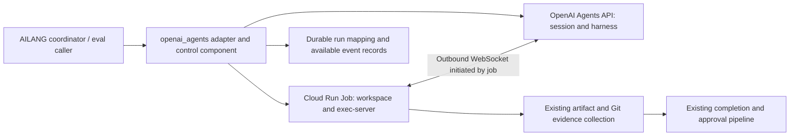

# M-OPENAI-AGENTS-API-EXECUTOR: Managed Codex Harness with Our Cloud Run Containers

**Status**: Planned — awaiting user design approval; implementation not authorized
**Target**: Unassigned release after v0.38.4; opt-in pilot first
**Priority**: P1 (proposed)
**Estimated**: 8–12 engineering days including beta investigation and integration tests; sprint planning must refine this
**Dependencies**: Existing executor factory, Cloud Run dispatch and completion pipeline; OpenAI Agents API project access; restricted environment key; coordinated changes in `ailang-multivac`
**Created / updated**: 2026-09-12

## Problem Statement

AILANG can dispatch coding work through several harnesses. Its current Codex adapter launches a local `codex exec --json` process. OpenAI's new Agents API offers a managed Codex harness with a separately hosted execution environment [S1, S2]. We want to evaluate that backend while retaining our container images, compiler/toolchain, task routing, acceptance checks, and approval decisions.

The integration opportunity is architectural, not a demonstrated performance improvement. Research to date consists of official documentation and repository code inspection; this proposal has not made a live API call or attached a Cloud Run container. Account access, compatibility, model fidelity, cancellation behavior, and operational economics remain pilot questions.

A thin HTTP adapter alone is insufficient: API sessions, Cloud Run executions, workspace state, and completion evidence have different lifetimes. Treating a completed model turn as completed repository work would bypass the evidence our coordinator expects.

## Goals

**Primary goal:** Run a bounded AILANG coding task using an OpenAI-managed harness and an AILANG-owned Cloud Run Job, producing the same reviewable completion evidence as existing executors.

Success metrics:

1. One task attempt maps to one session/environment and at most one active job under repeated dispatch and restart tests.
2. Every pilot task produces a classified outcome, session linkage, saved available events, and either verified artifacts or an explicit failure.
3. Cancellation and cleanup are measured; all pilot jobs stop within the configured task deadline plus a proposed 60-second cleanup allowance.
4. At least 10 matched tasks, repeated twice per backend, compare existing Codex and the new backend on correctness, latency, cost completeness, and recovery.
5. Missing accounting or unavailable capabilities are visible and never interpreted as a successful zero-cost or fully controlled run.

## High-Impact Decisions

| Decision | Why high impact | Chosen by | Deadline | Change cost |
|---|---|---|---|---|
| Separate opt-in `openai_agents` backend; existing defaults retained | Keeps comparisons and rollback attributable | human | design | high |
| AILANG owns lifecycle through application-managed Cloud Run Jobs | Avoids two independent controllers starting compute | human | design | high |
| Session-control credentials reside outside the agent environment | Defines the trust boundary and requires a control/worker split | human | design | high |
| Pilot has one active turn, subagents disabled, no automatic replay after ambiguous interruption | Bounds concurrent work and duplicate side effects | human | design | med |
| Usage remains provisional/unknown; exact dollar caps are not advertised | Affects scheduling and financial interpretation | human | design | high |
| Module decomposition and Go SDK versus direct HTTP | Local implementation choice after API contract probes | agent | compile | med |

### Design Freeze

The following are proposed decisions, not approvals inferred from requesting this document:

- [ ] Approve a separate opt-in backend and application-managed Cloud Run architecture.
- [ ] Approve the credential boundary and controller/worker protocol below.
- [ ] Approve provisional accounting and exclusion from jobs requiring a proven exact spend cap.
- [ ] Select dev project, API service account, supported model, pilot spend allowance, and task timeout before live trials.
- [ ] Approve pilot-only scope: one active turn, no subagents, no automatic retry of ambiguous execution, no production-default change.

## Solution Design

### Architecture

OpenAI operates the harness. AILANG operates the control application, job lifecycle, and execution environment [S2]. Add an executor package implementing the existing `executor.Executor` contract, backed by an AILANG control component. The control component owns the broader OpenAI credential; the Cloud Run worker owns only an environment connection credential.

The control component is a narrow service/module, not a second mission scheduler. It stores provider state and mediates session operations for trusted callers. The coordinator remains authoritative for work authorization, budgets, retries, and approval routing. The agent prompt cannot choose these policies.

**Important implementation consequence:** the general cloud wrapper currently performs work and publishes completion inside the job. Preserve that path for workspace preparation, evidence collection, and finalization, but give the new adapter an attach mode that uses the control component instead of an OpenAI application key. Do not solve this by placing the application key in a sibling process inside the same agent-accessible container.

### Proposed control/worker protocol

These operations are AILANG-internal design concepts, not claims about existing OpenAI endpoints:

1. A trusted coordinator/eval caller validates the task and reserves a durable run record keyed by task ID and attempt. Record the exact resolved model, image digest, prompt/config digest, timeout, and policy.
2. The control component creates a self-hosted session without submitting work, records the returned identifiers, and dispatches the job through existing Cloud Run infrastructure.
3. The job prepares its repository at a recorded commit and reports readiness through an authenticated, attempt-bound channel. For local evaluation, the caller prepares a container with the benchmark workspace through the same ownership split.
4. The worker starts `codex exec-server` with the returned environment ID and remote URL. After readiness and connection are verified, the control component submits the frozen task input once.
5. The adapter streams normalized progress through the existing event handler. It also saves available raw events with redaction and stable identifiers for reconciliation.
6. On terminal outcome, the worker stops further agent execution before inspecting files. Existing Git/artifact collection verifies the actual workspace and supplies completion evidence; model text is not that evidence.
7. The control component reconciles session and job outcome, cancels residual work when needed, and records cleanup. Existing finalization owns approval/handoff effects.

Control API authorization must bind worker identity to its assigned task and attempt. A worker can attach, read its progress, report readiness, and request cancellation for that assignment. It cannot select another model, submit arbitrary new tasks, approve work, or access other sessions. The assignment mapping is trusted server-side state, not a worker-supplied authorization claim.

### Durable state and retry policy

Proposed provider run states: `reserved`, `session_created`, `job_starting`, `connected`, `running`, `collecting`, `terminal`, plus explicit `outcome_unknown` and cleanup status. These are provider lifecycle states; do not replace coordinator task statuses.

Persist task/attempt ID, session/environment IDs, remote connection reference, job execution identity, resolved model, input submission state, last observed event position where supported, outcome, and cleanup status. Treat the connection URL as sensitive operational data and keep it out of public logs.

Use conditional store transitions to give one controller ownership. A crash between remote creation and local persistence creates an ambiguity: use provider-supported lookup/idempotency only after validating its actual contract. If the API cannot reconcile an uncertain create or submission, mark it unknown and stop automatic retries. Do not promise exactly-once remote submission across this boundary.

A disconnect is not evidence that a command never ran. Preserve artifacts and classify uncertainty before any new attempt. A fresh task attempt gets a fresh environment; same-session continuation is supported only while the original verified workspace remains available. The pilot does not restore a destroyed workspace merely by reusing a session ID. The lifecycle documentation requires application-owned files and cleanup and describes interrupted-command recovery limits [S4].

The control component must reconcile jobs after its own restart and after worker termination. Existing wrapper completion is preferred; an orphan/failure reconciler can report infrastructure failure when the worker cannot, through the existing idempotent finalization entry point. It must not fabricate Git evidence or overwrite a terminal decision.

### Container and credentials

Build a dedicated image variant, proposed `openai-agents`, declaring provider `openai_agents`. Include the verified exec-server version, AILANG, Git, and task-required tooling; add a Go variant only if the selected pilot needs it. Pin the tested CLI build and image digest rather than installing an unbounded moving alpha at runtime.

The documented self-hosted connection is outbound to the registration API and command WebSocket host. An environment key is restricted to connection operations and must match the session owner/project [S3]. Inject it using Secret Manager. Keep the broader API key in the control service. Audit inherited environment variables, home directories, mounts, and metadata-server IAM permissions: separating API keys alone does not constrain a broadly privileged worker service account.

For the pilot, use task-scoped read access to source and a separate trusted publication step or the existing approved publication boundary after verifying its permissions. No production deployment authority belongs in the pilot sandbox. Hosting compute on GCP does not mean prompt/tool-result data stays on GCP; the harness receives data needed for model execution.

### Executor contract mapping

| AILANG input/output | Proposed mapping and limitation |
|---|---|
| `Task.Model` | Explicit API model resolved from registry; save requested and provider-confirmed identity separately |
| `Directive`, `SystemPrompt` | Input and agent instructions; validate persistence semantics before claiming equivalence |
| `Workspace` | Worker directory prepared before submission; verify resulting files at that location |
| `Timeout`, idle/prefill timeouts | Separate startup, running, and cleanup deadlines; connection heartbeats do not count as useful model/tool progress |
| `ResumeSessionID` | Validate assignment and original workspace continuity; otherwise return an explicit unsupported/unavailable result |
| `AllowedTools`, MCP, plugins | Validate each requested surface; reject unsupported restrictions/configuration rather than silently discard it |
| `Result.SessionID` | Provider session ID; attempt/job linkage retained separately |
| `Result.Output`, transcript | Available API items/events; label completeness and retain unknown event types |
| `FinishReason` | Normalize actual outcome; timeout/cancellation/error outranks an earlier clean turn event |
| `Result.Success` | Executor turn result; repository acceptance remains independently checked by completion pipeline |
| Tokens/cost | Provisional/unknown accounting metadata, never inferred zero consumption |

Advertise only capabilities proven by the pilot. In particular, do not advertise approval-flow or per-edit hook equivalence from product naming. Compiler verification after execution is required; interactive compiler feedback through hooks is future work unless independently demonstrated.

### Accounting and Observatory

The public beta exposes events and best-effort session/turn usage, while detailed trace retrieval/export is not a supported public API. Missing usage can arrive later; reported values are not a final bill [S5].

Introduce optional accounting metadata through the result, completion payload, persistence, and consumers: `unknown`, `provisional`, or `reconciled_estimate`, with collection time and source. Existing numeric fields may retain zero as their serialization default, but this backend's unknown status must prevent displays/aggregates from treating it as measured zero. Do not globally reinterpret historical zero-cost local-model results.

Preserve available events in artifacts and correlate AILANG task/attempt/session/job IDs in Observatory. Label transcript completeness; do not synthesize inaccessible provider traces. Usage reconciliation updates estimates idempotently and does not retrigger completion or approvals.

Use a wall-clock limit and cancellation as the pilot's operational bound. Observed spend can trigger best-effort cancellation but is not an exact dollar guarantee. Report model estimates, tool charges when known, and GCP compute separately. A required exact cap or required full trace export makes the task ineligible for this backend until those guarantees can be demonstrated.

### Cancellation and completion

The API documents cancellation of the active turn [S6]. The controller must invoke it on user cancellation or deadline, observe the outcome, stop the execution server/job as needed, and persist whether provider cancellation was confirmed. Worker process exit alone is not proof that remote model work stopped.

Collect evidence before destroying the workspace when possible. A timeout may retain useful artifacts but remains a timeout. An expected-change task with no verified diff must retain the current no-changes behavior. API session deletion and job termination are separate cleanup actions [S4]. Session retention follows a configured policy so review/debugging can precede deletion.

## Examples

**Before:** a task routed to `codex` runs the harness and tools in the Cloud Run Job through `codex exec --json`.

**After (proposed):** the same frozen task routed to `openai_agents` creates a managed session; our job runs its shell/file tools through exec-server. The returned commit evidence, test results, and approval card are still produced through AILANG's completion path.

**Interrupted task:** the job terminates after editing a file but before reporting completion. The controller records interruption, attempts cancellation, and preserves any independently available artifacts. It does not resubmit the original input automatically or mark the task successful from a final message alone.

**Missing usage:** a successful verified task has `accounting_status=unknown`. Its artifact remains reviewable, while the comparison report marks cost unavailable until reconciliation. It cannot win a cost comparison by appearing free.

## Implementation Plan and Timeline

This is sequencing for design review, not an approved sprint plan.

1. **Contract probes and fixtures (2 days):** verify account/model access, restricted key, outbound attachment, event shapes, cancellation, instruction/tool controls, and accounting. Capture redacted fixtures. If a required control fails, revise the design before integration.
2. **Adapter and lifecycle control (3–4 days):** implement registration, controller/worker authorization, durable mapping, attach mode, event normalization, deadlines, uncertainty handling, and restart reconciliation.
3. **Cloud and accounting integration (2–3 days):** image/dispatch/preflight wiring, completion evidence, metadata propagation, artifact handling, deployment manifests, and documentation.
4. **Pilot and evaluation (1–3 days):** run matched tasks and fault cases, publish a comparison artifact, and request a production-routing decision.

Total: approximately 8–12 engineering days across 2–3 calendar weeks. Beta availability can extend elapsed time. A failed probe is a useful recorded result, not grounds for silently reducing acceptance criteria.

### Files to Modify/Create

Estimates are planning ranges, not implementation requirements. Existing paths below were inspected or identified from the executor contract; external-repository paths require pre-sprint verification.

| Surface | Expected work | Estimated LOC |
|---|---|---:|
| New `internal/executor/openai_agents/` | Adapter, API client/attach transport, event parser, fixtures/tests, README | 900–1,400 |
| New `internal/dispatch/openai_agents/` | Control/lifecycle composition around existing cloud dispatch | 500–900 |
| `internal/executor/factory.go`, `executor.go` | Config and optional accounting/capability metadata | 50–120 |
| `internal/coordinator/provider_executor.go`, `cloud_dispatcher.go` | Registration and trusted assignment propagation | 50–100 |
| `internal/coordinator/` store implementations and HTTP routing | Durable run mapping, authenticated control operations, reconciliation | 400–700 |
| `internal/dispatch/cloudrun/dispatcher.go` and provider audit tables | Variant agreement and assignment parameters | 50–100 |
| `cmd/ailang/coordinator_cloud*.go` and executor preflight | Worker attach, startup/termination, evidence preservation | 150–250 |
| `internal/pubsub/`, completion storage and Observatory/eval consumers | Preserve accounting validity through end-to-end reporting | 150–300 |
| `internal/eval_harness/models.yml` | Distinct pilot entry preserving same API model identity | 15–30 |
| New `docker/Dockerfile.agent-openai-agents` and optional Go variant | Pinned executor environment | 20–60 |
| `cloudbuild-dev.yaml`, `cloudbuild-release.yaml` | Build and roll variant consistently | 60–120 |
| `ailang-multivac` image pipeline, Terraform jobs/IAM/secrets, release job map | Dedicated worker/control deployment and access boundary | 150–300 |
| Executor shape/harness setup docs | Configuration, limitations, pilot runbook | 150–250 |

Split packages into small cohesive files. Do not put lifecycle orchestration into compiler/runtime packages. Reuse existing finalization and cloud dispatcher interfaces rather than duplicating their decision logic.

## Testing Strategy and Success Criteria

- [ ] Redacted API contract fixtures cover normal output, tool errors, unknown events, missing/late usage, and cancellation.
- [ ] Repeated dispatch, concurrent callers, and controller restarts leave at most one active environment per attempt; ambiguous external creation is surfaced.
- [ ] Negative authorization tests reject another task's IDs and altered model/input; sandbox cannot access the application API key.
- [ ] Live container can prepare workspace, connect outbound, execute compiler/tests, and return real artifact/Git evidence.
- [ ] Fault injection covers startup failure, mid-command disconnect, killed worker, expired deadline, cancelled turn, and lost completion delivery.
- [ ] Cleanup and remote cancellation confirmation are recorded independently; no pilot job survives deadline plus cleanup allowance.
- [ ] Result/stream/completion accounting retains unknown versus measured-zero semantics, including aggregation and display.
- [ ] Capability validation rejects each unsupported required tool/approval/trace/spend guarantee before dispatch.
- [ ] Existing Codex and managed_agents behavior remains covered by their regression suites.
- [ ] All tests passing: focused executor/dispatch/coordinator/CLI tests, then required `make test`, `make lint`, and `make check-boundaries` checks for implementation.
- [ ] Documentation updated, configuration examples added, and a reproducible pilot report produced.
- [ ] Ten matched tasks × two repetitions × two backends bank correctness, latency, accounting completeness, and available trace coverage.

Record identical model, source commit, teaching prompt, toolchain, timeout, and subagent setting across pairs. Save harness version/digest where available; explicitly mark any provider-managed version that cannot be pinned. Report failed attempts as well as successes. Proposed promotion criteria: all lifecycle/security acceptance cases pass and pilot success count is no worse than baseline; cost/latency tradeoffs and incomplete accounting require an explicit operator decision. This small sample is screening evidence, not a claim of statistical superiority.

## Conflict Surface

Language parser/typechecker/codegen conflict analysis is not applicable: this design changes executor and deployment plumbing, not language semantics. The operational shared surfaces are material: factory discovery, capability validation, provider/image agreement, retry ownership, timeout precedence, accounting aggregation, and completion finalization. Their existing behavior must remain intact for other backends. In particular, API success cannot bypass Git evidence or automatically approve an artifact.

## Deferred Decisions

- Go SDK versus direct HTTP and event-parser file layout — implementer after contract probes.
- Event artifact chunking/redaction implementation — implementer, preserving stable IDs and completeness labels.
- Exact pilot task selection — sprint planner, freeze before measuring both backends.
- Session retention period and alert thresholds — operator before deployment.
- Release version and production routing — operator after pilot evidence.

## Non-Goals

- Replacing motoko, Pi, existing Codex, or AILANG's mission coordinator.
- Changing AILANG syntax, effects, evaluator, or compiler semantics.
- Automatic production promotion, approvals, or merging.
- Multi-agent execution, webhook provisioning, or workspace snapshot restoration in the pilot.
- Claiming hook parity, exact spend enforcement, full trace export, or deterministic model replay without evidence.
- OpenAI-hosted sandbox support in this first integration.

## Risks and Mitigations

| Risk | Impact | Mitigation |
|---|---|---|
| Beta API or executor version drift | High | Pin tested client/image; keep contract fixtures and repeat startup/cancel probes before rollout |
| Crash between remote action and local persistence | High | Durable assignment, reconciliation, explicit unknown outcome; prohibit blind replay |
| Privileged worker credentials exposed to generated code | High | Separate controller, task-bound API, least-privilege IAM and secret/mount audit |
| Usage appears after task completion | High | Provisional accounting, reconciliation, exclude exact-cap workloads |
| Loss of detailed provider traces | Medium | Preserve available events and label gaps; keep existing backend for full-observability requirements |
| Managed harness cannot express required extension/tool restrictions | High | Fail capability probes and retain alternative executor; no silent downgrade |

## Axiom Compliance

Reference: [Design Axioms](../../docs/docs/references/axioms.mdx). Scores describe the proposed bounded integration relative to the existing executor contract; they do not assert that remote inference is deterministic.

| Axiom | Score | Justification |
|---|---:|---|
| A1: Determinism | 0 | Language semantics unchanged; remote inference remains explicit external work |
| A2: Replayability | -1 | Provider trace/version limits reduce reproducibility; available events and frozen inputs only partially mitigate |
| A3: Effect Legibility | 0 | External session, compute, and publication boundaries are declared |
| A4: Explicit Authority | +1 | Controller key separation and task-bound worker operations constrain authority |
| A5: Bounded Verification | +1 | Compiler/test/evidence checks gate completion independently of model text |
| A6: Safe Concurrency | 0 | New lifecycle races require conditional ownership; pilot serializes active work |
| A7: Machines First | +1 | Typed outcomes and explicit uncertainty feed existing machine consumers |
| A8: Minimal Syntax | 0 | No language syntax change |
| A9: Cost Visibility | -1 | Best-effort accounting cannot guarantee timely complete costs |
| A10: Composability | +1 | Implements existing executor and dispatch contracts |
| A11: Structured Failure | +1 | Connection, execution, accounting, and cleanup failures remain distinguishable |
| A12: System Boundary | +1 | Harness, control service, and sandbox responsibilities are explicit |

**Net score: +4.** Suitable for design review with the stated limits, not an implementation approval.

Hard-violation design checks:

- [x] A1: No implicit nondeterminism added to language execution.
- [x] A3: External operations remain explicit integration effects.
- [x] A4: No additional ambient authority is intended; negative credential/IAM tests are acceptance gates.
- [x] A7: Structured machine consumption is retained; inaccessible data is labeled rather than invented.

## Verification Log

All entries dated 2026-09-12. Documentation verification is distinct from live validation.

| ID | Premise and evidence | Result |
|---|---|---|
| V1 | Read `internal/executor/executor.go` and `factory.go` | Execute/stream/capabilities/session/result extension points exist |
| V2 | Read `internal/executor/codex/codex.go` | Existing path builds subprocess command using `codex exec` and parses output |
| V3 | Read `internal/dispatch/cloudrun/dispatcher.go` and `internal/coordinator/cloud_dispatcher.go` | Job variant/provider validation and dispatch parameters are explicit; adding adapter alone is insufficient |
| V4 | Read `cmd/ailang/coordinator_cloud.go` and `internal/coordinator/task_finalize_cloud_strategy.go` | Worker collects artifacts/completion metrics; diff source requires commit evidence |
| V5 | Read `internal/executor/managed_agents/README.md` | Remote API adapter precedent and documented accounting/control limitations; these are Google-specific evidence, not OpenAI behavior |
| V6 | Read official self-hosted docs [S3] | Container exec-server and outbound connection documented; our Cloud Run attachment remains untested |
| V7 | Read lifecycle docs [S4] | Files/compute cleanup remain application-owned; session ID is not workspace restoration |
| V8 | Read usage docs [S5] | Public detailed-trace export absent in beta; usage can be null/revised |
| V9 | Read session docs [S6] | Active-turn cancellation documented; timing/effect must be measured |
| V10 | Duplicate search: `ailang docs search --neural --timeout 5s --limit 3 'openai agents executor'` plus scaffold search | Neural output explicitly used `fallback-simhash`, with zero embeddings. Scores are not neural thresholds; irrelevant hits do not establish coverage |
| V11 | `rg` across planned/implemented docs for Agents API, exec-server, OpenAI agents, and self-hosted; read relevant executor-variant, Vertex migration, Gemini model-eval, completion docs | No OpenAI exec-server integration found in this scoped search; adjacent documents cover distinct components |
| V12 | Read `docs/internal/EXECUTOR_SHAPE.md` and `docker/Dockerfile.agent-codex` | Build/release/job-map touchpoints identified; external multivac files need pre-sprint inspection |
| V13 | Read `std/VERSION` | v0.38.4; target release deliberately unassigned |

No `.ail` programs were written and no new language-support claims are made. No live API performance, hook parity, budget guarantee, or Cloud Run recovery claim is marked verified.

## Related Documents

- [Program](../PROGRAM.md): preserve the self-specializing harness strategy; this backend supplies a comparison and execution option.
- [Executor shape](../../docs/internal/EXECUTOR_SHAPE.md): common interface and cloud deployment conventions.
- [Executor variants](../implemented/v0_15_0/m-executor-variants.md): image selection infrastructure; does not implement managed OpenAI sessions.
- [Vertex Managed Agents migration](../implemented/v0_22_0/m-antigravity-cli-migration.md): remote adapter precedent for a different provider and sandbox model.
- [Managed Agents model evaluation](v0_31_0/m-managed-agents-model-eval.md): Gemini model-selection work; distinct from this OpenAI integration.
- [Completion path parity](m-completion-path-parity.md): existing evidence/finalization contract to preserve, not reimplement.

## References

Official sources retrieved during the investigation on 2026-09-12; revalidate beta details before implementation.

- **S1:** [Introducing the Agents API](https://openai.com/index/introducing-the-agents-api/) — announcement and pricing model.
- **S2:** [Architecture](https://developers.openai.com/api/docs/guides/agents-api/architecture) — harness/application/environment split.
- **S3:** [Self-hosted sandboxes](https://developers.openai.com/api/docs/guides/agents-api/environments/self-hosted) — connection and credential contract.
- **S4:** [Sandbox lifecycle](https://developers.openai.com/api/docs/guides/agents-api/environments/lifecycle) — provisioning, interruption, and cleanup.
- **S5:** [Observability and usage](https://developers.openai.com/api/docs/guides/agents-api/observability) — event/trace/accounting limits.
- **S6:** [Run and continue sessions](https://developers.openai.com/api/docs/guides/agents-api/sessions) — input and cancellation.
- [Cloud Run task timeout](https://docs.cloud.google.com/run/docs/configuring/task-timeout) — platform job duration limits; pilot should choose a substantially smaller bound.

## Future Work

After pilot review: bounded subagents with combined accounting; workspace checkpoint/restore; verified per-edit compiler feedback; optional webhook lifecycle; additional environment backends. Each requires evidence and a scoped follow-up design rather than silently expanding this pilot.
