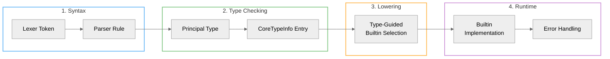

# Adding/Extending Operators in AILANG

This checklist gets you from syntax → types → lowering → runtime with type-guided determinism.



## 0) Decide: Monomorphic vs Polymorphic

- **Monomorphic** (e.g., integer `**`): one builtin.
- **Polymorphic** (e.g., `++` for String/List): one operator, multiple builtins chosen by type head.

## 1) Parser / Tokens (if new symbol)

- `internal/lexer/token.go`: add token (if needed).
- `internal/parser/parser_expr.go`: parse to the Surface AST node.

(Skip if reusing an existing token like `++`.)

## 2) Typechecking

- `internal/types/typechecker_operators.go`:
  - Specify principal type(s).
  - Emit constraints if needed (usually not; we use type heads).
  - Ensure CoreTypeInfo is populated for the resulting Core node.

## 3) CoreTypeInfo

- Confirm your operator expression gets a NodeID and an entry in CoreTypeInfo.
- If you create synthetic nodes post-inference, either (a) reuse an existing NodeID or (b) annotate and store types for them too.

## 4) Lowering (Type-Guided)

- `internal/pipeline/op_lowering.go`:
  - Use `lowerer.CoreTI[nodeID]` and `types.Head()` to pick builtin name.
  - Do **not** branch on ANF shape unless CoreTI is missing.

**Example (polymorphic `++`):**

```go
switch types.Head(lowerer.CoreTI[leftID]) {
case types.HeadList:
    call("_list_concat", left, right)
case types.HeadString:
    call("_str_concat", left, right)
default:
    panic("++ unsupported for type " + types.Pretty(lowerer.CoreTI[leftID]))
}
```

## 5) Builtins

- `internal/builtins/*.go`:
  - Register one builtin per concrete case (`concat_String`, `concat_List`, …).
  - Type via the builder DSL.
  - Write pure, defensive implementations (return helpful errors on mismatch).

## 6) Runtime Errors

- Use `internal/eval/builtin_errors.go` helpers:
  - `ArgTypeMismatch(name, expected, got, hint)`
- Avoid panics; return actionable messages.

## 7) Tests

- **Typechecker**: operator's principal types unify as expected.
- **Lowering**: given CoreTI, selects the correct builtin.
- **Runtime**: correct behavior + mismatch errors.
- **End-to-end**: small example program runs.

## 8) Docs

- Add a short note in [ANF Architecture](./anf) if the operator has unusual ANF implications.
- Update examples and the teaching prompt if user-facing.

## Pitfalls & Remedies

- **Args are Vars**: Use `core.ResolveValue` only if CoreTI is missing.
- **Wrong builtin at runtime**: Check CoreTI threading; run `ailang debug ast --show-types`.
- **Ambiguous types**: Ensure typechecker chooses a principal type (avoid unconstrained polymorphism at lowering sites).

## Example: Adding `**` (power) for Int and Float

- **Types**:
  - `int ** int -> int`
  - `float ** float -> float`
- **Builtins**: `_int_pow`, `_float_pow`
- **Lowering**: choose by `types.HeadInt` / `types.HeadFloat`.

## See Also

- [ANF Architecture Guide](./anf) - Understanding A-Normal Form
- [Type System](./types) - Type inference and CoreTypeInfo
- `internal/builtins/README.md` - Builtin registration guide
