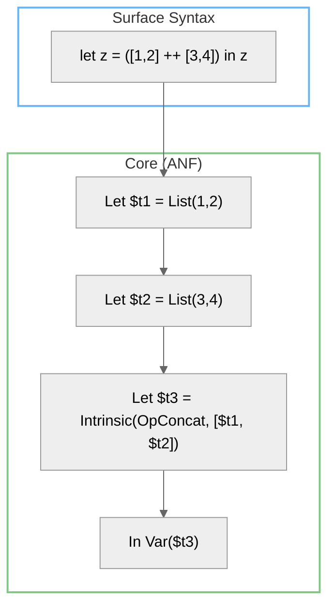

# Administrative Normal Form (ANF) in AILANG

## Why ANF?

ANF makes evaluation and lowering explicit and predictable: every non-trivial expression is bound to a name before it's used. This gives us simple sequencing, easy instrumentation, and type-guided lowering with no guesswork.

## TL;DR

- Complex sub-expressions are lifted into let bindings.
- Operator applications become intrinsics with explicit args.
- ANF is the only form seen by the typechecker and lowerer.
- Pair ANF with CoreTypeInfo for type-guided operator selection.

## From Surface → ANF (Core)



**Surface:**

```ailang
let z = ([1,2] ++ [3,4]) in z
```

**Core (ANF), conceptual:**

```
Let $t1 = List(1,2)
Let $t2 = List(3,4)
Let $t3 = Intrinsic(OpConcat, [$t1, $t2])
In  Var($t3)
```

## Reading ANF

- **Let**: `Let name = value in body`.
- **Intrinsic**: a primitive operation (`OpConcat`, `OpAdd`, …).
- **Var**: usage site of a previously bound value.
- **NodeID**: stable integer identity; keys into CoreTypeInfo.

## Type Information: CoreTypeInfo

- Produced during Core type inference.
- Map: `NodeID -> types.Type`.
- Threaded into the lowering pass; authoritative for decisions.

**Use CoreTypeInfo first.** Fall back to ANF shape only when types are unavailable (e.g., synthetic nodes created after inference).

## Common Patterns

### Binding chains

```
Let a = Var b
Let b = Var c
Let c = List(1)
```

Use `core.ResolveValue(expr, binds)` to chase once; it cycle-detects.

### Polymorphic operators

Lowering chooses builtin by type head (String/List/Int/etc.), not by shape.

## Debugging ANF & Types

```bash
$ ailang debug ast myfile.ail --show-types
=== Core AST (ANF) ===
...
[#11] Intrinsic(OpConcat)
 Arg[0]: Var(xs)  :: List[int]
 Arg[1]: Var(ys)  :: List[int]
 Result         :: List[int]
```

## Gotchas

- **ANF means intrinsic args are usually Vars.** Resolve via bindings if you must inspect shapes.
- **Keep AST nodes alive through lowering;** CoreTypeInfo keys by NodeID.
- **If runtime says "wrong builtin selected",** verify CoreTypeInfo reached the lowerer.

## See Also

- [Adding Operators Guide](./adding-operators) - Step-by-step operator implementation
- `internal/core/helpers.go` - ANF traversal utilities
- `internal/types/typeinfo.go` - CoreTypeInfo implementation
- `cmd/ailang/debug.go` - Debug CLI implementation
