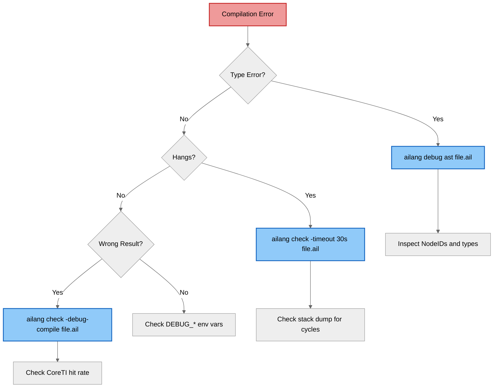

import CodeBlock from '@theme/CodeBlock';
import AnfExample from '!!raw-loader!@site/../examples/debug/anf_example.ail';
import ListConcatExample from '!!raw-loader!@site/../examples/debug/list_concat.ail';

# Debug Tools

AILANG provides several CLI tools for understanding the compilation pipeline and diagnosing issues.

## Quick Reference

| Command | Purpose |
|---------|---------|
| `ailang debug ast <file>` | Show Core AST (ANF) structure |
| `ailang check -debug-compile <file>` | Show compilation phase timing and lowering telemetry |
| `ailang check -timeout 30s <file>` | Detect compilation hangs with stack dump |
| `ailang builtins list` | List all 128 registered builtins |
| `ailang docs <module>` | Show stdlib module documentation |

## Debug AST

The `ailang debug ast` command shows the Core AST after ANF transformation.

### Example Source

<CodeBlock language="ailang" title="examples/debug/anf_example.ail">
  {AnfExample}
</CodeBlock>

### Running the Command

```bash
ailang debug ast examples/debug/anf_example.ail
```

### Output

```
=== Core AST (ANF) ===
Program:
  [0] Let(add) [#16]:
    Value: Lambda([x]) [#5]:
      Body: Lambda([y]) [#4]:
        Body: Intrinsic(0) [#3]:
          Arg[0]: Var(x) [#1]
          Arg[1]: Var(y) [#2]
    Body:  Let($tmp1) [#15]:
      Value: App [#8]:
        Func: Var(add) [#6]
        Arg[0]: Lit(1) [#7]
      Body:  Let(result) [#14]:
        Value: App [#11]:
          Func: Var($tmp1) [#10]
          Arg[0]: Lit(2) [#9]
        Body:  Var(result) [#13]
```

### Reading the Output

- **`[#N]`** - NodeID (keys into CoreTypeInfo)
- **`Let(name)`** - Variable binding in ANF
- **`Lambda([params])`** - Function with parameter list
- **`Intrinsic(0)`** - Primitive operation (0 = OpAdd)
- **`App`** - Function application
- **`Var(name)`** - Variable reference
- **`Lit(value)`** - Literal value

## Debug Compile

The `-debug-compile` flag shows compilation phase timing and lowering decisions.

### Example Source

<CodeBlock language="ailang" title="examples/debug/list_concat.ail">
  {ListConcatExample}
</CodeBlock>

### Running the Command

```bash
ailang check -debug-compile examples/debug/list_concat.ail
```

### Output

```
→ Type checking examples/debug/list_concat.ail...
→ Effect checking...
[DEBUG] Dictionary elaboration complete for module examples/debug/list_concat
[DEBUG] Monomorphization: 0 specializations, 0 skipped
[DEBUG] Var type resolution complete
[DEBUG M-DX4] NodeID 11: type=[α9], head=List
[DEBUG] Lowering telemetry: 1 operators processed
[DEBUG]   CoreTI hits: 1 (100.0%)
[DEBUG]   CoreTI misses: 0 (0.0%)

⏱ Compilation Phase Timings:
  Loading:                0ms
  Topo Sort:              0ms
  Compile:                4ms
  Evaluate:               0ms
  ----------------------------
  Total:                  4ms

✓ No errors found!
```

### What to Look For

- **CoreTI hits**: Percentage of operators resolved via CoreTypeInfo (should be 100%)
- **CoreTI misses**: Operators that fell back to other resolution (indicates potential issues)
- **Monomorphization stats**: Number of polymorphic function specializations
- **Phase timings**: Where time is spent during compilation

## Timeout Detection

For compilation hangs (often caused by cyclic types), use the timeout flag:

```bash
ailang check -timeout 30s problematic_file.ail
```

If the timeout triggers, you'll get a stack dump showing where the compiler is stuck.

## Builtin Exploration

### List All Builtins

```bash
ailang builtins list
```

Shows all 128 registered builtins with their effect categories and modules.

### Filter by Module

```bash
ailang builtins list --by-module
```

Groups builtins by their source module (std/io, std/fs, etc.).

### Filter by Effect

```bash
ailang builtins list --by-effect
```

Groups builtins by their effect requirements (pure, io, fs, etc.).

## Stdlib Documentation

### List Available Modules

```bash
ailang docs --list
```

### View Module Exports

```bash
ailang docs std/io
```

Output:
```
# std/io
Print to stdout and read from stdin.

## Exports

  print(s: string) -> () !
    Print string without newline

  println(s: string) -> () !
    Print string with newline

  readLine() -> string !
    Read line from stdin

## Usage

  import std/io (print)
  -- or --
  import std/io as Io
```

## Environment Variables

Debug environment variables for detailed tracing:

| Variable | Purpose |
|----------|---------|
| `DEBUG_STRICT=1` | Fail loudly on unhandled cases |
| `DEBUG_MONO_VERBOSE=1` | Monomorphization tracing |
| `DEBUG_OPERATOR_LOWERING=1` | Operator resolution details |
| `DEBUG_PARSER=1` | Token position tracing |
| `DEBUG_CODEGEN=1` | Record type fallback warnings |

### Example Usage

```bash
DEBUG_STRICT=1 DEBUG_MONO_VERBOSE=1 ailang run examples/factorial.ail
```

## Troubleshooting Workflow



## See Also

- [ANF Architecture](./anf) - Understanding the Core AST structure
- [Type System](./types) - CoreTypeInfo and type inference
- [Debugging Guide](/docs/guides/debugging) - General debugging tips
