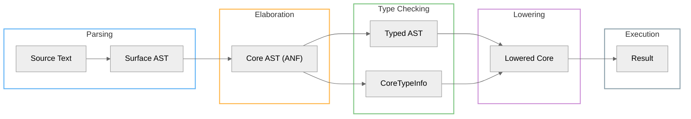

# AILANG Architecture

This section documents the internal architecture of AILANG for contributors and those who want to understand how the language works.

## Core Concepts

### [Type System](/docs/architecture/types)

AILANG uses a Hindley-Milner type system with row polymorphism and effect tracking. Learn about:

- Type inference pipeline (Surface AST → Core → Types → Evaluation)
- CoreTypeInfo: type storage and validation
- Row polymorphism for records and effects
- Dictionary passing for type classes

### [A-Normal Form (ANF)](/docs/architecture/anf)

All AILANG code is transformed to A-Normal Form before type checking and evaluation:

- Every non-trivial expression bound to a name
- Explicit sequencing
- Easy instrumentation and type-guided lowering

### [Adding Operators](/docs/architecture/adding-operators)

Step-by-step guide for implementing new operators:

- Parser and token definitions
- Type checking rules
- Type-guided lowering
- Builtin registration

### [Debug Tools](/docs/architecture/debug-tools)

CLI tools for understanding the compilation pipeline:

- `ailang debug ast` - Inspect Core AST (ANF)
- `ailang check -debug-compile` - Compilation telemetry
- `ailang builtins list` - Explore 128 registered builtins
- `ailang docs` - Stdlib documentation

## Compilation Pipeline

### Key Phases

1. **Parsing**: Source text → Surface AST
2. **Elaboration**: Surface AST → Core AST (ANF normalization)
3. **Type Inference**: Core AST → Typed AST + CoreTypeInfo
4. **Validation**: Verify CoreTypeInfo completeness
5. **Lowering**: Type-directed operator specialization
6. **Evaluation**: Execute lowered Core AST

## Implementation Files

| Component | Location | Description |
|-----------|----------|-------------|
| Lexer | `internal/lexer/` | Tokenization |
| Parser | `internal/parser/` | Surface AST construction |
| Elaboration | `internal/elaborate/` | Surface → Core |
| Type System | `internal/types/` | Type inference |
| Core AST | `internal/core/` | ANF representation |
| Pipeline | `internal/pipeline/` | Compilation orchestration |
| Evaluator | `internal/eval/` | Interpretation |
| Builtins | `internal/builtins/` | Built-in functions |
| Effects | `internal/effects/` | Effect runtime |

## Design Documents

For detailed design decisions and implementation history, see:

- [Design Docs (GitHub)](https://github.com/sunholo-data/ailang/tree/main/design_docs)
- [CHANGELOG](https://github.com/sunholo-data/ailang/blob/main/CHANGELOG.md)

## See Also

- [Development Guide](/docs/guides/development) - Contributing to the codebase
- [Development Workflow](/docs/guides/development-workflow) - Sprint planning and execution
- [Testing Guide](/docs/guides/testing) - Writing and running tests
- [Debugging Guide](/docs/guides/debugging) - Debug flags and troubleshooting
