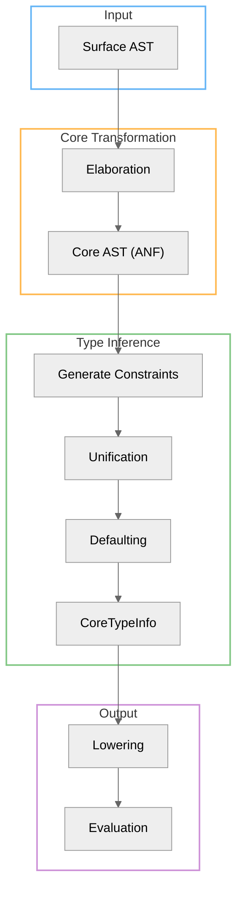
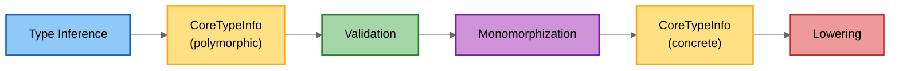

# Type System Architecture

AILANG uses a Hindley-Milner type system with row polymorphism and effect tracking.

## Type Inference Pipeline



### Key Phases

1. **Parsing**: Surface syntax → Surface AST
2. **Elaboration**: Surface AST → Core AST (ANF normalization)
3. **Type Inference**: Core AST → Typed AST + CoreTypeInfo
4. **Validation**: Verify CoreTypeInfo completeness (M-DX4)
5. **Lowering**: Type-directed operator specialization
6. **Evaluation**: Execute lowered Core AST

## CoreTypeInfo: Type Information Storage

**Purpose**: Maps Core NodeIDs to their inferred types for use during lowering and later passes.

**Definition** (`internal/types/typeinfo.go`):
```go
// CoreTypeInfo maps Core expression NodeIDs to their inferred types
type CoreTypeInfo map[uint64]Type
```

**Population**: During type inference, every Core expression gets an entry:
```go
// After successful type inference (internal/types/typechecker_core.go:442)
tc.CoreTI.Set(expr.ID(), inferredType)

// After defaulting (lines 207-210, 340-342)
tc.CoreTI.ApplySubstitution(sub)  // Resolve type variables to concrete types
```

### CoreTypeInfo Invariant

**CRITICAL COMPILER INVARIANT**: Every Core node must have an entry in CoreTypeInfo before lowering.

**Enforcement**: Validation runs before lowering in all pipeline paths:
- File pipeline
- Module pipeline
- REPL

**Validator**: `internal/pipeline/validate_coretypeinfo.go`

The validator:
- Walks all Core node types (Var, Lit, Lambda, Let, LetRec, App, If, Match, BinOp, UnOp, Intrinsic, Record, List, Tuple, DictAbs, DictApp, etc.)
- Checks `CoreTypeInfo.Has(node.ID())` for every node
- Reports missing entries with: NodeID, ExprKind, Position, Hint
- Performance: O(n) linear, zero allocations

**Properties**:
- Presence required (every node must have a type)
- Polymorphic types accepted (type variables α, β, etc. are OK)
- Monomorphization-ready (validation checks presence, not concreteness)

**Error Example**:
```
CoreTypeInfo validation failed: missing type information for Core nodes

Missing Lit(Float) types (1 nodes):
  • NodeID 42 at line 5, col 12
    Hint: This usually means defaulting/substitution wasn't applied to CoreTI.

Debug with: ailang debug ast <file> --show-types --compact
```

## Type Checking Algorithm

### Constraint-Based Inference

AILANG uses Algorithm W (Hindley-Milner) with constraints:

1. **Generate constraints**: Walk Surface AST, emit equality constraints
2. **Unify**: Solve constraints to find principal types
3. **Defaulting**: Resolve ambiguous numeric types (Int/Float)
4. **Generalization**: Abstract free type variables to `forall` quantifiers
5. **Instantiation**: Specialize polymorphic types at use sites

### Row Polymorphism

Records and effects use row polymorphism for extensibility:

```ailang
type Person = { name: string, age: int | r }  -- Open row type
type Employee = { name: string, age: int, id: int }  -- Extends Person
```

Effect rows track side effects:

```ailang
readFile : string -> ! {IO | e} string
```

The effect row `{IO | e}` means:
- Requires `IO` capability
- May have additional effects `e` (polymorphic)

## Effect System

### Capability-Based Effects

Effects are tracked in function types and enforced at runtime:

```ailang
-- Pure function (no effects)
add : int -> int -> int

-- Effectful function (requires IO capability)
println : string -> ! {IO} unit
```

### Effect Checking

1. **Effect inference**: Infer effect rows during type checking
2. **Effect subsumption**: Check effect compatibility (subset relation)
3. **Capability checking**: Verify runtime capabilities at evaluation

See `internal/effects/` for effect runtime implementation.

## Type Classes (Builtin)

Current implementation has hardcoded type class instances (Num, Eq, Ord, Show).

**Planned**: Structural reflection for user-defined type classes.

### Dictionary Passing

Type class constraints are resolved via dictionary-passing transformation:

```ailang
-- Surface syntax
add : forall a. Num a => a -> a -> a

-- Core (after elaboration)
add : forall a. NumDict a -> a -> a -> a
```

Dictionaries are constructed during elaboration and passed explicitly in Core AST.

## Monomorphization

**Transformation**: Specialize polymorphic functions to concrete types before final codegen.



After monomorphization:
- All type variables resolved to concrete types
- Polymorphic functions duplicated per instantiation
- CoreTypeInfo updated with specialized types

The validator continues to work because it checks *presence*, not *concreteness*.

## Implementation Files

### Type System Core
- `internal/types/` - Type representations and inference
- `internal/types/typechecker_core.go` - Core AST type checker
- `internal/types/typeinfo.go` - CoreTypeInfo storage

### Validation
- `internal/pipeline/validate_coretypeinfo.go` - Validator
- `internal/pipeline/validate_coretypeinfo_test.go` - Tests
- `internal/pipeline/validate_coretypeinfo_bench_test.go` - Benchmarks

### Type-Directed Lowering
- `internal/pipeline/op_lowering.go` - Operator specialization using CoreTypeInfo

### Effects
- `internal/effects/` - Effect runtime (capabilities, execution)

## Academic References

AILANG's type system draws from foundational research in programming language theory:

### Type Inference
> **Damas, L., & Milner, R.** (1982). Principal type-schemes for functional programs. POPL '82.
> [PDF](/references/damas-milner-1982.pdf) · [DOI](https://doi.org/10.1145/582153.582176)

The Hindley-Milner algorithm (Algorithm W) provides principal types without annotations.

### Type Classes & Dictionary Passing
> **Wadler, P., & Blott, S.** (1989). How to make ad-hoc polymorphism less ad hoc. POPL '89.
> [DOI](https://doi.org/10.1145/75277.75283)

Dictionary-passing elaboration transforms type class constraints into explicit dictionary arguments.

### Row Polymorphism
> **Wand, M.** (1989). Type inference for record concatenation and multiple inheritance. LICS '89.
> [DOI](https://doi.org/10.1109/LICS.1989.39162)

Row polymorphism enables extensible records and effect types.

**See [Citations & Bibliography](/docs/references) for complete references.**

## Further Reading

- [CHANGELOG](https://github.com/sunholo-data/ailang/blob/main/CHANGELOG.md)
- [ANF Normalization](./anf)
