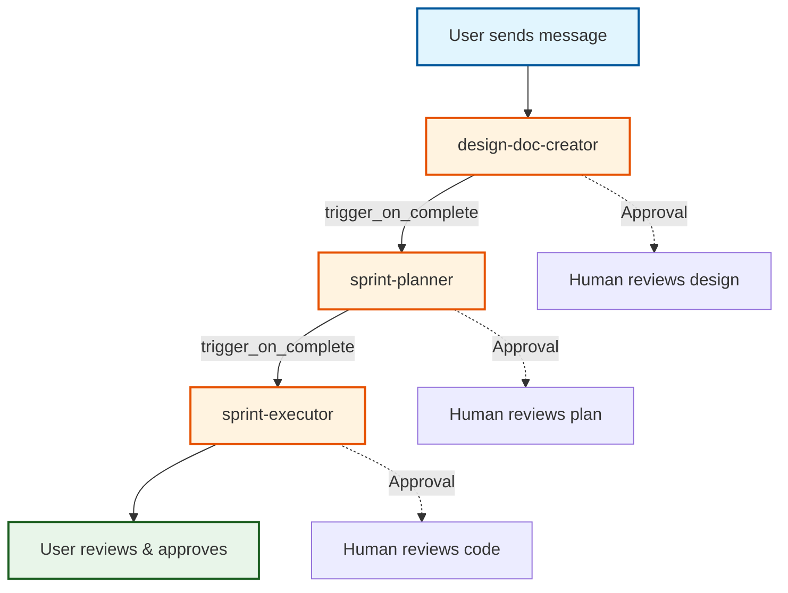

# Agent Handoff Workflows

This guide demonstrates real-world workflows for handing off work between interactive Claude Code sessions and autonomous AILANG agents via the **Coordinator**.

:::info Current Architecture (v0.9.0+)
Agent handoffs are managed by the **AILANG Coordinator** daemon, not shell-script hooks. The coordinator watches agent inboxes, executes tasks in isolated worktrees, and chains agents via `trigger_on_complete` configuration.
:::

## Quick Reference

**Key Commands:**
```bash
# Check messages
ailang messages list --unread         # Unread messages
ailang messages list --inbox user     # User inbox
ailang messages read <id>             # Full message content

# Acknowledge messages
ailang messages ack <id>              # Mark specific as read
ailang messages ack --all             # Mark all as read
ailang messages unack <id>            # Un-acknowledge (retry)

# Send messages
ailang messages send <inbox> "message" --title "Title" --from "sender"

# Coordinator management
ailang coordinator status             # Check daemon status
ailang coordinator start              # Start coordinator daemon
ailang chains list                    # View execution chains
ailang chains view <chain-id>         # Chain details
```

## Workflow 1: Design → Implement → Notify

**Scenario:** You design a feature interactively, then delegate implementation to the coordinator pipeline.

### Step 1: Interactive Design (Claude Code)

```
You: "Design a fix for the import resolution bug"

Claude Code: *analyzes codebase*
Claude Code: *creates design_docs/planned/M-IMPORT-FIX.md*
Claude Code: "I've created a design doc. It adds path normalization to the import resolver."

You: "Send this to the pipeline for implementation"
```

### Step 2: Send to Coordinator Pipeline

```bash
# Send the design doc to the design-doc-creator (or directly to sprint-planner)
ailang messages send sprint-planner "Plan sprint for M-IMPORT-FIX" \
  --title "Sprint: M-IMPORT-FIX" --from "user"
```

The coordinator picks up the message and runs the agent chain:

```yaml title="~/.ailang/config.yaml (coordinator config)"
coordinator:
  agents:
    - id: sprint-planner
      inbox: sprint-planner
      trigger_on_complete: [sprint-executor]
    - id: sprint-executor
      inbox: sprint-executor
      trigger_on_complete: []  # End of chain
```

### Step 3: Autonomous Implementation

The coordinator daemon handles the pipeline:

```
sprint-planner receives message
  → Creates sprint plan in isolated worktree
  → Approval request created (human reviews plan)
  → On approval: merges to dev, triggers sprint-executor

sprint-executor receives handoff
  → Implements the fix with TDD
  → Runs tests and linting
  → Approval request created (human reviews code)
  → On approval: merges to dev
```

### Step 4: Next Session (Check Inbox)

You start a new Claude Code session:

```
SessionStart hook fires:
━━━━━━━━━━━━━━━━━━━━━━━━━━━━━━━━━━━━━━━━━━━━━━━━━━━━━━━━━
📬 AGENT INBOX: 1 unread message(s) from autonomous agents
━━━━━━━━━━━━━━━━━━━━━━━━━━━━━━━━━━━━━━━━━━━━━━━━━━━━━━━━━

ID: abc12345-...
From: sprint-executor
Title: Implementation complete: M-IMPORT-FIX
Time: 2026-03-05T14:30:00Z
```

### Step 5: Review Results

```bash
# Read the full message
ailang messages read abc12345

# View the execution chain
ailang chains list --agent sprint-executor --since 24h
ailang chains view <chain-id> --spans

# View code changes
ailang chains diff <chain-id>

# Acknowledge
ailang messages ack abc12345
```

## Workflow 2: Multi-Agent Pipeline

**Scenario:** Work flows through the full design → plan → implement pipeline.



**Start the pipeline:**
```bash
# Send to the first agent in the chain
ailang messages send design-doc-creator "Create design doc for semantic caching" \
  --title "Feature: Semantic Caching" --from "user"
```

**Monitor progress:**
```bash
# View active chains
ailang chains active

# View chain execution tree
ailang chains tree <chain-id> --detailed

# Check coordinator status
ailang coordinator status
```

**Approve work at each stage:**
```bash
# List pending approvals
ailang coordinator pending

# Interactive approval (view diff, chat history, approve/reject)
# Press: a=approve, r=reject, d=diff, c=chat, q=quit
```

## Workflow 3: GitHub Issue → Agent Pipeline

**Scenario:** GitHub issues automatically flow into the agent pipeline.

### Configuration

```yaml title="~/.ailang/config.yaml"
coordinator:
  github_sync:
    enabled: true
    interval_secs: 300
    target_inbox: design-doc-creator
```

### Flow

1. **Issue created** on GitHub with label `from:stapledon` or `from:ailang-core`
2. **`ailang messages import-github`** imports it as a message (runs on session start)
3. **Coordinator** picks up the message and assigns to `design-doc-creator`
4. **Pipeline executes**: design → plan → implement → approve

### Manual Import

```bash
# Import GitHub issues as messages
ailang messages import-github
ailang messages import-github --labels bug,feature
ailang messages import-github --dry-run  # Preview without importing
```

## Workflow 4: Script-Based Agents

**Scenario:** Run deterministic tasks (evals, CI) alongside AI agents.

```yaml title="~/.ailang/config.yaml"
coordinator:
  agents:
    - id: eval-runner
      inbox: eval-runner
      invoke:
        type: script                    # Shell script, not AI
        command: ./scripts/run-eval.sh
        env_from_payload: true          # JSON payload → env vars
        timeout: 2h
```

```bash
# Send task - JSON payload becomes environment variables
ailang messages send eval-runner '{"model": "gpt5", "benchmarks": "all"}' \
  --title "Run v0.9.0 baseline"

# Script receives: MODEL=gpt5 BENCHMARKS=all ./scripts/run-eval.sh
```

**Benefits:**
- Deterministic (same input = same execution)
- Zero AI cost ($0.00)
- Same approval workflow and dashboard streaming as AI agents

## Monitoring & Observability

### Chain Monitoring

```bash
# List all execution chains
ailang chains list --since 7d

# View chain with full span details
ailang chains view <chain-id> --spans

# Cost and token stats
ailang chains stats --by-agent

# System health check
ailang chains health
```

### Dashboard

The Collaboration Hub provides real-time monitoring:

```bash
make services-start  # Start server + coordinator
# Open http://localhost:1957
```

**Dashboard features:**
- Live task execution streaming via WebSocket
- Approval queue with git diff viewer
- Chain visualization with timing
- Cost tracking per agent

### Audit Agent Work

```bash
# View conversation turns (reasoning + tool calls)
ailang coordinator logs <task-id> --limit 500

# View git changes
ailang chains diff <chain-id>

# Quick health report
ailang chains diagnose <chain-id>
```

## Message Storage

All messages are stored in SQLite (`~/.ailang/state/collaboration.db`), shared between the CLI, Collaboration Hub dashboard, and coordinator.

**Message statuses:** `unread` → `read` → `archived` → `deleted`

```bash
# Manage message lifecycle
ailang messages list --unread          # View unread
ailang messages read <id>              # Read full content
ailang messages ack <id>               # Mark as read
ailang messages cleanup --older-than 7d  # Remove old messages
```

## Best Practices

### 1. Use Descriptive Titles

```bash
# Good - specific and actionable
ailang messages send sprint-planner "Plan sprint for M-IMPORT-FIX" \
  --title "Sprint: M-IMPORT-FIX" --from "user"

# Bad - vague
ailang messages send sprint-planner "do stuff" --title "Task"
```

### 2. Use GitHub Sync for Important Issues

```bash
# Bug reports and features auto-create GitHub issues
ailang messages send user "Parser crashes on empty input" \
  --type bug --title "Bug: Parser crash"
```

### 3. Monitor Chain Execution

```bash
# Check active work
ailang chains active

# Review completed chains
ailang chains list --status completed --since 24h
```

### 4. Review Before Approving

```bash
# Always check the diff before approving
ailang coordinator pending
# Press 'd' to view diff, 'c' to view chat history
```

## Troubleshooting

### Messages not being picked up

```bash
# Check coordinator is running
ailang coordinator status

# Check agent configuration
cat ~/.ailang/config.yaml

# Check message exists
ailang messages list --unread --inbox sprint-planner
```

### Agent task failing

```bash
# View task logs
ailang coordinator logs <task-id> --limit 500

# Check chain diagnostics
ailang chains diagnose <chain-id>

# Reject and retry with feedback
ailang coordinator reject <task-id> --feedback "Need error handling for edge cases"
```

### Hook not firing

```bash
# Check server is running (HTTP hooks need it)
curl http://127.0.0.1:1957/health

# Check hook logs
tail -f ~/.ailang/state/hooks.log
```

## Related Documentation

- **[Claude Code Integration Guide](./claude-code-integration.mdx)** — Complete integration guide
- **[Hooks Setup](./hooks-setup.mdx)** — HTTP hooks configuration
- **[Coordinator Guide](./coordinator.md)** — Agent orchestration and task delegation
- **[Cross-Project Messaging](./cross-project-messaging.mdx)** — Inter-project communication
- **[Telemetry Guide](./telemetry.md)** — Distributed tracing and observability

---

**Last updated:** March 2026 (v0.9.0)
