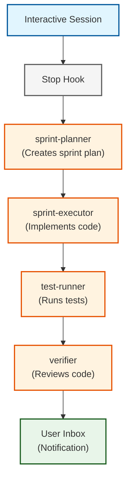

import { ArrowRight, CheckCircle, Play, Users } from 'lucide-react';

# Agent Handoff Workflows

This guide demonstrates real-world workflows for handing off work between interactive Claude Code sessions and autonomous AILANG agents.

## Quick Reference

**Key Commands:**
```bash
# View user inbox
ailang agent inbox user

# Send to agent
ailang agent send <agent> '<json-payload>'

# Send to user
ailang agent send --to-user '<json-payload>'

# Wait for response
ailang agent send --wait 30s <agent> '<json>'
```

## Workflow 1: Design → Implement → Notify

**Scenario:** You design a feature interactively, then hand it off to autonomous agents for implementation.

### Step 1: Interactive Design (Claude Code)

```
You: "Design a fix for the import resolution bug"

Claude Code: *analyzes codebase*
Claude Code: *creates design_docs/planned/M-IMPORT-FIX.md*
Claude Code: "I've created a design doc. It adds path normalization to the import resolver."

You: "Looks good, implement it"
```

### Step 2: Session Stops (Automatic Handoff)

When you stop the session (or it times out), the Stop hook fires:

```bash
# agent_handoff.sh runs automatically:
→ Detects design_docs/planned/M-IMPORT-FIX.md (modified < 5 min ago)
→ Computes hash: sha256:a1b2c3...
→ Stores artifact in ~/.ailang/state/artifacts/
→ Sends message to sprint-planner:
  {
    "task": "implement_design_doc",
    "event": {
      "session_id": "claude-session-xyz",
      "user_id": "mark",
      "event": "Stop",
      "provider": "claude-code"
    },
    "artifacts": [
      {
        "path": "design_docs/planned/M-IMPORT-FIX.md",
        "hash": "sha256:a1b2c3...",
        "title": "M-IMPORT-FIX: Path normalization for import resolver"
      }
    ]
  }
```

### Step 3: Autonomous Implementation

The sprint-planner agent (running separately):

```bash
# Sprint-planner polls for messages
→ Receives message from interactive session
→ Reads design doc from artifact store
→ Creates sprint plan
→ Sends to sprint-executor
→ Executor implements the fix
→ Runs tests
→ Sends completion message to user inbox
```

### Step 4: Next Session (Notification)

You start a new Claude Code session:

```bash
# session_start.sh runs automatically:
╔═══════════════════════════════════════════════════════════╗
║  📬 You have 1 unread message(s) from agents              ║
╚═══════════════════════════════════════════════════════════╝

To view messages, run:
  ailang agent inbox user

Preview (most recent):
  From: sprint-executor
  Message ID: msg_20251025_143022_def456
```

### Step 5: Review Results

```bash
$ ailang agent inbox user

📬 User Inbox (1 message)
================================================================================

▶ Message 1/1
  ID: msg_20251025_143022_def456
  From: sprint-executor
  Type: notification
  Correlation ID: cycle_20251025_001
  Payload:
    {
      "status": "completed",
      "task": "implement M-IMPORT-FIX",
      "tests_passed": true,
      "files_modified": [
        "internal/loader/import_resolver.go",
        "internal/loader/import_resolver_test.go"
      ],
      "commit": "abc123def456"
    }

  ✓ Marked as read

Total: 1 message(s)
```

## Workflow 2: Interactive Query → Agent Response

**Scenario:** You ask an agent a question and wait for an answer.

```bash
# Send query with --wait flag
$ ailang agent send --wait 1m eval-analyzer '{
  "action": "summarize_failures",
  "baseline": "eval_results/baselines/v0.3.19"
}'

✓ Message sent to eval-analyzer
  Message ID: msg_20251025_144523_xyz789
  Correlation ID: cycle_20251025_014

Waiting for response (timeout: 1m)...

✓ Received response!
  Message ID: msg_20251025_144530_abc456
  From: eval-analyzer
  Payload:
    {
      "total_failures": 12,
      "top_errors": [
        {"error": "type mismatch", "count": 5},
        {"error": "import resolution", "count": 4},
        {"error": "syntax error", "count": 3}
      ],
      "recommendations": [
        "Fix type inference in let-polymorphism",
        "Add path normalization to imports"
      ]
    }
```

## Workflow 3: Background Agent → User Notification

**Scenario:** An agent completes a long-running task and notifies you.

### Agent Side

```go
// In your autonomous agent:
inbox := agentprotocol.NewUserInbox(stateDir)

// After completing work
msg := &agentprotocol.Envelope{
    MessageID:   agentprotocol.GenerateMessageID(),
    FromAgent:   "sprint-executor",
    ToAgent:     "user",
    MessageType: "notification",
    Payload: map[string]interface{}{
        "status": "completed",
        "task":   "implement M-IMPORT-FIX",
        "summary": "Fixed import resolver, all tests passing",
    },
}

inbox.SendToUser(msg)
```

### User Side

Next time you start Claude Code:

```
╔═══════════════════════════════════════════════════════════╗
║  📬 You have 1 unread message(s) from agents              ║
╚═══════════════════════════════════════════════════════════╝
```

Check details:
```bash
$ ailang agent inbox user
# ... message details displayed ...
```

## Workflow 4: Multi-Agent Pipeline

**Scenario:** Work flows through multiple agents with handoffs.



Each agent sends messages to the next agent in the pipeline using the correlation_id to track the workflow.

**Example from sprint-planner:**

```bash
# Sprint-planner receives design doc
→ Creates sprint plan
→ Sends to sprint-executor:
  {
    "message_id": "msg_abc",
    "correlation_id": "cycle_20251025_001",  # Same as original
    "parent_message_id": "msg_xyz",          # References design doc message
    "to_agent": "sprint-executor",
    "payload": {
      "sprint_plan_path": "~/.ailang/state/sprints/current_sprint.json",
      "tasks": 5
    }
  }
```

## Content-Addressed Artifacts

Large files (design docs, code, test results) are stored as artifacts to avoid bloating messages.

### Storing Artifacts

```go
store := agentprotocol.NewArtifactStore(stateDir)

// Read design doc
content, _ := os.ReadFile("design_docs/planned/M-TEST.md")

// Store with hash
hash, _ := store.StoreArtifact("design_docs/planned/M-TEST.md", content, "text/markdown")
// Returns: "sha256:a1b2c3d4e5f6..."

// Reference in message
msg.Payload["artifacts"] = []map[string]interface{}{
    {
        "path": "design_docs/planned/M-TEST.md",
        "hash": hash,
        "mime_type": "text/markdown",
    },
}
```

### Retrieving Artifacts

```go
// Agent receives message with artifact reference
artifactHash := msg.Payload["artifacts"].([]interface{})[0].(map[string]interface{})["hash"].(string)

// Retrieve content
content, metadata, _ := store.RetrieveArtifact(artifactHash)

// Use content
fmt.Printf("Design doc: %s\n", string(content))
```

### Benefits

- **Deduplication:** Same content stored only once
- **Verification:** Hash ensures content hasn't been tampered with
- **Bandwidth:** Messages stay small, artifacts stored separately
- **History:** Artifacts persist even after messages are archived

## Message Signing & Security

All messages are signed with HMAC-SHA256 to prevent spoofing.

### Automatic Signing

```go
signer := agentprotocol.NewMessageSigner(stateDir)

// Sign message before sending
signer.SignMessage(msg)

// Message now has:
// - signature: "a1b2c3d4..."
// - signature_alg: "hmac-sha256"
// - kid: "key-xyz123"
```

### Automatic Verification

```go
// Verify message on receive
if err := signer.VerifyMessage(msg); err != nil {
    log.Printf("Invalid signature: %v", err)
    return // Reject message
}
```

## Inbox Management

### Read/Unread/Archive Flow

```
New message
    ↓
_unread/       ← Initial state
    ↓
  (view)
    ↓
_read/         ← After viewing
    ↓
  (archive)
    ↓
_archive/      ← Long-term storage
```

### Commands

```bash
# View unread (marks as read automatically)
ailang agent inbox user

# View without marking as read
ailang agent inbox user --unread-only

# View read messages
ailang agent inbox user --read-only

# View and archive
ailang agent inbox user --archive

# View archived
ailang agent inbox user --archived
```

## Best Practices

### 1. Use Correlation IDs

Track related messages across agents:

```go
// First message in workflow
correlationID := agentprotocol.GenerateCorrelationID()

// All subsequent messages use same correlation ID
msg.CorrelationID = correlationID
```

### 2. Include Parent Message IDs

Build message chains for audit trails:

```go
// Response to a previous message
parentID := originalMsg.MessageID
msg.ParentMessageID = &parentID
```

### 3. Set Reasonable TTLs

Messages expire after TTL to prevent stale data:

```go
msg.TTLSeconds = 3600  // 1 hour for quick responses
msg.TTLSeconds = 86400 // 24 hours for batch jobs
```

### 4. Declare Effects

Make side effects explicit:

```go
msg.DeclaredEffects = []string{"IO", "FS", "Net"}
```

### 5. Use Structured Payloads

Define clear schemas for payloads:

```go
msg.PayloadSchema = "https://ailang.dev/schemas/sprint_plan/v1.json"
msg.Payload = map[string]interface{}{
    "tasks": []Task{...},
    "estimated_days": 3.5,
}
```

## Troubleshooting

### Message not received

**Check inbox:**
```bash
ls -la ~/.ailang/state/messages/inbox/user/_unread/
```

**Check agent inbox:**
```bash
ls -la ~/.ailang/state/messages/<agent-id>/
```

**Verify message was sent:**
```bash
# Look for confirmation in CLI output
✓ Message sent to sprint-planner
  Path: ~/.ailang/state/messages/sprint-planner/msg_xyz.pending.json
```

### Artifact not found

**List all artifacts:**
```bash
ls -la ~/.ailang/state/artifacts/sha256/
```

**Verify hash is correct:**
```bash
# Compute hash using ailang CLI
ailang debug hash design_docs/planned/M-TEST.md
```

**Check artifact metadata:**
```bash
cat ~/.ailang/state/artifacts/sha256/abc123.../metadata.json
```

### Hook not firing

**Check .claude/hooks.json exists:**
```bash
cat .claude/hooks.json
```

**Verify scripts are executable:**
```bash
ls -la scripts/hooks/
```

**Check hook logs:**
```bash
tail -50 ~/.ailang/state/hooks.log
```

## Related Documentation

- **[Claude Code Integration Guide](./claude-code-integration.mdx)** - Main integration guide
- **[Hooks Setup](./hooks-setup.mdx)** - Quick setup guide

**Design documents** (GitHub):
- **[M-CLAUDE-CODE-INTEGRATION-V2](https://github.com/sunholo-data/ailang/blob/main/design_docs/planned/v0_3_20/m-claude-code-integration-v2.md)** - Complete specification
- **[M-AGENT-PROTOCOL](https://github.com/sunholo-data/ailang/blob/main/design_docs/planned/v0_3_19/M-AGENT-PROTOCOL.md)** - Protocol details

---

**Last updated:** October 25, 2025 (v0.3.20)
