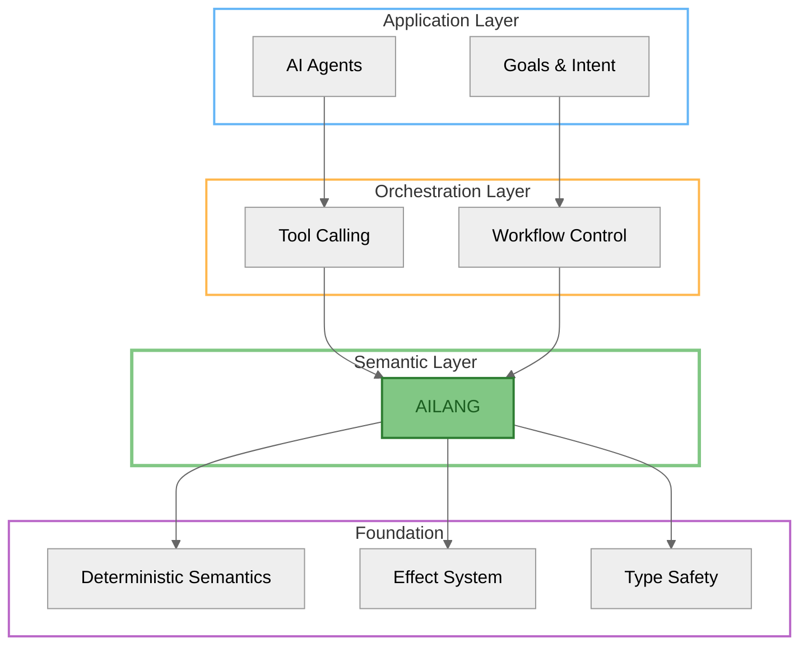
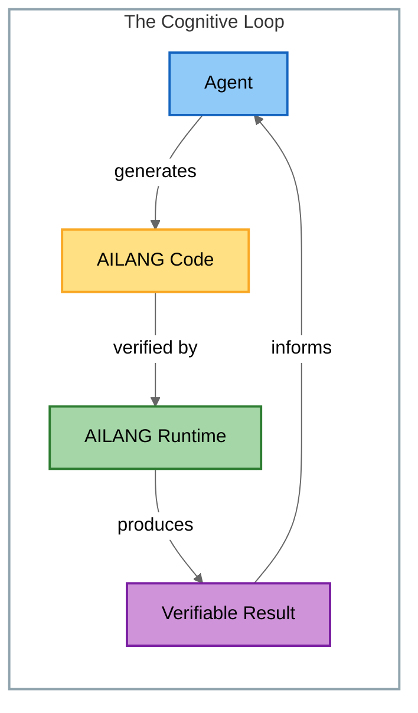
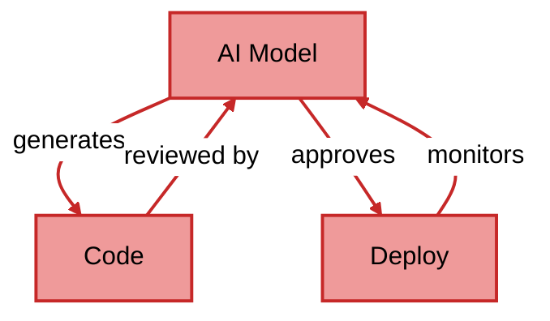
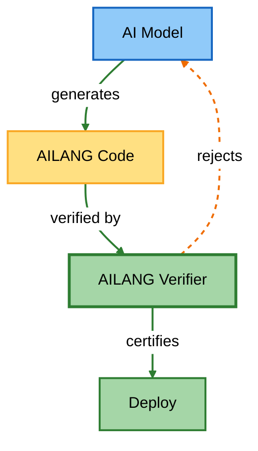

import Icon, { CheckIcon, CrossIcon, InfoIcon, WarningIcon } from '@site/src/components/Icon';

# <Icon name="scale" inline /> AILANG vs Agent Frameworks

**Why AILANG is not an agent — and why agents need it.**

:::tip Core Insight
Most readers assume AILANG is "another agent framework" or "workflow engine." This is a fundamental misunderstanding that obscures the real value proposition.
:::

---

## <Icon name="target" inline /> The Key Distinction

| Dimension | <Icon name="bot" inline size={14} /> Agent Frameworks | <Icon name="code" inline size={14} /> AILANG |
|-----------|------------------|--------|
| **Primary unit** | Agent / loop | Program / evaluation |
| **Time model** | Open-ended, implicit | Closed, explicit |
| **State** | Mutable, long-lived | Immutable, value-based |
| **Control** | Scheduler / prompts | Semantics / types |
| **Safety** | Heuristics | Decidability |
| **Failure mode** | Silent drift | Explicit mismatch |

:::info The Fundamental Difference
**Agent frameworks act.** They execute, respond, iterate.

**AILANG decides.** It evaluates, compares, verifies.
:::

---

## <Icon name="warning" inline /> Why Agent Frameworks Break Down

Agent systems inevitably accumulate problems that become harder to detect over time:

- <CrossIcon inline size={14} /> **Hidden mutable state** — Internal variables drift without visibility
- <CrossIcon inline size={14} /> **Non-replayable execution paths** — Same input, different outputs
- <CrossIcon inline size={14} /> **Prompt drift** — Gradual semantic shift in behavior
- <CrossIcon inline size={14} /> **Non-comparable outcomes** — No way to verify equivalence

Once an agent rewrites itself, you lose:

| Lost Property | Consequence |
|--------------|-------------|
| **Provenance** | Can't trace how a decision was reached |
| **Equivalence** | Can't compare two runs meaningfully |
| **Verification** | Can't prove correctness |

:::caution The Drift Problem
AILANG refuses to cross this boundary implicitly. Every state change, every effect, must be declared and tracked.
:::

---

## <Icon name="layers" inline /> The Relationship (Not Competition)

AILANG is *below* agents in the stack — it's infrastructure, not competition.

### <Icon name="bot" inline /> What Agents Do

- <CheckIcon inline size={14} /> Choose goals
- <CheckIcon inline size={14} /> Orchestrate tools
- <CheckIcon inline size={14} /> Decide when to act

### <Icon name="code" inline /> What AILANG Does

- <CheckIcon inline size={14} /> Defines what a valid action even *is*
- <CheckIcon inline size={14} /> Guarantees two actions are meaningfully comparable
- <CheckIcon inline size={14} /> Makes "self-modification" provable, not hopeful

:::tip The Cognitive Loop
**Agents without AILANG drift** — they lose semantic grounding.

**AILANG without agents is inert** — it needs intention to be useful.

**Together, they form a closed cognitive loop** — intent meets verification.
:::

---

## <Icon name="brain" inline /> Design Principle

> **AILANG constrains cognition so autonomy becomes safe.**

This is the core thesis: unrestricted autonomy is dangerous. AILANG provides the semantic boundaries that make AI systems trustworthy.

---

## <Icon name="zap" inline /> Why AILANG Is Not "A Better Python"

And why trying to replace Python would kill it.

### <Icon name="x" inline /> The Wrong Comparison

AILANG is often compared to Python, Rust, or Haskell. This misses the point entirely.

:::info
**AILANG is not a human productivity language.**

It's a machine reasoning substrate.
:::

### What Python Optimizes For

- <Icon name="user" inline size={14} /> Fast iteration for humans
- <Icon name="book" inline size={14} /> Human readability
- <Icon name="play" inline size={14} /> Implicit control flow
- <Icon name="zap" inline size={14} /> Rich side effects

These are **features for humans**. For machines, they become **liabilities**.

### What AILANG Optimizes For

- <Icon name="scale" inline size={14} /> Semantic equivalence
- <Icon name="play" inline size={14} /> Replayability
- <Icon name="bot" inline size={14} /> Machine-readability
- <Icon name="target" inline size={14} /> Total analyzability

**Python asks:** "What did the programmer mean?"

**AILANG asks:** "Are these two programs the same computation?"

---

### <Icon name="idea" inline /> The Correct Mental Model

| <Icon name="code" inline size={14} /> Python Is | <Icon name="brain" inline size={14} /> AILANG Is |
|-----------|-----------|
| A scripting language | A semantic substrate |
| A tool for humans | A tool for machines |
| Execution-oriented | Evaluation-oriented |
| Debugged interactively | Verified structurally |

:::tip Key Insight
**Python is how humans talk to machines.**

**AILANG is how machines talk to themselves.**
:::

---

## <Icon name="shield" inline /> AILANG as a Semantic Control Surface

Why determinism is the real feature.

### <Icon name="warning" inline /> The Problem Nobody Names

Modern AI systems form closed loops:

1. <Icon name="code" inline size={14} /> Generate code
2. <Icon name="play" inline size={14} /> Evaluate code
3. <Icon name="wrench" inline size={14} /> Modify code
4. <Icon name="rocket" inline size={14} /> Deploy code

Often using **the same model** at each step.

:::danger The Self-Legitimizing Loop
Without external ground truth, AI systems approve their own mistakes. Changes become untraceable. Performance "improves" without meaning. Security becomes probabilistic.

The system becomes **self-legitimizing**.
:::

**Without AILANG:**

<i>Closed loop — no external truth</i>

**With AILANG:**

<i>External verification — semantic ground truth</i>

### <Icon name="check" inline /> What AILANG Provides

AILANG introduces a **fixed semantic boundary**:

- <CheckIcon inline size={14} /> **Deterministic evaluation** — Same input, same output, always
- <CheckIcon inline size={14} /> **Explicit effects** — Side effects are declared, not hidden
- <CheckIcon inline size={14} /> **Total iteration** — No unbounded loops, guaranteed termination
- <CheckIcon inline size={14} /> **Replayable traces** — Every execution can be reproduced

No matter which model generated, reviewed, or optimized the code — **the meaning of the code is stable**.

---

### <Icon name="rocket" inline /> The Control Surface Analogy

In aerospace engineering:

> A control surface doesn't create thrust. It constrains motion so thrust becomes usable.

Similarly:

> **AILANG doesn't create intelligence. It makes intelligence go somewhere predictable.**

---

### <Icon name="globe" inline /> Why This Matters Long-Term

As AI models converge:

- Prompts homogenize
- Architectures align
- Behaviors correlate

The only remaining differentiator is **semantic discipline**.

:::tip The Bottom Line
**AILANG is discipline, encoded.**

It's not about what AI can do — it's about making what AI does *verifiable*.
:::

---

## Learn More

- <Icon name="book" inline size={14} /> [Getting Started](/docs/guides/getting-started) — Install and run your first AILANG program
- <Icon name="bot" inline size={14} /> [Agent Integration](/docs/guides/agent-integration) — How AI agents use AILANG
- <Icon name="layers" inline size={14} /> [Module Execution](/docs/guides/module_execution) — Understanding AILANG's execution model
- <Icon name="shield" inline size={14} /> [AI Effect System](/docs/guides/ai-effect) — How AILANG tracks AI interactions
