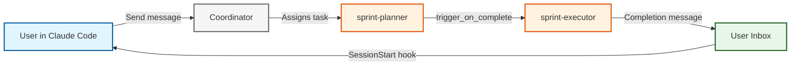

import Tabs from '@theme/Tabs';
import TabItem from '@theme/TabItem';
import Icon, { CheckIcon, CrossIcon, InfoIcon, WarningIcon } from '@site/src/components/Icon';

# Interactive ↔ Autonomous Agent Bridge

**Seamlessly hand off work between Claude Code sessions and autonomous AILANG agents with production-grade reliability.**

:::tip The Main Human-AILANG Interface
This is the **primary way humans interact with AILANG** — through Claude Code for exploration and the Coordinator for autonomous execution.
:::

:::success Ready to Use in AILANG Repo!
**Already working in the AILANG repository?** HTTP hooks and the coordinator are configured and ready to go!

**Quick test:**
```bash
# Start server + coordinator
make services-start

# Send test message
ailang messages send user "Test message" --title "Integration test" --from "claude-code"

# Check inbox
ailang messages list --unread

# Acknowledge
ailang messages ack --all
```

See [Hooks Setup Guide](./hooks-setup.mdx) for HTTP hook details.
:::

---

## <Icon name="target" inline size={20} /> What It Does



**The workflow:**
1. **Interactive**: You explore with Claude Code, create design docs
2. **Handoff**: Send a message to an agent inbox via `ailang messages send`
3. **Autonomous**: Coordinator assigns task, agents implement in isolated worktrees
4. **Notification**: Next session shows completed work via SessionStart hook

---

## <Icon name="rocket" inline size={20} /> Quick Start

### Prerequisites

<CheckIcon inline size={16} /> AILANG installed (`ailang --version`)
<CheckIcon inline size={16} /> Claude Code or VSCode with Claude extension
<CheckIcon inline size={16} /> Coordinator configured (`~/.ailang/config.yaml`)

:::tip Already configured in AILANG repo!
If you're working in the [AILANG repository](https://github.com/sunholo-data/ailang), hooks are configured in `.claude/settings.json` and the coordinator config is ready. Skip to testing!
:::

### Setup (3 Steps)

**Step 1: Configure hooks in `.claude/settings.json`**

HTTP hooks are configured alongside command hooks:

```json title=".claude/settings.json (excerpt)"
{
  "hooks": {
    "SessionStart": [{
      "hooks": [
        {
          "type": "command",
          "command": "\"$CLAUDE_PROJECT_DIR\"/scripts/hooks/session_start.sh"
        },
        {
          "type": "http",
          "url": "http://127.0.0.1:1957/api/hooks/claude",
          "timeout": 5
        }
      ]
    }],
    "PreToolUse": [{
      "matcher": "*",
      "hooks": [{
        "type": "http",
        "url": "http://127.0.0.1:1957/api/hooks/claude",
        "timeout": 5
      }]
    }]
  }
}
```

**Step 2: Start the server and coordinator**

```bash
make services-start    # Starts ailang serve + coordinator daemon
```

**Step 3: Test the integration**

```bash
# Send a test message
ailang messages send user "Integration test" --title "Test" --from "claude-code"

# Check inbox
ailang messages list --unread

# Acknowledge
ailang messages ack --all
```

:::success It works!
You should see the test message. Now you're ready to use the full workflow!
:::

---

## <Icon name="code" inline size={20} /> CLI Commands Reference

### Send Messages

<Tabs groupId="send-examples">
<TabItem value="user" label="To User Inbox">

```bash
# Send notification to user
ailang messages send user "Task complete" --title "Done" --from "agent-name"
```

</TabItem>
<TabItem value="agent" label="To Agent">

```bash
# Send task to sprint-planner
ailang messages send sprint-planner "Plan sprint for M-FIX-123" \
  --title "Sprint: M-FIX-123" --from "user"
```

</TabItem>
<TabItem value="bug" label="Bug Report">

```bash
# Bug report (auto-creates GitHub issue)
ailang messages send user "Parser crashes on empty input" \
  --type bug --title "Bug: Parser crash" --from "user"
```

</TabItem>
</Tabs>

### Check Inbox

<Tabs groupId="inbox-examples">
<TabItem value="user" label="User Inbox">

```bash
# Check your messages
ailang messages list --unread

# Read specific message
ailang messages read <message-id>

# Read without marking as read
ailang messages read <message-id> --peek
```

</TabItem>
<TabItem value="agent" label="Agent Inbox">

```bash
# Check agent's pending messages
ailang messages list --inbox sprint-planner

# JSON output (for scripting)
ailang messages list --inbox sprint-planner --json
```

</TabItem>
</Tabs>

### Manage Messages

```bash
# Acknowledge (mark as read)
ailang messages ack <id>              # Single message
ailang messages ack --all             # All messages

# Un-acknowledge (move back to unread for retry)
ailang messages unack <id>

# Forward to different inbox
ailang messages forward --to design-doc-creator <id>

# Cleanup old messages
ailang messages cleanup --older-than 7d
ailang messages cleanup --expired
```

### Monitor System

```bash
# Coordinator status
ailang coordinator status

# View execution chains
ailang chains list --since 24h
ailang chains active

# View chain details
ailang chains view <chain-id> --spans
ailang chains tree <chain-id> --detailed

# Cost and token stats
ailang chains stats --by-agent
```

---

## <Icon name="zap" inline size={20} /> Complete Workflow Example

### Scenario: Fix Eval Failure

**1. Interactive Exploration (Claude Code)**

You: "Analyze the failing evals and create a design doc"

Claude Code investigates and creates:
```
design_docs/planned/M-FIX-FACTORIAL.md
```

You: "Looks good! Send to sprint-planner"

**2. Send to Coordinator Pipeline**

```bash
ailang messages send sprint-planner "Plan sprint for M-FIX-FACTORIAL" \
  --title "Sprint: M-FIX-FACTORIAL" --from "user"
```

**3. Autonomous Execution (Coordinator)**

The coordinator handles the pipeline automatically:
- `sprint-planner` receives message → creates sprint plan in worktree
- Human approves plan → merges to dev, triggers `sprint-executor`
- `sprint-executor` implements fix with TDD → creates approval request
- Human reviews code → approves merge

**4. User Notification (SessionStart Hook)**

Next time you start Claude Code:

```
━━━━━━━━━━━━━━━━━━━━━━━━━━━━━━━━━━━━━━━━━━━━━━━━━━━━━━━━━
📬 AGENT INBOX: 1 unread message(s) from autonomous agents
━━━━━━━━━━━━━━━━━━━━━━━━━━━━━━━━━━━━━━━━━━━━━━━━━━━━━━━━━

ID: abc12345-...
From: sprint-executor
Title: Implementation complete: M-FIX-FACTORIAL
Time: 2026-03-05T14:30:00Z
━━━━━━━━━━━━━━━━━━━━━━━━━━━━━━━━━━━━━━━━━━━━━━━━━━━━━━━━━
💡 Use 'ailang messages read <id>' to view full content
```

**5. Review:**

```bash
# Read message details
ailang messages read abc12345

# View execution chain
ailang chains list --agent sprint-executor --since 24h
ailang chains view <chain-id> --spans

# View code changes
ailang chains diff <chain-id>
```

---

## <Icon name="scale" inline size={20} /> Production Features

### HTTP Hook Telemetry

All Claude Code events (tool use, session lifecycle, subagent activity) are captured via HTTP hooks and stored in the observatory:

```json
{
  "type": "http",
  "url": "http://127.0.0.1:1957/api/hooks/claude",
  "headers": {
    "X-Ailang-Task-Id": "${AILANG_TASK_ID}",
    "X-Ailang-Chain-Id": "${AILANG_CHAIN_ID}"
  },
  "timeout": 5
}
```

**Benefits:**
- <CheckIcon inline size={14} /> No shell script dependencies (cloud-ready)
- <CheckIcon inline size={14} /> Full JSON payload storage
- <CheckIcon inline size={14} /> Real-time dashboard via WebSocket
- <CheckIcon inline size={14} /> Correlation ID tracking across chains

### Hook Token Authentication

For cloud deployments, secure the hook endpoint:

```bash
# Set token on the server
export AILANG_HUB_TOKEN="your-secret-token"
ailang serve
```

When configured, hooks must include `Authorization: Bearer <token>`. In local mode (no token set), all requests pass through.

### Coordinator Approval Workflow

Every agent task goes through human review:

```bash
# List pending approvals
ailang coordinator pending

# Interactive review
# a=approve  r=reject  d=diff  c=chat  q=quit
```

**Approval types:**
| Type | On Approve |
|------|------------|
| `merge` | Merges code to dev branch |
| `merge_handoff` | Merges AND triggers next agent |

### Message Storage

All messages stored in SQLite (`~/.ailang/state/collaboration.db`):

- <CheckIcon inline size={14} /> Shared between CLI, dashboard, and coordinator
- <CheckIcon inline size={14} /> Full-text and semantic search
- <CheckIcon inline size={14} /> GitHub issue sync
- <CheckIcon inline size={14} /> Deduplication support

---

## <Icon name="bar-chart" inline size={20} /> Observability

### Chain Monitoring

```bash
# View all execution chains
ailang chains list --since 7d

# Active chains
ailang chains active

# Chain details with spans
ailang chains view <chain-id> --spans

# Cost tracking
ailang chains stats --by-agent --hours 168
```

### Dashboard

```bash
make services-start
# Open http://localhost:1957
```

**Features:**
- Live task execution streaming
- Approval queue with git diff viewer
- Session monitoring via HTTP hooks
- Cost and token tracking

### Audit Agent Work

```bash
# View conversation (reasoning + tool calls)
ailang coordinator logs <task-id> --limit 500

# View git changes
ailang chains diff <chain-id>

# Quick health check
ailang chains diagnose <chain-id>
```

---

## ⚙️ Hook Configuration

### HTTP Hooks (Primary)

HTTP hooks send Claude Code events to the AILANG server for telemetry and monitoring. They fire for all 7 event types: SessionStart, PreToolUse, PostToolUse, PostToolUseFailure, SubagentStart, SubagentStop, Stop.

See [Hooks Setup Guide](./hooks-setup.mdx) for full configuration.

### Command Hooks (Supplementary)

These command hooks run alongside HTTP hooks:

| Hook | Script | Purpose |
|------|--------|---------
| SessionStart | `session_start.sh` | Check inbox, set up environment |
| SessionStart | `cloud_setup.sh` | Cloud environment setup |
| PostToolUse | `format_go.sh` | Auto-format Go files on Edit/Write |
| Stop | `session_end_speak.sh` | Text-to-speech session summary |

---

## <Icon name="wrench" inline size={20} /> Troubleshooting

### Messages not appearing

```bash
# Check server is running
curl http://127.0.0.1:1957/health

# Check database
ailang messages list --unread

# Send test message
ailang messages send user "test" --title "Test" --from "debug"
```

### Coordinator not picking up tasks

```bash
# Check coordinator is running
ailang coordinator status

# Start if not running
ailang coordinator start

# Check config
cat ~/.ailang/config.yaml
```

### Hooks not firing

```bash
# Check hook logs
tail -f ~/.ailang/state/hooks.log

# HTTP hooks fail silently - check server is running
curl http://127.0.0.1:1957/health
```

---

## <Icon name="book" inline size={20} /> Related Documentation

- **[Getting Started](./getting-started.mdx)** — Installation and first steps
- **[Hooks Setup Guide](./hooks-setup.mdx)** — HTTP hook configuration
- **[Agent Workflows](./agent-workflows.mdx)** — Workflow examples and patterns
- **[Coordinator Guide](./coordinator.md)** — Agent orchestration and task delegation
- **[Cross-Project Messaging](./cross-project-messaging.mdx)** — Inter-project communication
- **[Telemetry Guide](./telemetry.md)** — Distributed tracing and observability

---

## <Icon name="brain" inline size={20} /> Best Practices

1. **Keep design docs focused** — One feature per doc
2. **Use descriptive message titles** — `Sprint: M-FIX-EVAL-FACTORIAL` not `fix`
3. **Review agent output** — Check inbox regularly, review diffs before approving
4. **Monitor chains** — Run `ailang chains active` to track progress
5. **Use GitHub sync for bugs** — `--type bug` auto-creates GitHub issues

---

**Next Steps:**
- **Try it now**: Send a message to `sprint-planner` and watch the pipeline
- **Monitor**: Open http://localhost:1957 for the dashboard
- **Customize**: Edit `~/.ailang/config.yaml` for your agent configuration

**Questions?**
- GitHub Issues: https://github.com/sunholo-data/ailang/issues
- Documentation: https://ailang.sunholo.com/
