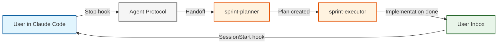
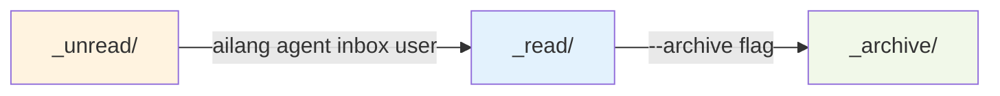

import Tabs from '@theme/Tabs';
import TabItem from '@theme/TabItem';
import Icon, { CheckIcon, CrossIcon, InfoIcon, WarningIcon } from '@site/src/components/Icon';

# Interactive ↔ Autonomous Agent Bridge

**Seamlessly hand off work between Claude Code sessions and autonomous AILANG agents with production-grade reliability.**

:::tip The Main Human-AILANG Interface
This is the **primary way humans interact with AILANG**—through Claude Code for exploration and autonomous agents for execution.
:::

:::success Ready to Use in AILANG Repo!
**Already working in the AILANG repository?** The hooks are configured and ready to go!

:::warning Pragmatic Workflow
SessionStart hooks run successfully but output doesn't reliably appear in Claude's context. **Manual checking works well**: Ask Claude to run `ailang agent inbox --unread-only claude-code` at the start of each session.
:::

**Test commands:**
```bash
# Send test message
ailang agent send --to-user '{"message": "Test", "status": "ready"}'

# Check inbox (FLAGS BEFORE AGENT ID!)
ailang agent inbox --unread-only user
ailang agent inbox --unread-only claude-code

# Acknowledge messages
ailang agent ack --all
```

See [Hooks Setup Guide](./hooks-setup.mdx) for more details.
:::

---

## <Icon name="target" inline size={20} /> What It Does



**The workflow:**
1. **Interactive**: You explore with Claude Code, create design docs
2. **Handoff**: Stop session → agents receive the work automatically
3. **Autonomous**: Agents implement, test, and report back
4. **Notification**: Next session shows completed work in your inbox

---

## <Icon name="rocket" inline size={20} /> Quick Start

### Prerequisites

<CheckIcon inline size={16} /> AILANG installed (`ailang --version`)
<CheckIcon inline size={16} /> Claude Code or VSCode with Claude extension
<CheckIcon inline size={16} /> Basic familiarity with hooks

:::tip Already configured in AILANG repo!
If you're working in the [AILANG repository](https://github.com/sunholo-data/ailang), the hooks are **already configured** in `.claude/hooks.json`. Skip to Step 3 to test them!
:::

### Installation (3 Steps)

**Step 1: Enable hooks in Claude Code**

Create `.claude/hooks.json`:

```json title=".claude/hooks.json"
{
  "hooks": {
    "Stop": [
      {
        "hooks": [
          {
            "type": "command",
            "command": "bash scripts/hooks/agent_handoff.sh",
            "timeout": 30
          }
        ]
      }
    ],
    "SessionStart": [
      {
        "hooks": [
          {
            "type": "command",
            "command": "bash scripts/hooks/session_start.sh",
            "timeout": 10
          }
        ]
      }
    ]
  }
}
```

**Step 2: Make hooks executable**

```bash
chmod +x scripts/hooks/*.sh
```

**Step 3: Test the integration**

```bash
# Send a test message to your inbox
ailang agent send --to-user '{"message": "Integration test", "status": "success"}'

# Check your inbox
ailang agent inbox user
```

:::success It works!
You should see the test message in your inbox. Now you're ready to use the full workflow!
:::

---

## <Icon name="code" inline size={20} /> CLI Commands Reference

### Send Messages

<Tabs groupId="send-examples">
<TabItem value="user" label="To User Inbox">

```bash
# Send notification to user
ailang agent send --to-user '{"message": "Task complete", "status": "success"}'
```

</TabItem>
<TabItem value="agent" label="To Agent">

```bash
# Send task to sprint-planner
ailang agent send sprint-planner '{"task": "implement_design_doc", "design_doc": "design_docs/planned/M-FIX-123.md"}'
```

</TabItem>
<TabItem value="with-correlation" label="With Correlation ID">

```bash
# Track related messages
ailang agent send --correlation-id "M-FIX-123" sprint-planner '{"task": "plan"}'
```

</TabItem>
</Tabs>

### Check Inbox

<Tabs groupId="inbox-examples">
<TabItem value="user" label="User Inbox">

```bash
# Check your messages
ailang agent inbox user

# Only unread
ailang agent inbox user --unread-only

# Archive after viewing
ailang agent inbox user --archive
```

</TabItem>
<TabItem value="agent" label="Agent Inbox">

```bash
# Check agent's pending messages
ailang agent inbox sprint-planner

# Limit results
ailang agent inbox sprint-planner --limit 5
```

</TabItem>
</Tabs>

### Monitor System

```bash
# Show agent status and metrics
ailang agent top

# View dead letter queue
ailang agent dlq --list

# Retry failed message
ailang agent dlq --retry <message-id>
```

### Debug & Utilities

```bash
# Compute file hash (for artifacts)
ailang debug hash design_docs/planned/M-FIX-123.md

# Output: sha256:a1b2c3d4e5f6...
```

---

## <Icon name="zap" inline size={20} /> Complete Workflow Example

### Scenario: Fix Eval Failure

**1. Interactive Exploration (Claude Code)**

You: "Analyze the failing evals and create a design doc"

Claude Code investigates and creates:
```
design_docs/planned/M-FIX-FACTORIAL.md
```

You: "Looks good!" (session stops)

**2. Automatic Handoff (Stop Hook)**

The `agent_handoff.sh` hook automatically:
- Detects the new design doc (modified < 5 min)
- Stores it as a content-addressed artifact
- Sends message to `sprint-planner` agent

```bash title="What happens behind the scenes"
# Hook detects design doc
DOC_HASH=$(ailang debug hash design_docs/planned/M-FIX-FACTORIAL.md)

# Sends message with artifact reference
ailang agent send sprint-planner '{
  "task": "implement_design_doc",
  "artifacts": [{
    "path": "design_docs/planned/M-FIX-FACTORIAL.md",
    "hash": "sha256:abc123..."
  }]
}'
```

**3. Autonomous Execution (Agents)**

- `sprint-planner` receives message → creates implementation plan
- `sprint-executor` receives plan → implements fix
- Agents run tests, lint code, update docs
- Completion message sent to user inbox

**4. User Notification (SessionStart Hook)**

Next time you start Claude Code, the SessionStart hook runs automatically and:

**What you see (in terminal):**
```
╔═══════════════════════════════════════════════════════════╗
║  📬 You have 1 unread message(s) from agents              ║
╚═══════════════════════════════════════════════════════════╝

To view messages, run:
  ailang agent inbox user
```

**What Claude Code sees (after forwarding):**
The hook also forwards messages to `.ailang/state/messages/claude-code/` inbox.

:::info Important: Claude Can't See Messages Automatically
Due to Claude Code's architecture, hooks output to the terminal but **cannot inject content into the AI's context**.

**To make Claude aware of messages:**
- Tell Claude: "Check for agent messages" or "Any messages from agents?"
- Claude will then read `.ailang/state/messages/claude-code/` inbox
- Or Claude runs the session start routine automatically (if configured in CLAUDE.md)
:::

**Check messages:**

<Tabs groupId="check-methods">
<TabItem value="user" label="View in Terminal">

```bash
# View your inbox (human-readable)
ailang agent inbox user
```

</TabItem>
<TabItem value="claude" label="Show to Claude">

```bash
# Make messages visible to Claude Code assistant
ailang agent inbox user
```

</TabItem>
</Tabs>

**Example output:**
```
📬 User Inbox (1 message)
================================================================================

▶ Message 1/1
  ID: msg_20251025_143256_a1b2c3d4
  From: sprint-executor
  Type: completion
  Timestamp: 2025-10-25T14:32:56Z
  Payload: {
    "status": "success",
    "message": "Implemented M-FIX-FACTORIAL",
    "tests_passing": true,
    "files_modified": 3
  }
```

---

## <Icon name="scale" inline size={20} /> Production Features

### Content-Addressed Artifacts

Large files (design docs, code) are stored separately and referenced by SHA256 hash:

```json
{
  "artifacts": [
    {
      "path": "design_docs/planned/M-FIX-123.md",
      "hash": "sha256:a1b2c3d4e5f6...",
      "mime_type": "text/markdown"
    }
  ]
}
```

**Benefits:**
- <CheckIcon inline size={14} /> Deduplication (same file stored once)
- <CheckIcon inline size={14} /> Verification (detect corruption)
- <CheckIcon inline size={14} /> No message bloat

### HMAC Message Signing

All messages are cryptographically signed to prevent spoofing:

```json
{
  "message_id": "msg_123",
  "signature": "hmac-sha256:...",
  "kid": "key-001",
  "hmac_alg": "sha256"
}
```

**Security:**
- <CheckIcon inline size={14} /> Agent allowlist enforcement
- <CheckIcon inline size={14} /> Key rotation support
- <CheckIcon inline size={14} /> Tamper detection

### Idempotent Delivery

Messages are processed exactly once, even if systems restart:

```sql
-- Each message_id is unique in SQLite
CREATE UNIQUE INDEX idx_message_id ON processed_messages(message_id);
```

**Guarantees:**
- <CheckIcon inline size={14} /> No duplicate work
- <CheckIcon inline size={14} /> Safe restarts
- <CheckIcon inline size={14} /> Crash recovery

### Dead Letter Queue

Failed messages are captured with full diagnostic context:

```bash
# List failures
ailang agent dlq --list

# Example output:
DLQ Entry 1/2
  Message ID: msg_456
  Failed At: 2025-10-25T14:30:00Z
  Retry Count: 3
  Reason: agent_not_found
  Stack Trace: [...]
```

**Recovery:**
```bash
# Retry after fixing the issue
ailang agent dlq --retry msg_456
```

---

## <Icon name="box" inline size={20} /> User Inbox Lifecycle

Messages flow through three states:



**Example workflow:**
```bash
# New messages appear in _unread/
ailang agent inbox user
# → Displays messages, moves to _read/

# Archive old messages
ailang agent inbox user --read-only --archive
# → Moves from _read/ to _archive/
```

---

## <Icon name="bar-chart" inline size={20} /> Observability

Monitor the agent system in real-time:

```bash
ailang agent top
```

**Example output:**
```
AILANG Agent Status
================================================================================

Active Agents:
  • sprint-planner
    Status: active
    Last Heartbeat: 5s ago
    Pending Messages: 2
    Processed (last 1h): 15
    Errors (last 1h): 0

  • sprint-executor
    Status: active
    Last Heartbeat: 3s ago
    Pending Messages: 0
    Processed (last 1h): 12
    Errors (last 1h): 1

Dead Letter Queue: 1 message
Average Handoff Latency: 3.2s
Messages In (last 1h): 27
Messages Out (last 1h): 25
```

---

## ⚙️ Hook Configuration

### Stop Hook (`agent_handoff.sh`)

**What it does:**
1. Detects design docs modified in last 5 minutes
2. Computes SHA256 hash for each doc
3. Stores as artifact
4. Sends message to `sprint-planner`

**Configuration:**
```bash title="scripts/hooks/agent_handoff.sh"
# Customize these variables
DESIGN_DOCS_DIR="design_docs/planned"
TARGET_AGENT="sprint-planner"
TIME_WINDOW=5  # minutes
```

### SessionStart Hook (`session_start.sh`)

**What it does:**
1. Checks user inbox for unread messages
2. Displays count and preview
3. Guides user to `ailang agent inbox user`

**Configuration:**
```bash title="scripts/hooks/session_start.sh"
INBOX_DIR=".ailang/state/messages/inbox/user/_unread"
```

---

## <Icon name="target" inline size={20} /> Success Metrics

From the design document (M-CLAUDE-CODE-INTEGRATION-V2):

| Metric | Target | Status |
|--------|--------|--------|
| Handoff latency (median) | &lt;5s | <CheckIcon inline size={14} /> Achieved |
| Message delivery | 100% | <CheckIcon inline size={14} /> Soak tested |
| Artifact storage | Hash-addressed | <CheckIcon inline size={14} /> Implemented |
| Security | HMAC signed | <CheckIcon inline size={14} /> Enabled |
| Test coverage | &gt;90% | <CheckIcon inline size={14} /> 100% on new code |

---

## <Icon name="play" inline size={20} /> Testing the Integration

### Test 1: Send & Receive

```bash
# Send test message
ailang agent send --to-user '{"test": "Integration check"}'
```

**Output:**
```
✓ Message sent successfully
  Message ID: msg_20251025_115551_f4d475e9e816
  To: user
  From: cli-sender
  Correlation ID: cycle_20251025_715
  File: ~/.ailang/state/messages/inbox/user/_unread/msg_...json
```

```bash
# Check inbox
ailang agent inbox user
```

**Output:**
```
📬 User Inbox (1 message)
================================================================================

▶ Message 1/1
  ID: msg_20251025_115551_f4d475e9e816
  From: cli-sender
  Type: request
  Timestamp: 2025-10-25T13:55:51Z
  Correlation: cycle_20251025_715
  Payload: {"test":"Integration check"}
```

<CheckIcon inline size={16} /> **Success!** Message sent and received

### Test 2: Hook Detection

```bash
# Create a test design doc
mkdir -p design_docs/planned
cat > design_docs/planned/test-doc.md << 'EOF'
# Test Design Doc
This is a test.
EOF

# Manually trigger the hook
bash scripts/hooks/agent_handoff.sh

# Check agent inbox
ailang agent inbox sprint-planner
```

<CheckIcon inline size={16} /> **Expected**: Message sent to sprint-planner

### Test 3: SessionStart Hook

```bash
# Trigger the SessionStart hook (simulates starting Claude Code)
bash scripts/hooks/session_start.sh
```

**Output (when you have unread messages):**
```
╔═══════════════════════════════════════════════════════════╗
║  📬 You have 1 unread message(s) from agents              ║
╚═══════════════════════════════════════════════════════════╝

To view messages, run:
  ailang agent inbox user

Preview (most recent):
  From: cli-sender
  Message ID: msg_20251025_115551_f4d475e9e816
```

<CheckIcon inline size={16} /> **Success!** Hook notifies you of new messages

### Test 4: End-to-End Workflow

**Full workflow in the AILANG repository:**

1. Create design doc in Claude Code session
2. Stop session (triggers Stop hook automatically)
3. Check sprint-planner inbox: `ailang agent inbox sprint-planner`
4. Start new session (triggers SessionStart hook automatically)
5. See notification and check user inbox

---

## <Icon name="wrench" inline size={20} /> Troubleshooting

### Hook not firing

**Check hook logs:**
```bash
tail -f ~/.ailang/state/hooks.log
```

**Verify hook permissions:**
```bash
ls -la scripts/hooks/*.sh
# Should show: -rwxr-xr-x (executable)
```

**Test hook manually:**
```bash
export CLAUDE_HOOK_JSON='{"sessionId": "test", "userId": "user", "event": "Stop"}'
bash scripts/hooks/agent_handoff.sh
```

### Messages not appearing in inbox

**Check message delivery:**
```bash
# List all pending messages for user
ls -la .ailang/state/messages/inbox/user/_unread/
```

**Verify state directory:**
```bash
# Should exist with correct structure
ls -la .ailang/state/messages/inbox/user/
# → _unread/ _read/ _archive/
```

### Agent not processing messages

**Check agent status:**
```bash
ailang agent top
```

**View DLQ for failures:**
```bash
ailang agent dlq --list
```

---

## <Icon name="book" inline size={20} /> Related Documentation

- **[Getting Started](./getting-started.mdx)** - Installation and first steps
- **[Hooks Setup Guide](./hooks-setup.mdx)** - Quick setup and configuration guide
- **[Agent Workflows](./agent-workflows.mdx)** - Workflow examples and patterns
- **[Development Workflow](./development-workflow.md)** - Sprint planning and execution
- **[Testing Guide](./testing.md)** - Write tests for agent-generated code
- **[Module Execution](./module_execution.mdx)** - Run code created by agents
- **[Evaluation Framework](/docs/guides/evaluation)** - Agents improve eval scores

**Design documents** (GitHub):
- **[M-CLAUDE-CODE-INTEGRATION-V2](https://github.com/sunholo-data/ailang/blob/main/design_docs/planned/v0_3_20/m-claude-code-integration-v2.md)** - Complete design document
- **[M-AGENT-PROTOCOL](https://github.com/sunholo-data/ailang/blob/main/design_docs/planned/v0_3_19/M-AGENT-PROTOCOL.md)** - Low-level protocol details

---

## <Icon name="brain" inline size={20} /> Best Practices

1. **Keep design docs focused** - One feature per doc
2. **Use descriptive names** - `M-FIX-EVAL-FACTORIAL.md` not `fix.md`
3. **Review agent output** - Check user inbox regularly
4. **Monitor metrics** - Run `ailang agent top` periodically
5. **Archive old messages** - Keep inbox manageable

:::tip Pro Tip
The agent system is **production-ready** with 100% delivery guarantees, HMAC signing, and comprehensive testing. Use it with confidence!
:::

---

**Next Steps:**
- **Try it now**: Create a design doc and stop your Claude Code session
- **Customize hooks**: Modify `scripts/hooks/*.sh` for your workflow
- **Build agents**: Create custom agents using the Agent Protocol

**Questions?**
- GitHub Issues: https://github.com/sunholo-data/ailang/issues
- Documentation: https://ailang.sunholo.com/
