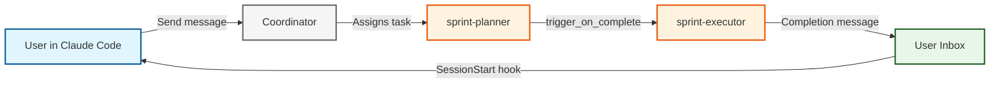

import Icon, { CheckIcon, CrossIcon, InfoIcon, WarningIcon } from '@site/src/components/Icon';

# Interactive ↔ Autonomous Agent Bridge

**Hand off work between interactive Claude Code sessions and autonomous AILANG
agents.** This page explains the bridge concept and gets you to a working
handoff; the pages it links own the details.

:::tip The Main Human-AILANG Interface
This is the **primary way humans interact with AILANG** — through Claude Code
for exploration and the Coordinator for autonomous execution.
:::

## <Icon name="target" inline size={20} /> What It Does



**The workflow:**
1. **Interactive**: You explore with Claude Code, create design docs
2. **Handoff**: Send a message to an agent inbox via `ailang messages send`
3. **Autonomous**: Coordinator assigns the task, agents implement in isolated worktrees, every merge goes through human approval
4. **Notification**: Your next session shows the completed work via the SessionStart hook

## <Icon name="rocket" inline size={20} /> Quick Start

In the [AILANG repository](https://github.com/sunholo-data/ailang) the hooks
(`.claude/settings.json`) and coordinator config are already set up. Elsewhere,
follow the [Hooks Setup Guide](./hooks-setup.mdx) first.

```bash
# Start server + coordinator
make services-start

# Send a test message
ailang messages send user "Integration test" --title "Test" --from "claude-code"

# Check inbox, then acknowledge
ailang messages list --unread
ailang messages ack --all
```

## <Icon name="zap" inline /> A Complete Handoff, End to End

1. **Explore interactively** — Claude Code investigates a failure and writes
   `design_docs/planned/M-FIX-FACTORIAL.md`.
2. **Hand off**:
   ```bash
   ailang messages send sprint-planner "Plan sprint for M-FIX-FACTORIAL" \
     --title "Sprint: M-FIX-FACTORIAL" --from "user"
   ```
3. **Autonomous pipeline** — `sprint-planner` drafts a plan in a worktree; on
   your approval it merges and triggers `sprint-executor`, which implements
   with TDD and files its own approval request.
4. **Notified next session** — the SessionStart hook surfaces the completion
   message in your inbox.
5. **Review**:
   ```bash
   ailang messages read <id>          # the agent's report
   ailang chains view <chain-id> --spans
   ailang chains diff <chain-id>      # the actual code changes
   ```

## <Icon name="book" inline size={20} /> Where the Details Live

| Topic | Page |
|-------|------|
| Full messaging CLI (send/read/ack/forward/search) | [Agent Messaging](./agent-messaging.md) |
| Hook configuration (HTTP + command hooks, auth) | [Hooks Setup](./hooks-setup.mdx) |
| Coordinator: agents, pipelines, approvals | [Coordinator Guide](./coordinator.md) |
| Worked multi-agent workflows | [Agent Workflows](./agent-workflows.mdx) |
| Cross-repo messaging via GitHub | [Cross-Project Messaging](./cross-project-messaging.mdx) |
| Chains, costs, dashboard, tracing | [Telemetry](./telemetry.md) |

**Practices that matter:** one feature per design doc; descriptive message
titles (`Sprint: M-FIX-EVAL-FACTORIAL`, not `fix`); review diffs before
approving; `--type bug` auto-creates GitHub issues.

## <Icon name="wrench" inline size={20} /> If It Doesn't Work

```bash
curl http://127.0.0.1:1957/health   # server up?
ailang coordinator status           # coordinator running?
tail -f ~/.ailang/state/hooks.log   # hooks firing?
```

More in the [Hooks Setup troubleshooting section](./hooks-setup.mdx#troubleshooting).
