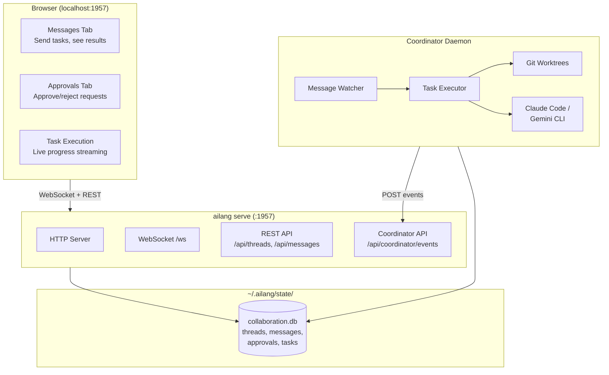

# Collaboration Hub Guide

The AILANG Collaboration Hub enables human-AI collaboration through a web UI and the coordinator daemon. It provides real-time visibility into autonomous agent execution, approval workflows, and multi-agent pipelines.

## Overview

The Collaboration Hub consists of two interfaces:

### Web Dashboard (React)

The web dashboard provides real-time monitoring of agent execution with:
- **Task Execution Panel** - Live streaming of agent activity
- **Approval Queue** - Review and approve/reject agent work with git diff viewer
- **Message Center** - Send directives and view results
- **Analytics** - Cost tracking, token usage, and performance metrics


### CLI Dashboard

For terminal-based workflows, the CLI provides the same functionality:

```bash
# View pending approvals
ailang coordinator pending

# Interactive approval with diff viewer
ailang coordinator approve <task-id>

# Reject with feedback
ailang coordinator reject <task-id> -f "Needs error handling"
```


## Installation

### Building from Source

```bash
# Build ailang
make build

# Install to $GOPATH/bin (makes it available system-wide)
make install
```

After installation, verify it works:

```bash
ailang --version
ailang coordinator status
```

## Quick Start

### Using Make (Recommended)

The easiest way to start everything:

```bash
# Start both server and coordinator daemon
make services-start

# Check status
make services-status

# Stop all services
make services-stop
```

### Manual Start

#### 1. Start the Server

```bash
ailang serve
```

This opens [http://localhost:1957](http://localhost:1957) with:
- **Messages tab** - Send directives to agents, see results
- **Approvals tab** - Approve/reject capability requests
- **Task Execution tab** - Watch real-time task progress from coordinator

#### 2. Start the Coordinator Daemon

In a separate terminal:

```bash
ailang coordinator start
```

The coordinator:
- Watches for new messages automatically
- Executes tasks in isolated git worktrees
- Streams progress to the dashboard in real-time
- Stores results in SQLite

#### 3. Send a Task

From the CLI:
```bash
ailang messages send coordinator "Create a hello.go file" --title "New file"
```

Or from the web UI:
1. Click **New Thread**
2. Type a directive: `Create a hello.go file that prints "Hello, World!"`
3. Click **Send**

Watch the coordinator execute in real-time!

## Architecture



## Approval Workflow

When a directive requires special capabilities (like network access), the agent:

1. **Detects capabilities** - Analyzes directive text for FS/Net/IO patterns
2. **Requests approval** - Creates an approval request in the database
3. **Waits for human** - The Approvals tab shows pending requests
4. **Proceeds or aborts** - After approval, executes; after rejection, cancels

Example:

```
User: "Fetch the API docs from https://api.example.com"

Agent: [Detected: Net capability required]
       [Created approval request]
       [Waiting 60s for approval...]

UI: Shows approval card with:
    - Requested capability: Net
    - Target URL: api.example.com
    - Estimated cost: $0.05
    - [Approve] [Reject] buttons

User: [Clicks Approve]

Agent: [Approval received]
       [Executing directive...]
       [Done! Results sent to UI]
```

### Multi-Channel Approvals (v0.6.4+)

Approvals can come from multiple sources, unified in the dashboard:

| Source | UI Indicator | How to Use |
|--------|--------------|------------|
| **Dashboard** | 🖥️ | Click Approve/Reject buttons |
| **CLI** | ⌨️ | `ailang coordinator approve/reject <task-id>` |
| **GitHub** | 🐙 | Add `ailang:approved` or `ailang:needs-revision` labels |

#### Iteration Tracking

When tasks are rejected with feedback, they're re-queued for another attempt. The UI shows:

- **Iteration Badge**: "Iteration 2/3" on retriggered tasks
- **Final Attempt Warning**: Orange badge on iteration 3
- **Feedback Display**: Harvested feedback from previous rejections

#### Approval Detail Modal

The approval detail modal shows:

1. **Header**: Task title, branch name, worktree path
2. **Badges**: Type (merge/execute/cost), Iteration, Channel source
3. **Tabs**: Files (diff viewer), Description, Logs
4. **Footer**: Keyboard shortcuts (A=Approve, R=Reject, Esc=Close)

When rejecting, the modal displays:
- Harvested feedback from GitHub (if linked issue exists)
- FeedbackInput with 1000 character limit
- Character counter with over-limit warning

## CLI Reference

### Server

```bash
# Start server (default port 1957)
ailang serve

# Custom port
ailang serve --port 8080

# Custom database
ailang serve --db /path/to/collab.db
```

### Coordinator Daemon

```bash
# Start coordinator daemon
ailang coordinator start

# Check status
ailang coordinator status

# Stop daemon
ailang coordinator stop

# Start with options
ailang coordinator start --poll-interval 10s --max-worktrees 5
```

### Service Management (Make)

```bash
# Start both server and coordinator
make services-start

# Stop both
make services-stop

# Restart with fresh build
make services-restart

# Check status of both
make services-status
```

## Database Schema

The `collaboration.db` SQLite database contains:

```sql
-- Conversation threads
CREATE TABLE threads (
    id TEXT PRIMARY KEY,
    title TEXT,
    status TEXT,  -- 'active', 'completed', 'archived'
    created_by_type TEXT,
    created_by_id TEXT,
    created_at INTEGER,
    updated_at INTEGER
);

-- Messages (directives and results)
CREATE TABLE messages (
    id TEXT PRIMARY KEY,
    thread_id TEXT,
    message_seq INTEGER,
    from_type TEXT,   -- 'human', 'ailang_instance'
    from_id TEXT,
    to_type TEXT,
    to_id TEXT,
    kind TEXT,        -- 'directive', 'result', 'status', 'error'
    content TEXT,
    delivery_state TEXT,
    business_state TEXT,
    created_at INTEGER
);

-- Capability approval requests
CREATE TABLE approvals (
    id TEXT PRIMARY KEY,
    thread_id TEXT,
    status TEXT,      -- 'pending', 'approved', 'rejected'
    capability_token TEXT,
    proposal_text TEXT,
    impact_level TEXT,
    estimated_cost REAL,
    created_at INTEGER,
    reviewed_at INTEGER,
    reviewed_by TEXT,
    review_notes TEXT
);
```

## API Endpoints

### Threads

```bash
# List threads
curl http://localhost:1957/api/threads

# Create thread
curl -X POST http://localhost:1957/api/threads \
  -H "Content-Type: application/json" \
  -d '{"title": "Build a CLI tool"}'

# Get thread
curl http://localhost:1957/api/threads/{thread_id}
```

### Messages

```bash
# Get messages for thread
curl http://localhost:1957/api/messages?thread_id={thread_id}

# Send message
curl -X POST http://localhost:1957/api/messages \
  -H "Content-Type: application/json" \
  -d '{
    "thread_id": "...",
    "from_type": "human",
    "from_id": "user",
    "to_type": "ailang_instance",
    "to_id": "default",
    "kind": "directive",
    "content": "Create a hello.go file"
  }'
```

### Approvals

```bash
# List pending approvals
curl http://localhost:1957/api/approvals?status=pending

# Approve
curl -X POST http://localhost:1957/api/approvals/{id}/approve \
  -H "Content-Type: application/json" \
  -d '{"notes": "Looks safe"}'

# Reject
curl -X POST http://localhost:1957/api/approvals/{id}/reject \
  -H "Content-Type: application/json" \
  -d '{"notes": "Too risky"}'
```

### Coordinator API

The coordinator daemon integrates with the Collaboration Hub for task management and approvals.

#### Pending Approvals

```bash
# List pending approvals (enriched with task details)
curl http://localhost:1957/api/coordinator/pending

# Response includes task context:
# {
#   "id": "approval-123",
#   "task_id": "task-456",
#   "type": "task_completion",
#   "status": "pending",
#   "worktree_path": "/Users/.../.ailang/state/worktrees/coordinator/task-456",
#   "session_id": "claude-session-abc",
#   "task_title": "Fix parser bug",
#   "task_status": "pending_approval",
#   "provider": "claude-code"
# }
```

#### Approve/Reject Tasks

```bash
# Approve changes (merges worktree to main branch)
curl -X POST http://localhost:1957/api/coordinator/approve/approval-123

# Reject changes (preserves worktree for inspection)
curl -X POST http://localhost:1957/api/coordinator/reject/approval-123
```

#### Task Diff

```bash
# Get git diff for a task's worktree
curl http://localhost:1957/api/coordinator/tasks/task-456/diff

# Returns git diff output showing all changes made by the agent
```

#### Task Events

```bash
# Get execution events for a task (tool calls, output, etc.)
curl http://localhost:1957/api/coordinator/tasks/task-456/events
```

#### Coordinator Events (Internal)

```bash
# POST events from coordinator daemon (used internally)
curl -X POST http://localhost:1957/api/coordinator/events \
  -H "Content-Type: application/json" \
  -d '{
    "task_id": "...",
    "stream_type": "status",
    "status": "running"
  }'
```

### Health Check

```bash
curl http://localhost:1957/health
# {"status":"healthy","connections":1,"timestamp":1732888800}
```

## Troubleshooting

### Server won't start

```bash
# Check if port is in use
lsof -i :1957

# Use different port
ailang serve --port 8080
```

### Coordinator not receiving messages

```bash
# Check coordinator status
ailang coordinator status

# Check logs
tail -f ~/.ailang/logs/coordinator.log

# Restart services
make services-restart
```

### Streaming not working

If events aren't appearing in the dashboard:

```bash
# 1. Verify server is running
curl http://127.0.0.1:1957/health

# 2. Check coordinator can reach server
# (Should see "HTTP broadcaster initialized" in logs)
tail ~/.ailang/logs/coordinator.log | grep broadcaster

# 3. Restart both services in correct order
make services-restart
```

**Note:** The server must start before the coordinator. Use `make services-start` to ensure correct order.

### Messages stuck as "pending"

The coordinator may have stopped. Check and restart:

```bash
ailang coordinator status
make services-restart
```

### Approval timeout

Default approval timeout is 60 seconds. If no human approves in time, the directive is cancelled.

## Multi-Agent Workflows

The Collaboration Hub supports chained agent workflows where completion of one agent triggers another.

### Agent Configuration

Agents are configured in `~/.ailang/config.yaml`:

```yaml
coordinator:
  default_provider: claude

  agents:
    - id: design-doc-creator
      label: "Design Doc Creator"
      inbox: design-doc-creator
      workspace: /path/to/project
      trigger_on_complete: [sprint-planner]
      auto_approve_handoffs: false

    - id: sprint-planner
      label: "Sprint Planner"
      inbox: sprint-planner
      workspace: /path/to/project
      trigger_on_complete: [sprint-executor]

    - id: sprint-executor
      label: "Sprint Executor"
      inbox: sprint-executor
      workspace: /path/to/project
      trigger_on_complete: []

  github_sync:
    enabled: true
    interval_secs: 300
    target_inbox: design-doc-creator
```

See [Coordinator Guide](/docs/guides/coordinator) for full configuration reference.

### Approval Gates

When `auto_approve_handoffs: false`, the dashboard shows approval requests before triggering the next agent:

1. Agent completes task → Approval request created
2. Dashboard shows pending approval with:
   - Worktree path (click to inspect changes)
   - Git diff viewer
   - Session ID for continuity
3. Human reviews and approves/rejects
4. Approved → Next agent triggered with session context
5. Rejected → Worktree preserved, no handoff

## Current Limitations

:::info Status
The Collaboration Hub is functional with the coordinator daemon providing real-time streaming and multi-agent workflows.
:::

**Completed:**
- Real-time task streaming to dashboard
- Service management via Make targets
- Coordinator daemon with auto-retry queue
- Multi-agent workflows with approval gates
- GitHub issue sync integration
- Session continuity across agent handoffs

**Planned improvements:**
- Agent status indicator in UI
- Cloud storage backends (Firestore, DynamoDB)

## See Also

- [Coordinator Guide](/docs/guides/coordinator) - Multi-agent workflows with approval gates
- [Agent Messaging](/docs/guides/agent-messaging) - CLI-based messaging between projects
- [Evaluation Guide](/docs/guides/evaluation) - Running AI benchmarks
