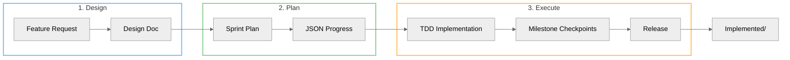

# AILANG Development Workflow

AILANG is developed using a structured workflow powered by Claude Code skills. This guide explains the three core skills that drive development: design documentation, sprint planning, and sprint execution.



## Overview

The development workflow follows three phases:

1. **Design** - Create structured design documents before implementation
2. **Plan** - Analyze velocity and create realistic sprint plans
3. **Execute** - Implement with TDD, continuous testing, and progress tracking

Each phase is supported by a Claude Code skill that provides automation, templates, and best practices.

## Phase 1: Design Doc Creation

**Skill**: [design-doc-creator](https://github.com/sunholo-data/ailang/tree/main/.claude/skills/design-doc-creator)

Before implementing any feature, create a design document that captures requirements, approach, and acceptance criteria.

### When to Create a Design Doc

- New features or capabilities
- Bug fixes that require architectural changes
- Performance improvements
- Any work expected to take more than a few hours

### Creating a Design Doc

```bash
# Create a new design doc for a feature
.claude/skills/design-doc-creator/scripts/create_planned_doc.sh feature-name v0_6_1
```

The script:
- Detects current version from CHANGELOG.md
- Creates doc from template in `design_docs/planned/`
- Fills in creation date and metadata

### Design Doc Structure

Every design doc includes:

| Section | Purpose |
|---------|---------|
| **Status** | Planned, In Progress, or Implemented |
| **Problem Statement** | What pain point this solves |
| **Goals** | Success metrics and acceptance criteria |
| **Solution Design** | Technical approach and architecture |
| **Implementation Plan** | Phased breakdown with LOC estimates |
| **Timeline** | Realistic schedule based on velocity |

### Systemic Analysis

Before writing a design doc for a bug fix, check if it's part of a larger pattern:

```bash
# Search for similar issues in implemented docs
ailang docs search --stream implemented "error handling"

# Check if already planned
ailang docs search --stream planned "error handling"
```

This prevents incremental patching and encourages unified solutions.

### Moving to Implemented

After a feature ships:

```bash
.claude/skills/design-doc-creator/scripts/move_to_implemented.sh feature-name v0_6_0
```

## Phase 2: Sprint Planning

**Skill**: [sprint-planner](https://github.com/sunholo-data/ailang/tree/main/.claude/skills/sprint-planner)

Sprint planning transforms design docs into actionable, time-boxed work with realistic estimates.

### Velocity Analysis

The planner analyzes recent development velocity:

```bash
# Analyze last 7 days of velocity
.claude/skills/sprint-planner/scripts/analyze_velocity.sh 7
```

Output includes:
- LOC per day from recent milestones
- Average milestone duration
- Actual vs estimated completion rates

### Creating a Sprint Plan

```bash
# Create JSON progress file for multi-session execution
.claude/skills/sprint-planner/scripts/create_sprint_json.sh \
  "M-FEATURE" \
  "design_docs/planned/v0_6_1/m-feature-sprint-plan.md" \
  "design_docs/planned/v0_6_1/m-feature-design.md"
```

### Sprint Plan Contents

Each sprint plan includes:

- **Milestones** with LOC estimates and acceptance criteria
- **Dependencies** between milestones
- **Risk factors** and mitigation strategies
- **Day-by-day breakdown** for short sprints

### JSON Progress Tracking

The sprint creates a JSON file at `.ailang/state/sprints/sprint_<id>.json`:

```json
{
  "sprint_id": "M-FEATURE",
  "status": "not_started",
  "features": [
    {
      "id": "M1_PARSER",
      "description": "Add parser support",
      "estimated_loc": 150,
      "passes": null,
      "completed": null
    }
  ],
  "velocity": {
    "target_loc_per_day": 150,
    "estimated_total_loc": 450
  }
}
```

This enables multi-session continuity - sprints can span days or weeks.

## Phase 3: Sprint Execution

**Skill**: [sprint-executor](https://github.com/sunholo-data/ailang/tree/main/.claude/skills/sprint-executor)

Sprint execution implements the plan with test-driven development and continuous quality checks.

### Core Principles

1. **Test-Driven** - All code must pass tests before proceeding
2. **Lint-Clean** - All code must pass linting
3. **Document as You Go** - Update CHANGELOG and docs progressively
4. **Pause for Breath** - Stop at natural breakpoints for review
5. **Cross-Platform** - CI runs `go test ./...` on `windows-latest` (job: `test-windows`). If your change touches paths, shell-outs, or CLI flag parsing, expect Windows-specific failures and treat them as blocking. Reproduce locally via `GOOS=windows go build` for compile-time issues; runtime issues need a Windows VM or wait for CI.

### Starting a Sprint

```bash
# Validate prerequisites
.claude/skills/sprint-executor/scripts/validate_prerequisites.sh

# Validate sprint JSON has real milestones
.claude/skills/sprint-executor/scripts/validate_sprint_json.sh M-FEATURE
```

### Multi-Session Continuity

Sprints can span multiple Claude Code sessions:

```bash
# At the start of EVERY session continuing a sprint
.claude/skills/sprint-executor/scripts/session_start.sh M-FEATURE
```

This shows:
- Current progress (which milestones complete)
- Velocity metrics
- "Here's where we left off" summary

### Milestone Workflow

For each milestone:

1. **Implement** - Write code with tests
2. **Checkpoint** - Run `milestone_checkpoint.sh <name>`
3. **Update JSON** - Set `passes: true` and add notes
4. **Pause** - Review progress before continuing

```bash
# After completing a milestone
.claude/skills/sprint-executor/scripts/milestone_checkpoint.sh M1_PARSER
```

### Finalizing a Sprint

```bash
# Move design docs to implemented/
.claude/skills/sprint-executor/scripts/finalize_sprint.sh M-FEATURE v0_6_1
```

This:
- Moves design doc from `planned/` to `implemented/<version>/`
- Updates status to IMPLEMENTED
- Closes the sprint JSON

## GitHub Integration

Sprints integrate with GitHub issues:

```bash
# Issues are automatically linked during sprint creation
# Commits reference issues without closing them
git commit -m "Complete M1: Parser foundation, refs #17"

# Final commit auto-closes issues
git commit -m "Finalize sprint M-FEATURE

Fixes #17
Fixes #42"
```

## Best Practices

### Realistic Estimates

- Use actual velocity from recent work
- Add 20-30% buffer for unknowns
- Split large milestones into smaller ones

### Concrete Tasks

- "Write parser for X (~100 LOC) + 15 tests" is good
- "Implement X" is too vague

### Test Coverage

- Test LOC is typically 30-50% of implementation
- Include test writing in timeline estimates
- Never skip tests to save time

### Documentation

- Update CHANGELOG.md at each milestone
- Create example files for new features
- Keep design docs in sync with reality

## File Locations

```
.claude/skills/
├── design-doc-creator/     # Design documentation
│   ├── SKILL.md
│   └── scripts/
├── sprint-planner/         # Sprint planning
│   ├── SKILL.md
│   ├── scripts/
│   └── resources/
└── sprint-executor/        # Sprint execution
    ├── SKILL.md
    ├── scripts/
    └── resources/

design_docs/
├── planned/                # Future work
│   └── v0_6_1/
└── implemented/            # Completed work
    └── v0_6_0/

.ailang/state/sprints/      # Sprint progress JSON
```

## See Also

- [Testing Guide](/docs/guides/testing) - Tests are part of sprint execution
- [Debugging Guide](/docs/guides/debugging) - Debug flags for troubleshooting
- [Architecture Overview](/docs/architecture) - System design before modifying
- [Evaluation Framework](/docs/guides/evaluation) - AI benchmark baselines during development
- [Design Documents](/docs/design-docs) - Browse all design docs
- [Roadmap](/docs/roadmap) - Planned features
- [CHANGELOG](https://github.com/sunholo-data/ailang/blob/main/CHANGELOG.md) - Release history
