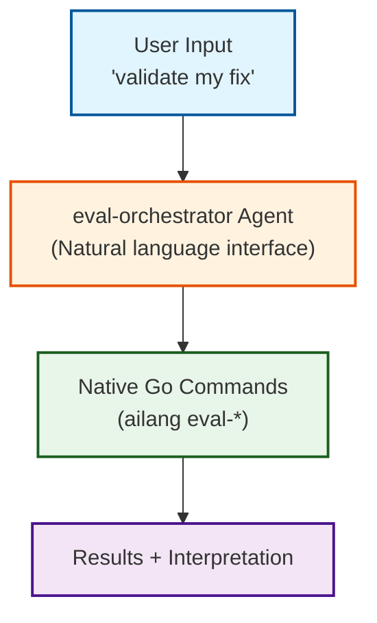

# M-EVAL-LOOP Architecture (v2.0)

## Quick Reference

### Running Evaluations

```bash
# Quick dev eval (default: gpt5-mini, gemini-2-5-flash)
ailang eval-suite

# Full comprehensive eval (gpt5, claude-sonnet-4-5, gemini-2-5-pro)
ailang eval-suite --full

# Custom models
ailang eval-suite --models gpt5,claude-sonnet-4-5

# Create baseline
make eval-baseline                # Quick baseline (dev models)
make eval-baseline FULL=true      # Full baseline (all models)

# Compare results
ailang eval-compare eval_results/baselines/v0.3.0 eval_results/current

# Analyze failures
ailang eval-analyze -results eval_results/baselines/v0.3.0 -dry-run
```

### Available Commands

| Command | Purpose | Example |
|---------|---------|---------|
| `ailang eval-suite` | Run full benchmark suite | `ailang eval-suite --full` |
| `ailang eval-suite --agent` | Run agent-based eval (agentic coding) | `ailang eval-suite --agent --models claude-haiku-4-5` |
| `ailang eval-compare` | Compare two eval runs | `ailang eval-compare baseline current` |
| `ailang eval-compare --chain` | Compare two chain-based runs | `ailang eval-compare --chain ID1 --chain ID2` |
| `ailang eval-analyze` | Analyze failures, generate design docs | `ailang eval-analyze -results dir -dry-run` |
| `ailang eval-matrix` | Generate performance matrix | `ailang eval-matrix results/ v0.3.0` |
| `ailang eval-summary` | Export to JSONL | `ailang eval-summary results/` |
| `ailang eval-report` | Generate reports (file or chain) | `ailang eval-report --from-chain ID v0.8.0` |
| `ailang eval-chains` | List/view/analyze eval chains | `ailang eval-chains stats ID` |

## Architecture Overview



## Tier 1: Native Go Commands

Location: `internal/eval_analysis/` + `internal/eval_harness/` + `cmd/ailang/`

### eval-suite: Full Benchmark Execution

**Key Flags:**
- `--full`: Use expensive models (gpt5, claude-sonnet-4-5, gemini-2-5-pro)
- `--models X,Y,Z`: Custom model list (default: gpt5-mini, gemini-2-5-flash)
- `--benchmarks X,Y,Z`: Specific tests (default: all)
- `--langs X,Y`: Target languages (default: python,ailang)
- `--parallel N`: Concurrent API calls (default: 5)
- `--self-repair`: Enable self-repair on errors
- `--output DIR`: Output directory (default: eval_results)
- `--agent`: Run in agent mode (agentic coding via Claude/Gemini CLI)

**Examples:**
```bash
# Quick dev check (cheap/fast) - standard 0-shot mode
ailang eval-suite

# Full validation (expensive)
ailang eval-suite --full

# Agent mode (agentic coding - uses Claude Code / Gemini CLI)
ailang eval-suite --agent --models claude-haiku-4-5,gemini-2-5-flash

# Custom subset
ailang eval-suite --models gpt5 --benchmarks fizzbuzz,json_parse
```

**Model Cost Comparison:**
- Dev models (default): ~$0.0003-0.002 per benchmark
- Full models (--full): ~$0.003-0.015 per benchmark
- Agent mode: ~$0.01-0.05 per benchmark (uses CLI tools for multi-turn coding)
- **5-10x cheaper for day-to-day development**

### eval-chains: Chain-Based Result Analysis (v0.8.0+)

Agent eval results are stored as chains in `observatory.db` — one chain per suite, one stage per benchmark. Use `ailang eval-chains` to query results:

```bash
# List recent eval chains
ailang eval-chains list

# View chain with per-benchmark assessment
ailang eval-chains view <chain-id>

# Show only failing stages
ailang eval-chains failures <chain-id>

# Pass rate breakdown by model/language/benchmark
ailang eval-chains stats <chain-id>
```

Results can also be loaded into the existing report/compare pipeline:

```bash
# Generate report from chain
ailang eval-report --from-chain <chain-id> v0.8.0 --format=json

# Compare two chains
ailang eval-compare --chain <id1> --chain <id2>

# Use most recent eval chain
ailang eval-report --from-latest-chain v0.8.0
```

### eval-compare: Diff Two Runs

```bash
# File-based comparison
ailang eval-compare baseline/ current/

# Chain-based comparison (v0.8.0+)
ailang eval-compare --chain <id1> --chain <id2>
```

Shows:
- Success rate changes
- Newly passing/failing tests
- Token usage deltas
- Cost differences

### eval-analyze: Failure Analysis

```bash
ailang eval-analyze -results eval_results/baselines/v0.3.0 -dry-run
ailang eval-analyze -results eval_results/baselines/v0.3.0 -generate  # Create design docs
```

Categorizes failures by type (compile_error, runtime_error, logic_error) and can generate design docs for fixes.

### Other Commands

```bash
ailang eval-matrix results/ v0.3.0     # Aggregate stats
ailang eval-summary results/           # Export JSONL
ailang eval-report results/ v0.3.0 -f html  # Generate report
```

## Tier 2: Smart Agents

### eval-orchestrator (.claude/agents/eval-orchestrator.md)

Interprets natural language and routes to correct commands:

```
User: "analyze eval failures"
Agent: → ailang eval-analyze -results dir -dry-run
      → Interprets results
      → Suggests fixes
```

### eval-fix-implementer (.claude/agents/eval-fix-implementer.md)

Automates fix implementation from design docs:

```
User: "implement the float_eq fix"
Agent: → Reads design_docs/planned/EVAL_ANALYSIS_float_eq.md
      → Implements fix
      → Runs tests
      → Runs eval-suite to verify
      → Reports metrics
```

## Make Targets (Convenience)

```bash
make eval-baseline              # Quick baseline
make eval-baseline FULL=true    # Full baseline
make eval-baseline MODELS=X,Y   # Custom baseline

make eval-suite                 # Run benchmarks
make eval-analyze               # Generate design docs
make eval-diff BASELINE=X NEW=Y # Compare runs
```

## User Experience

### Natural Language (Recommended)
```
✅ "validate my fix for records"
✅ "how is AILANG performing?"
✅ "compare baseline to current"
✅ "generate a release report"
```

### Direct Commands (Power Users)
```bash
ailang eval-analyze -results baselines/v0.3.0 -dry-run
ailang eval-compare baselines/v0.3.0 current
ailang eval-report results/ v0.3.0 --format=html
```

## Model Selection Strategy

### Default: Cheap & Fast (Dev Models)
- **Models**: gpt5-mini, gemini-2-5-flash
- **Cost**: ~1/5 of full suite
- **Use for**: Daily development, rapid iteration, CI checks
- **Command**: `ailang eval-suite` (no flags needed)

### Full Suite: Comprehensive (Production Models)
- **Models**: gpt5, claude-sonnet-4-5, gemini-2-5-pro
- **Cost**: Full price
- **Use for**: Release validation, final QA, baseline creation
- **Command**: `ailang eval-suite --full`

### Custom: Mix & Match
- **Models**: Your choice
- **Cost**: Varies
- **Use for**: Targeted testing, specific model evaluation
- **Command**: `ailang eval-suite --models X,Y,Z`

## Data Storage Architecture (v0.8.0+)

### Standard Evals (0-shot + self-repair)
- **Storage**: JSON files on disk (`eval_results/baselines/VERSION/*.json`)
- **Best for**: API-based evaluation, cheap/fast, file-based comparisons
- **Access**: `ailang eval-report results/ VERSION`, `ailang eval-compare dir1 dir2`

### Agent Evals (agentic coding via CLI)
- **Storage**: `observatory.db` chains — one chain per suite, one stage per benchmark
- **Best for**: Multi-turn agent evaluation, rich tool/chat data, structured querying
- **Access**: `ailang eval-chains`, `ailang eval-report --from-chain ID`

### Chain Structure
```
execution_chains (source_type = "eval_suite")
├── source_ref: "eval-<timestamp>/agent"
├── status: completed
├── total_cost, total_tokens
│
├── chain_stage 1: fizzbuzz / claude-haiku / ailang
│   ├── eval_assessment: { compile_ok, runtime_ok, stdout_ok, ... }
│   ├── cost, tokens, turns, tool_calls
│   └── chat_messages (Claude) or session_tools (Gemini)
│
├── chain_stage 2: fizzbuzz / gemini-flash / python
│   └── ...
└── ... (one stage per benchmark × model × language)
```

### Chat/Tool Data Capture (Executor-Aware)

| Executor | Data Source | Table | Quality |
|----------|------------|-------|---------|
| **Claude** | Post-execution JSONL disk import | `chat_messages` | Full tool inputs/outputs, thinking |
| **Gemini** | Real-time streaming | `session_tools` | Full tool inputs/outputs |

## File Organization

```
.claude/
  skills/
    eval-analyzer/                # Eval analysis skill
    post-release/                 # Post-release baseline workflow
    eval-gap-finder/              # Language gap analysis

internal/
  eval_analysis/                  # Native Go implementation (~2,000 LOC)
    types.go, loader.go, comparison.go, matrix.go, formatter.go,
    loader_chains.go              # Chain-based result loading (v0.8.0+)
    export.go, *_test.go (90%+ coverage)
  eval_harness/                   # Benchmark execution
    models.yml                    # Model configurations
    agent_runner_multi.go         # Multi-executor agent runner
  claudehistory/                  # Claude Code JSONL reader/importer
    reader.go, importer.go        # Used for post-execution chat import
  observatory/                    # Chain storage
    store_chains.go               # Chain/stage CRUD + eval assessment

cmd/ailang/
  eval_suite.go                   # eval-suite command
  eval_benchmark.go               # Per-benchmark execution + chain stage management
  eval_tools.go                   # eval-report, eval-compare, eval-chains commands
  eval_parallel.go                # Parallel benchmark runner
  observatory_writer.go           # Streaming tool capture (Gemini)
  main.go                         # Command routing

Makefile                          # Convenience targets
```

## Design Principles

1. **Native Go First**: Fast, type-safe, testable
2. **Smart Agents Layer**: Add intelligence without forcing syntax
3. **Cost-Conscious Defaults**: Cheap models for dev, expensive for release
4. **Flexible**: Natural language, direct commands, or make targets
5. **Separation of Concerns**: Execution vs. interpretation

## Why This Architecture?

### Performance
- Native Go = 5-10x faster than old bash scripts
- No jq/sed/awk overhead
- Parallel execution built-in

### Reliability
- 90%+ test coverage
- Type-safe (no division by zero!)
- Proper error handling

### Usability
- Natural language interface (agents)
- Power user direct commands
- Cost-conscious defaults

### Maintainability
- Clear layer boundaries
- Easy to test and debug
- No brittle bash scripts

---

**Version**: 3.0
**Updated**: 2026-02-14
**Status**: Production Ready
