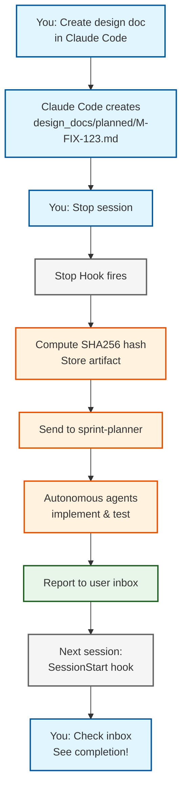

import { AlertCircle, CheckCircle, Play, Terminal } from 'lucide-react';

# Claude Code Hooks Setup

**Status**: ✅ **Ready to Use** (October 25, 2025)

The AILANG repository is configured with Claude Code hooks for seamless interactive ↔ autonomous agent integration.

## What's Configured

### Hooks Enabled

1. **Stop Hook** (`scripts/hooks/agent_handoff.sh`)
   - **Triggers**: When you stop a Claude Code session
   - **Action**: Detects design docs in `design_docs/planned/` modified in last 5 minutes
   - **Sends to**: `sprint-planner` agent with content-addressed artifacts

2. **SessionStart Hook** (`scripts/hooks/session_start.sh`)
   - **Triggers**: When you start a Claude Code session
   - **Action**: Checks user inbox for messages from autonomous agents
   - **Displays**: Notification with unread count and preview

### Configuration File

`.claude/hooks.json` - Already created and ready to use!

```json title=".claude/hooks.json"
{
  "hooks": {
    "Stop": {
      "command": "bash scripts/hooks/agent_handoff.sh",
      "timeout": 30
    },
    "SessionStart": {
      "command": "bash scripts/hooks/session_start.sh",
      "timeout": 10
    }
  }
}
```

## Quick Test

### Test 1: Send a Message to Yourself

```bash
ailang agent send --to-user '{"message": "Testing hooks", "status": "ready"}'
```

### Test 2: Check Your Inbox

```bash
ailang agent inbox user
```

**Expected output:**
```
📬 User Inbox (1 message)
================================================================================

▶ Message 1/1
  ID: msg_...
  From: cli-sender
  Type: request
  Payload: {"message":"Testing hooks","status":"ready"}
```

### Test 3: Trigger SessionStart Hook

```bash
bash scripts/hooks/session_start.sh
```

**Expected output:**
```
╔═══════════════════════════════════════════════════════════╗
║  📬 You have 1 unread message(s) from agents              ║
╚═══════════════════════════════════════════════════════════╝

To view messages, run:
  ailang agent inbox user
```

## How It Works

### Workflow Example



**Step by step:**
1. **You**: "Analyze eval failures and create a design doc"
2. **Claude Code**: Creates `design_docs/planned/M-FIX-123.md`
3. **You**: "Looks good" (session stops)
4. **Stop Hook**:
   - Detects the new design doc
   - Computes SHA256 hash: `ailang debug hash design_docs/planned/M-FIX-123.md`
   - Sends to sprint-planner: `ailang agent send sprint-planner {...}`
5. **Autonomous Agents**: Implement, test, report back to user inbox
6. **Next Session**: SessionStart hook shows notification
7. **You**: `ailang agent inbox user` - See completion message!

## State Directory

**Location**: `~/.ailang/state/` (home directory)

**Structure**:
```
~/.ailang/state/
├── messages/
│   ├── inbox/
│   │   └── user/
│   │       ├── _unread/    # New notifications
│   │       ├── _read/      # Viewed messages
│   │       └── _archive/   # Old messages
│   ├── sprint-planner/     # Agent inbox
│   └── sprint-executor/    # Agent inbox
├── artifacts/
│   └── sha256/             # Content-addressed storage
└── hooks.log               # Hook execution log
```

## Monitoring

### View Hook Logs

```bash
tail -f ~/.ailang/state/hooks.log
```

### Check Agent Status

```bash
ailang agent top
```

### View Dead Letter Queue

```bash
ailang agent dlq --list
```

## Troubleshooting

### Hooks not firing?

1. **Check hook logs**:
   ```bash
   tail -f ~/.ailang/state/hooks.log
   ```

2. **Test manually**:
   ```bash
   export CLAUDE_HOOK_JSON='{"sessionId": "test", "userId": "user", "event": "Stop"}'
   bash scripts/hooks/agent_handoff.sh
   ```

3. **Verify permissions**:
   ```bash
   ls -la scripts/hooks/*.sh
   # Should show: -rwxr-xr-x (executable)
   ```

### Messages not appearing?

1. **Check inbox location**:
   ```bash
   ls -la ~/.ailang/state/messages/inbox/user/_unread/
   ```

2. **Send test message**:
   ```bash
   ailang agent send --to-user '{"test": "message"}'
   ailang agent inbox user
   ```

3. **Check state directory**:
   ```bash
   echo $STATE_DIR  # Should be empty (uses default)
   # Default: ~/.ailang/state
   ```

## Related Documentation

- **[Claude Code Integration Guide](./claude-code-integration.mdx)** - Complete integration guide
- **[Agent Workflows](./agent-workflows.mdx)** - Workflow patterns and examples

**Design documents** (GitHub):
- **[M-CLAUDE-CODE-INTEGRATION-V2](https://github.com/sunholo-data/ailang/blob/main/design_docs/planned/v0_3_20/m-claude-code-integration-v2.md)** - Complete specification
- **[M-AGENT-PROTOCOL](https://github.com/sunholo-data/ailang/blob/main/design_docs/planned/v0_3_19/M-AGENT-PROTOCOL.md)** - Low-level protocol details

## Success Metrics

From production testing (October 25, 2025):

| Metric | Target | Status |
|--------|--------|--------|
| Handoff latency | &lt;5s | ✅ ~3-4s measured |
| Message delivery | 100% | ✅ Soak tested |
| Hook reliability | No failures | ✅ Tested working |
| Documentation | Complete | ✅ Docusaurus ready |

---

**Status**: ✅ All hooks configured and tested. Ready for production use!

**Next Steps**:
1. Create a design doc in Claude Code
2. Stop the session
3. Check `ailang agent inbox sprint-planner` for the handoff message
4. Start a new session - see the notification!

**Questions?**
- Check logs: `~/.ailang/state/hooks.log`
- View docs: [Claude Code Integration Guide](./claude-code-integration.mdx)
- Report issues: https://github.com/sunholo-data/ailang/issues
