# Module Execution Guide

**AILANG v0.5.11** - Complete guide to executing modules with entrypoint functions

---

import Icon, { CheckIcon, CrossIcon, InfoIcon, WarningIcon } from '@site/src/components/Icon';
import CodeBlock from '@theme/CodeBlock';

{/* Import verified example files */}
import HelloExample from '!!raw-loader!@site/../examples/runnable/hello.ail';
import ModuleWithHelper from '!!raw-loader!@site/../examples/docs/module_with_helper.ail';
import ModuleMainInt from '!!raw-loader!@site/../examples/docs/module_main_int.ail';
import ModuleGreet from '!!raw-loader!@site/../examples/docs/module_greet.ail';
import ModuleProcessRecord from '!!raw-loader!@site/../examples/docs/module_process_record.ail';
import ModuleAddRecord from '!!raw-loader!@site/../examples/docs/module_add_record.ail';
import IoPrintDemo from '!!raw-loader!@site/../examples/docs/io_print_demo.ail';
import IoPrintlnDemo from '!!raw-loader!@site/../examples/docs/io_println_demo.ail';
import CliGreeter from '!!raw-loader!@site/../examples/docs/cli_greeter.ail';

## <Icon name="info" inline /> Overview

AILANG v0.2.0 introduces the **Module Execution Runtime** (M-R1), enabling you to run modules with exported entrypoint functions. This guide covers basic usage, requirements, and common patterns.

### Execution Pipeline

```mermaid
graph LR
    A["Source File<br/>(module.ail)"] --> B["Parse"]
    B --> C["Type Check"]
    C --> D["Elaborate to Core"]
    D --> E["Load Module"]
    E --> F["Find Entrypoint"]
    F --> G["Execute"]
    G --> H["Output"]

    style A fill:#e1f5fe,stroke:#01579b,stroke-width:2px
    style B fill:#f5f5f5,stroke:#616161,stroke-width:2px
    style C fill:#f5f5f5,stroke:#616161,stroke-width:2px
    style D fill:#f5f5f5,stroke:#616161,stroke-width:2px
    style E fill:#fff3e0,stroke:#e65100,stroke-width:2px
    style F fill:#fff3e0,stroke:#e65100,stroke-width:2px
    style G fill:#e8f5e9,stroke:#1b5e20,stroke-width:2px
    style H fill:#f3e5f5,stroke:#4a148c,stroke-width:2px
```



## <Icon name="rocket" inline /> Quick Start

### Basic Usage

```bash
# Run a module with a main() function
ailang run --caps IO --entry main examples/hello.ail

# Run with a different entrypoint
ailang run --caps IO --entry greet examples/demo.ail

# Pass arguments via JSON
ailang run --caps IO --entry process --args-json '{"input": "data"}' examples/processor.ail
```

### Minimal Example

<CodeBlock language="typescript" title="examples/runnable/hello.ail">
  {HelloExample}
</CodeBlock>

Run with:
```bash
ailang run --caps IO --entry main examples/runnable/hello.ail
# Output: Hello, AILANG!
```

---

## <Icon name="code" inline /> Module Structure

### Anatomy of an Executable Module

<CodeBlock language="typescript" title="examples/docs/module_with_helper.ail">
  {ModuleWithHelper}
</CodeBlock>

### Module Declaration

- **Required**: Every executable module must have a `module` declaration
- **Path matching**: Module path must match file path
  - File: `examples/demo.ail` → Module: `module examples/demo`
  - File: `src/utils/math.ail` → Module: `module src/utils/math`

---

## <Icon name="target" inline /> Entrypoint Functions

### Requirements

An entrypoint function must:
1. <CheckIcon inline size={14} /> Be **exported** from the module (`export func`)
2. <CheckIcon inline size={14} /> Be a **function** (not a value)
3. <CheckIcon inline size={14} /> Have **0 or 1 parameters** (v0.2.0 limitation)
4. <CheckIcon inline size={14} /> Be specified via `--entry <name>` flag

### Supported Arities

#### 0-Argument Functions

<CodeBlock language="typescript" title="examples/docs/module_main_int.ail">
  {ModuleMainInt}
</CodeBlock>

Run with:
```bash
ailang run --entry main examples/docs/module_main_int.ail
# Output: 42
```

#### 1-Argument Functions

<CodeBlock language="typescript" title="examples/docs/module_greet.ail">
  {ModuleGreet}
</CodeBlock>

Run with:
```bash
ailang run --caps IO --entry greet --args-json '"World"' examples/docs/module_greet.ail
# Output: World
```

#### Record Parameters (Recommended Pattern)

<CodeBlock language="typescript" title="examples/docs/module_process_record.ail">
  {ModuleProcessRecord}
</CodeBlock>

Run with:
```bash
ailang run --caps IO --entry process --args-json '{"input": "data", "count": 5}' examples/docs/module_process_record.ail
# Output: data
```

### Multi-Argument Workaround

Functions with 2+ parameters are not directly supported. Wrap parameters in a record:

<CrossIcon inline size={14} /> **Not supported:**
```typescript
export func add(x: int, y: int) -> int {
    x + y
}
```

<CheckIcon inline size={14} /> **Supported pattern:**
<CodeBlock language="typescript" title="examples/docs/module_add_record.ail">
  {ModuleAddRecord}
</CodeBlock>

Run with:
```bash
ailang run --entry add --args-json '{"x": 10, "y": 32}' examples/docs/module_add_record.ail
# Output: 42
```

---

## stdlib Functions

### IO Builtins

AILANG v0.2.0 provides three builtin IO functions:

#### `_io_print(s: string) -> ()`

Print a string without a newline.

<CodeBlock language="typescript" title="examples/docs/io_print_demo.ail">
  {IoPrintDemo}
</CodeBlock>

Output: `Hello World`

#### `_io_println(s: string) -> ()`

Print a string with a newline.

<CodeBlock language="typescript" title="examples/docs/io_println_demo.ail">
  {IoPrintlnDemo}
</CodeBlock>

Output:
```
Line 1
Line 2
```

#### `_io_readLine() -> string`

Read a line from stdin (blocking).

```typescript
export func main() -> () {
    _io_println("Enter your name:")
    let name = _io_readLine() in
    _io_println(name)
}
```

---

## Return Values and Output

### Printing Results

- **Non-Unit values**: Printed to stdout automatically
- **Unit values**: Silent (no output)

```typescript
-- Returns int, prints to stdout
export func compute() -> int {
    42
}

-- Returns unit, no output
export func greet() -> () {
    _io_println("Hello")
}
```

### Exit Codes

- **Success**: Exit code 0
- **Runtime error**: Exit code 1
- **Type error**: Exit code 1
- **Parse error**: Exit code 1

---

## Effects and Type Checking

### Effect Annotations (v0.2.0)

Effects are **type-checked** but **not enforced** at runtime in v0.2.0.

```typescript
-- Effect annotation required for IO operations
export func main() -> () ! {IO} {
    _io_println("Hello")
}
```

**Note**: Runtime effect enforcement is **live** — capabilities are granted per-run with
`ailang run --caps IO,FS ...` (a program may only perform effects whose capabilities it was
granted). See the [effects reference](/docs/reference/effects) and
[capability budgets](/docs/reference/capability-budgets).

### Pure Functions

Pure functions have no effect annotation:

```typescript
export pure func add(x: int, y: int) -> int {
    x + y
}
```

---

## Common Patterns

### Simple Script

```typescript
module scripts/hello

export func main() -> () {
    _io_println("Hello from AILANG!")
}
```

### CLI Tool with Arguments

<CodeBlock language="typescript" title="examples/docs/cli_greeter.ail">
  {CliGreeter}
</CodeBlock>

Usage:
```bash
ailang run --caps IO --entry greet --args-json '{"name":"Alice","greeting":"Hello"}' examples/docs/cli_greeter.ail
# Output: Hello Alice
```

### Interactive Program

```typescript
module apps/echo

export func main() -> () {
    _io_println("Enter text:")
    let input = _io_readLine() in
    _io_println(input)
}
```

---

## Error Handling

### Common Errors

#### Entrypoint Not Found

```
Error: entrypoint 'main' not found in module examples/demo
  Available exports: greet, process
```

**Solution**: Use `--entry <name>` with an exported function name.

#### Wrong Arity

```
Error: entrypoint 'process' takes 2 parameters. v0.2.0 supports 0 or 1.
  Suggestion: wrap as 'wrapper(p:{...}) -> ...' and pass --args-json
```

**Solution**: Wrap parameters in a record type.

#### Not a Function

```
Error: entrypoint 'config' is not a function (got RecordValue)
```

**Solution**: Only functions can be entrypoints. Values cannot be executed.

#### Module Path Mismatch

```
Error: module declaration 'hello' doesn't match canonical path 'examples/hello'
Suggestions:
  1. Rename module to: module examples/hello
  2. Move file to: hello.ail
```

**Solution**: Ensure module path matches file path.

---

## Known Limitations (v0.2.0)

### Supported <CheckIcon inline size={14} />
- 0-argument and 1-argument entrypoints
- Builtin IO functions (`_io_print`, `_io_println`, `_io_readLine`)
- JSON argument parsing
- Module imports and dependency resolution
- Type checking with effects
- Pure functions

### Not Yet Supported ⏳
- **Multi-argument functions** (2+ parameters)
  - Workaround: Use record parameter
- **Effect enforcement** at runtime
  - Effects are type-checked only
  - Runtime capability checks coming in M-R2 (v0.3.0)
- **Pattern matching guards**
  - Planned for M-P4
- **Multi-statement function bodies**
  - Parser limitation, planned for future release

---

## Advanced Topics

### Module Dependencies

Modules can import other modules:

```typescript
-- math/utils.ail
module math/utils

export func double(x: int) -> int {
    x * 2
}
```

```typescript
-- app/main.ail
module app/main
import math/utils (double)

export func main() -> () {
    let result = double(21) in
    _io_println(show(result))
}
```

### Encapsulation

Only **exported** bindings are accessible from other modules:

```typescript
module lib/secret

-- Private (not accessible from imports)
func private_helper() -> int {
    42
}

-- Public (accessible via import)
export func public_api() -> int {
    private_helper()
}
```

---

## CLI Reference

### Flags

- `--entry <name>`: Specify entrypoint function (required for modules)
- `--args-json <json>`: Pass arguments as JSON (for 1-arg functions)
- `--runner <mode>`: Choose execution runner (`module` or `fallback`)
- `--no-print`: Suppress output (exit code only)

### Examples

```bash
# Basic execution
ailang run --entry main app.ail

# With arguments
ailang run --entry process --args-json '{"data": [1,2,3]}' app.ail

# Use fallback runner (pre-M-R1 execution)
ailang run --runner fallback app.ail

# Exit code only (no output)
ailang run --entry main --no-print app.ail
echo $?  # Check exit code
```

---

## Troubleshooting

### Module won't load

1. Check module path matches file path
2. Ensure all imports exist
3. Verify no circular imports
4. Check for syntax errors: `ailang check module.ail`

### Function won't execute

1. Ensure function is exported: `export func ...`
2. Check arity (0 or 1 parameters only)
3. Verify entrypoint name: `--entry <name>`
4. Check type errors: `ailang check module.ail`

### No output

- Functions returning `()` (Unit) produce no output
- Use `_io_println()` for explicit output
- Check stderr for errors: `ailang ... 2>&1 | grep Error`

---

## What's Next?

### v0.3.0 (M-R2: Effect Runtime)
- Runtime effect enforcement
- Capability-based security
- IO and FS capabilities
- Deny-by-default model

### v0.4.0 (Pattern Matching Polish)
- Guards in match expressions
- Exhaustiveness checking
- Decision tree optimization

### Future
- Multi-statement function bodies
- Async/await concurrency
- Quasiquotes (SQL, HTML, regex)
- Training data export

---

## See Also

- [Effect System](/docs/reference/effects) - Understanding effects and capabilities
- [Module Reference](/docs/reference/modules) - Module syntax and organization
- [Testing Guide](/docs/guides/testing) - Testing module code
- [Debugging Guide](/docs/guides/debugging) - Troubleshooting execution issues
- [Language Syntax](/docs/reference/language-syntax) - Complete syntax reference

## Resources

- **Examples**: `examples/` directory
- **stdlib**: `stdlib/std/io.ail`, `stdlib/std/option.ail`
- **Design docs**: `design_docs/20251002/m_r1_module_execution.md`
- **CHANGELOG**: Track new features and breaking changes

---

**Version**: v0.5.11
**Last Updated**: December 2025
**Status**: Complete
