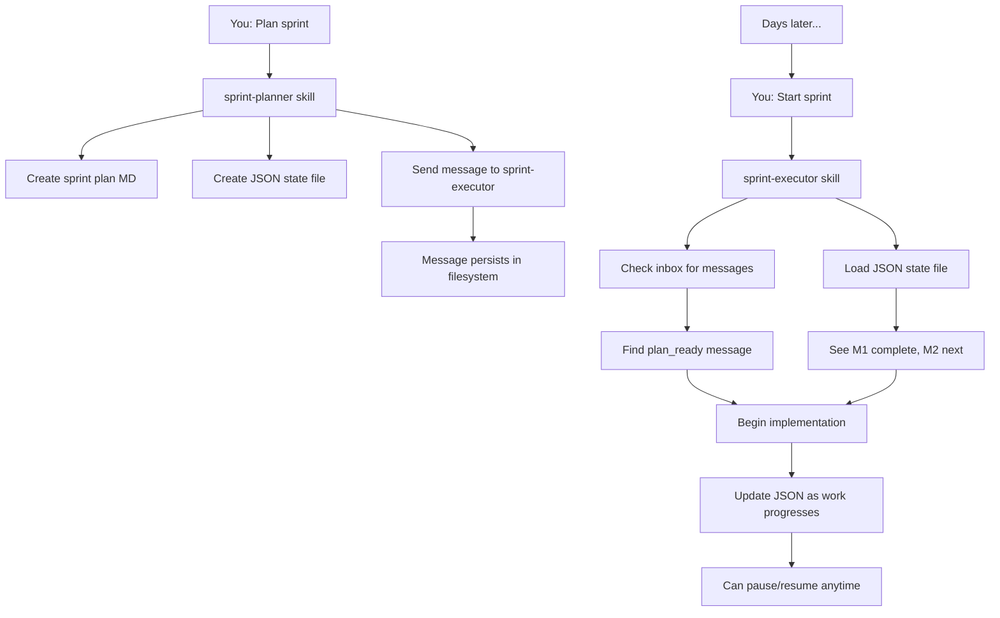

# State System & Multi-Session Workflows

Learn how AILANG's state system enables persistent, multi-session development workflows with Claude Code skills.

## Overview

AILANG provides a sophisticated state management system that enables **multi-day sprints**, **agent handoffs**, and **session continuity**. Unlike traditional AI assistants that lose context when you close them, AILANG's state system persists progress across sessions.

:::tip Key Innovation
The state system gives Claude Code a "hard drive" - work persists across sessions, days, or weeks!
:::

## Three Integrated Systems

### 1. AILANG Agent Messaging

Built into AILANG itself (Go implementation), provides persistent message passing between agents.

**Location:** `.ailang/state/messages/<agent-id>/`

**Commands:**
```bash
# Send message to an agent
ailang agent send <agent-id> '<json message>'

# Check inbox
ailang agent inbox <agent-id> --unread-only

# Acknowledge message (mark as read)
ailang agent ack <message-id>

# Un-acknowledge if task failed
ailang agent unack <message-id>
```

**Two inbox locations:**
- **User inbox:** `~/.ailang/state/messages/user/` - Home directory, persists across projects
- **Agent inboxes:** `.ailang/state/messages/<agent-id>/` - Project-specific

### 2. JSON State Files

Structured progress tracking for long-running tasks like sprints.

**Location:** `.ailang/state/sprints/sprint_<id>.json`

**Purpose:**
- Track milestone completion (`passes: true/false/null`)
- Record actual LOC vs estimates
- Store velocity metrics
- Enable multi-session continuity

**Example:**
```json
{
  "sprint_id": "M-TESTING-INLINE",
  "status": "in_progress",
  "milestones": [
    {
      "id": "M1",
      "description": "Pipeline Integration",
      "passes": true,
      "actual_loc": 210,
      "started": "2025-11-27T09:00:00Z",
      "completed": "2025-11-27T15:00:00Z"
    },
    {
      "id": "M2",
      "description": "Examples & Tests",
      "passes": null,
      "started": "2025-11-27T15:00:00Z"
    }
  ]
}
```

### 3. Claude Code Skills

Specialized workflows following Anthropic's October 2025 specification.

**Location:** `.claude/skills/<skill-name>/`

**Key skills:**
- **sprint-planner** - Creates plans, sends handoffs
- **sprint-executor** - Executes plans, reads state
- **agent-inbox** - Checks messages from agents

## How They Work Together



## Complete Workflow Example

### Session 1: Planning (15 minutes)

```bash
# Start Claude Code
You: "Plan sprint for inline testing"

# sprint-planner skill activates automatically
✓ Analyzes design docs
✓ Checks recent velocity (31 LOC/day)
✓ Discovers feature is 90% complete!
✓ Creates sprint plan:
  design_docs/planned/v0_4_2/M-TESTING-INLINE-COMPLETION-SPRINT.md

✓ Creates JSON state:
  .ailang/state/sprints/sprint_M-TESTING-INLINE.json

✓ Sends handoff message:
  ailang agent send sprint-executor '{
    "type": "plan_ready",
    "sprint_id": "M-TESTING-INLINE",
    "progress_path": ".ailang/state/sprints/sprint_M-TESTING-INLINE.json",
    "estimated_duration": "1-2 days",
    "milestones": [...]
  }'

# Message persists at:
~/.ailang/state/messages/sprint-executor/msg_20251127_092441.pending.json

# You close Claude Code
# Days pass... no memory retained in Claude
```

### Session 2: Start Implementation (next day)

```bash
# You open Claude Code (fresh session, no memory)
You: "Start the sprint"

# sprint-executor skill activates
✓ Checks inbox:
  ailang agent inbox sprint-executor --unread-only

✓ Finds message from sprint-planner:
  "plan_ready" for M-TESTING-INLINE

✓ Loads JSON state:
  .ailang/state/sprints/sprint_M-TESTING-INLINE.json

✓ Shows summary:
  ╔═══════════════════════════════════════════╗
  ║  Sprint M-TESTING-INLINE                  ║
  ╚═══════════════════════════════════════════╝

  Status: not_started
  Progress: 0/2 milestones

  Next: M1 - Pipeline Integration (8 hours)
        - Create executor.go
        - Update runner.go
        - Write unit tests

✓ Begins work with TDD:
  1. Write test first
  2. Implement code
  3. Run make test && make lint
  4. Update JSON: {"id": "M1", "passes": true}
  5. Commit code

# You work for 6 hours, complete M1
# Need to stop for the day

You: "Pause sprint"

✓ Updates JSON:
  {
    "status": "paused",
    "last_checkpoint": "M1 complete, M2 ready to start",
    "milestones": [
      {"id": "M1", "passes": true, "actual_loc": 210}
    ]
  }

# You close Claude Code
# A week passes...
```

### Session 3: Resume Work (a week later)

```bash
# You open Claude Code (fresh session, no memory of last week)
You: "Continue the sprint"

# sprint-executor skill activates
✓ Loads JSON state (no inbox check needed - state is current)

✓ Shows "Here's where we left off":
  ╔═══════════════════════════════════════════╗
  ║  Sprint M-TESTING-INLINE                  ║
  ╚═══════════════════════════════════════════╝

  Status: paused
  Progress: 1/2 milestones complete

  Completed:
    ✓ M1: Pipeline Integration (210 LOC, 6 hours)

  Next:
    → M2: Examples & Tests (4-6 hours)
        - Fix examples/testing_basic.ail
        - Update examples/factorial.ail
        - Write integration tests

  Last checkpoint: "M1 complete, M2 ready to start"
  Velocity: 35 LOC/hour (on track!)

✓ Continues implementation from exactly where it left off
✓ NO manual recap needed
✓ NO context lost
```

## Directory Structure

```
your-project/
├── .claude/                    # Claude Code skills (IDE-local)
│   └── skills/
│       ├── sprint-planner/     # Creates plans & handoffs
│       └── sprint-executor/    # Executes plans, tracks progress
│
├── .ailang/                    # AILANG state (persistent)
│   └── state/
│       ├── sprints/            # Sprint progress tracking
│       │   ├── sprint_M-TESTING-INLINE.json
│       │   ├── sprint_M-DX11.json
│       │   └── sprint_M-POLY-B.json
│       │
│       └── messages/           # Agent messaging
│           ├── sprint-executor/
│           │   └── msg_*.pending.json
│           ├── user/           # Messages to you
│           └── claude-code/    # Messages to Claude
│
└── design_docs/
    └── planned/v0_4_2/
        └── M-TESTING-INLINE-COMPLETION-SPRINT.md
```

## Practical Use Cases

### Use Case 1: Check Sprint Status (Without Claude)

```bash
# From command line, inspect progress anytime:
$ jq '.milestones[] | {id, passes, actual_loc}' \
  .ailang/state/sprints/sprint_M-TESTING-INLINE.json

{
  "id": "M1",
  "passes": true,
  "actual_loc": 210
}
{
  "id": "M2",
  "passes": null,
  "actual_loc": 0
}
```

### Use Case 2: Review Messages

```bash
# See all messages waiting for sprint-executor:
$ ailang agent inbox sprint-executor

Message ID: msg_20251127_092441
From: cli-sender
Type: plan_ready
Sprint: M-TESTING-INLINE
Status: unread
Created: 2025-11-27 09:24:41

# Mark as read after handling:
$ ailang agent ack msg_20251127_092441
```

### Use Case 3: Recovery from Interruption

```bash
# Sprint crashes, Claude session lost
# No problem! State is persistent:

$ cat .ailang/state/sprints/sprint_M-TESTING-INLINE.json
{
  "milestones": [
    {
      "id": "M1",
      "passes": true,
      "notes": "Complete, all tests pass"
    },
    {
      "id": "M2",
      "passes": null,
      "started": "2025-11-27T10:00:00Z",
      "notes": "In progress, wrote 3/5 example files"
    }
  ]
}

# Start new Claude session:
You: "Resume sprint M-TESTING-INLINE"

Claude: "I see M1 is complete and M2 is in progress.
         You've written 3/5 example files.
         Let me continue with the remaining 2..."
```

### Use Case 4: Parallel Sprints

```bash
# Work on multiple features simultaneously
$ ls .ailang/state/sprints/
sprint_M-TESTING-INLINE.json    # Testing feature (70% done)
sprint_M-DX11.json               # Developer experience (20% done)
sprint_M-POLY-B.json             # Polymorphism phase 2 (not started)

# Switch between them freely:
You: "Continue sprint M-DX11"
# Claude loads that sprint's state, continues that work

You: "Switch to M-TESTING-INLINE"
# Claude saves M-DX11 state, loads M-TESTING-INLINE state
```

## Key Benefits

### 1. Multi-Day/Week Sprints
Work on complex features over extended periods without losing context.

### 2. Zero Context Loss
State persists across session boundaries, interruptions, crashes, or days of inactivity.

### 3. Automatic Agent Handoffs
sprint-planner → sprint-executor with zero manual copy/paste.

### 4. Parallel Development
Multiple sprints can run concurrently, switch between them anytime.

### 5. Auditable Progress
All progress tracked in version-controlled JSON files.

### 6. Resumable Anytime
Interrupt work at any point, resume exactly where you left off.

## Comparison: Before vs After

### Without State System ❌

```
Session 1:
You: "Plan sprint"
Claude: Creates plan (in context only)
[Close Claude]

Session 2 (days later):
You: "Continue sprint"
Claude: "I don't have context about a sprint"
You: *Pastes entire plan manually*
You: "We completed M1, now do M2"
You: *Explains what M1 was*
You: *Explains what tests passed*
```

**Time lost: 10-15 minutes every session for context**

### With State System ✅

```
Session 1:
You: "Plan sprint"
Claude: Creates plan + JSON + sends message
[Close Claude]

Session 2 (days later):
You: "Continue sprint"
Claude: Loads state → "M1 complete, starting M2..."
```

**Time lost: 0 minutes!**

## Technical Details

### Message Format

Messages use JSON with standard fields:

```json
{
  "type": "plan_ready",
  "correlation_id": "sprint_M-TESTING-INLINE_2025-11-27",
  "sprint_id": "M-TESTING-INLINE",
  "plan_path": "design_docs/planned/v0_4_2/M-TESTING-INLINE-COMPLETION-SPRINT.md",
  "progress_path": ".ailang/state/sprints/sprint_M-TESTING-INLINE.json",
  "estimated_duration": "1-2 days (10-14 hours)",
  "milestones": [
    {
      "id": "M1",
      "name": "Pipeline Integration",
      "estimated_hours": 8
    }
  ],
  "discovery": "Feature is 90-95% complete!",
  "total_loc_estimate": 400,
  "risk_level": "low"
}
```

### State File Schema

Sprint JSON files follow a consistent schema:

```json
{
  "sprint_id": "M-TESTING-INLINE",
  "created": "2025-11-27T09:00:00Z",
  "status": "in_progress",
  "plan_path": "design_docs/...",
  "milestones": [
    {
      "id": "M1",
      "description": "Pipeline Integration",
      "estimated_loc": 200,
      "actual_loc": 210,
      "passes": true,
      "started": "2025-11-27T09:00:00Z",
      "completed": "2025-11-27T15:00:00Z",
      "notes": "Completed ahead of schedule"
    }
  ],
  "velocity": {
    "target_loc_per_day": 150,
    "actual_loc_per_day": 35,
    "estimated_total_loc": 400,
    "actual_total_loc": 210
  },
  "last_session": "2025-11-27T15:00:00Z",
  "last_checkpoint": "M1 complete, M2 ready"
}
```

## Best Practices

### 1. Commit State Files
```bash
# Track sprint progress in git
git add .ailang/state/sprints/sprint_*.json
git commit -m "Update sprint progress: M1 complete"
```

### 2. Regular Checkpoints
```bash
# After completing each milestone:
You: "Update sprint checkpoint"
# Claude updates JSON with latest progress
```

### 3. Clear Messages
```bash
# When sending custom messages, include context:
ailang agent send sprint-executor '{
  "type": "pause_request",
  "reason": "Need to context-switch to urgent bug",
  "resume_at": "2025-11-28",
  "current_state": "M2 50% complete"
}'
```

### 4. Clean Up Old Sprints
```bash
# Archive completed sprints
mkdir -p .ailang/state/sprints/archive
mv .ailang/state/sprints/sprint_M-OLD.json \
   .ailang/state/sprints/archive/
```

## Troubleshooting

### Sprint State Not Loading

```bash
# Check if file exists
ls -la .ailang/state/sprints/

# Validate JSON
jq -e . .ailang/state/sprints/sprint_M-TESTING-INLINE.json

# Check permissions
chmod 644 .ailang/state/sprints/*.json
```

### Messages Not Appearing

```bash
# Check both inbox locations
ailang agent inbox sprint-executor  # Project inbox
ailang agent inbox user             # User inbox

# List all messages (including read)
ailang agent inbox sprint-executor --read-only
```

### State Conflicts

```bash
# If multiple Claude sessions modify same sprint:
# 1. Load current state
cat .ailang/state/sprints/sprint_M-TESTING-INLINE.json

# 2. Manually merge if needed
# 3. Commit merged version
git add .ailang/state/sprints/sprint_M-TESTING-INLINE.json
git commit -m "Resolve sprint state conflict"
```

## Related Documentation

- [Agent Workflows](/docs/guides/agent-workflows) - Overview of agent patterns
- [Claude Code Integration](/docs/guides/claude-code-integration) - Setting up Claude Code
- [Hooks Setup](/docs/guides/hooks-setup) - Configuring hooks for automation

## Further Reading

- [Anthropic: Long-Running Agents](https://www.anthropic.com/engineering/effective-harnesses-for-long-running-agents) - Design patterns this system implements
- [AILANG Agent System](https://github.com/sunholo-data/ailang) - Source code and examples
