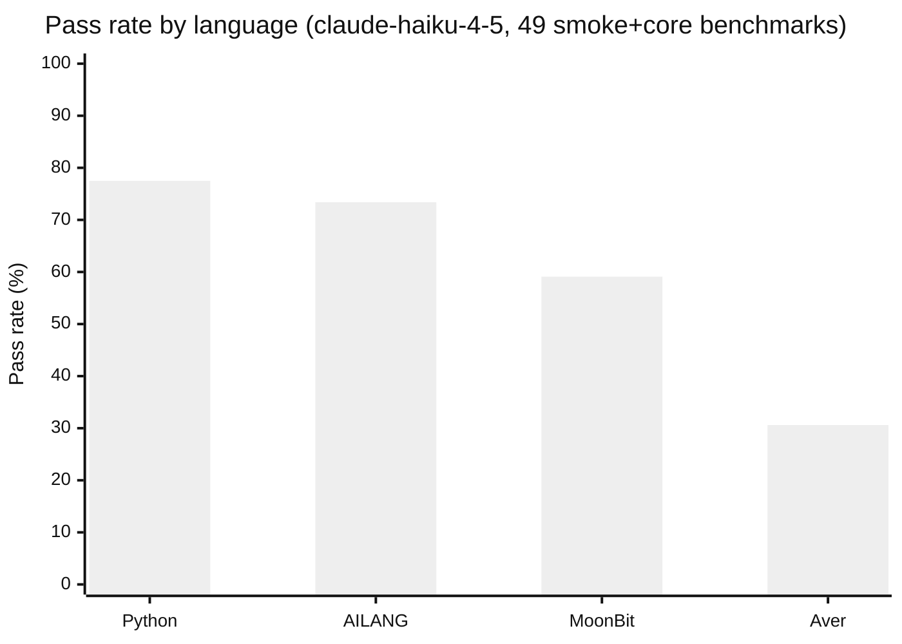
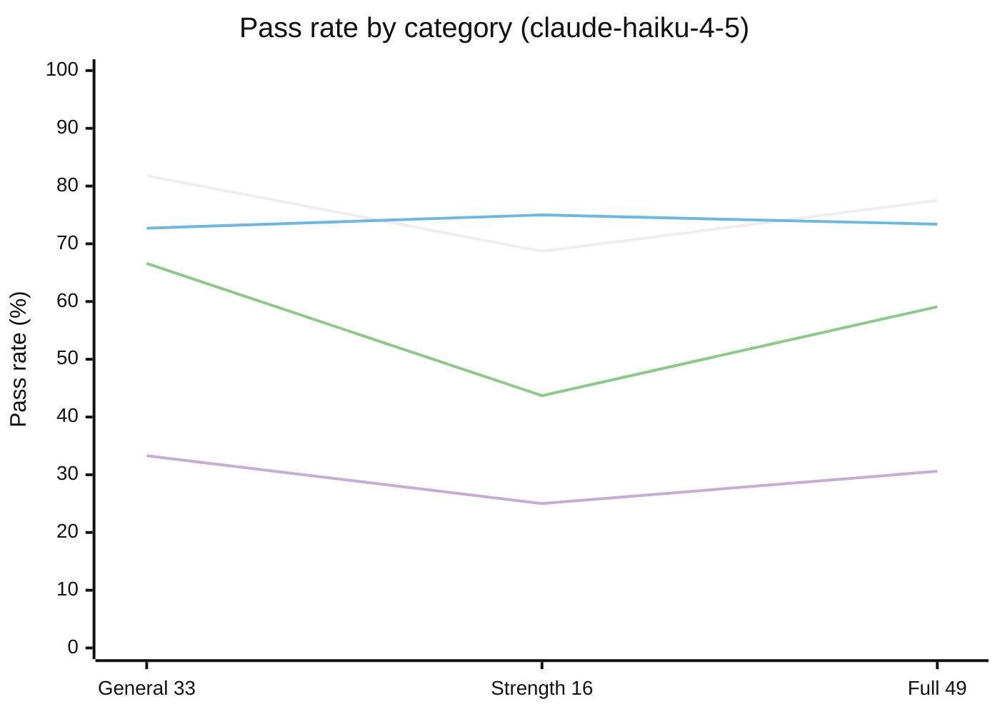

# Three Camps Self-Audit

The companion [Three Camps Comparison](./three-camps-comparison) page surveys 16 AI-native languages and identifies ~14 **gap benchmarks** — each one a testable hypothesis about why a particular camp exists. This page is AILANG running against those benchmarks. Honest scoreboard. The failures are the most informative part.

:::tip Methodology in one sentence
We wrote 14 benchmarks designed to probe each camp's core claim, then ran AILANG and Python (baseline) under the same teaching-prompt eval methodology AILANG already uses on itself.
:::

## Setup

- **Run date**: 2026-05-20
- **Model**: `claude-haiku-4-5` (cheap-model floor; multi-model run deferred)
- **Languages**: AILANG, Python (baseline)
- **Benchmarks**: 11 of 14 (3 vision-tier benchmarks requiring real `std/ai` provider deferred to mainline eval)
- **Self-repair**: enabled (LLM gets one retry on compile errors)
- **Duration**: 11s wall-clock for 22 runs
- **Cost**: under $0.50

The 3 vision-tier benchmarks deferred from this run are `multi_agent_handoff`, `ai_effect_summarize`, `ai_effect_json_schema` — all require a real AI provider configured. Their type-level structure is verified but execution is left to the next mainline eval cycle.

## Aggregate Results

| Language | Pass Rate (initial run) | After harness-bug fix | One-shot | Self-repair pass | Fail |
|----------|-------------------------|-----------------------|----------|-------------------|------|
| AILANG | 8/11 (73%) | unchanged | 5 | 3 | 3 |
| Python | 10/11 (91%) | **11/11 (100%)** on the affected benchmark | 9 | 1 | 1 (since fixed) |

"One-shot" = passed without using the self-repair retry. "Self-repair pass" = first attempt produced a compile error but the LLM corrected it on retry (~2× token cost).

:::note Harness bug discovered mid-sprint
The initial run flagged the Python `ast_patch_roundtrip` solution as `WRONG_LANG`. Inspection showed the Python code was perfectly valid Python — but `CategorizeErrorWithCode` was applying its `WRONG_LANG` regex (which matches `def `, `import json`, `class `, `function `, etc.) regardless of target language. Those patterns are *idiomatic* in Python/JS/Go/Java, so any valid Python solution containing `import json` was falsely flagged. The fix [gates the WRONG_LANG/IMPERATIVE patterns on `language == "ailang"`](https://github.com/sunholo-data/ailang/blob/dev/internal/eval_harness/errors.go) and adds regression tests covering Python/JS/Go code. The single rerun confirms Python now scores correctly; full re-baseline left for the next mainline eval cycle.
:::

## The Hypothesis Map

For each gap benchmark, the table below records:
- **Pass/Fail** for AILANG and Python
- The camp's underlying claim
- What the result tells us about that claim

| Benchmark | AILANG | Python | Camp's claim | Result |
|-----------|--------|--------|--------------|--------|
| `dense_operator_program` | ✅ | ✅ | **NERD**: ambiguous operators hurt LLM pass rate | **Refuted (locally).** Both languages pass operator-heavy code one-shot. Tokenizer ambiguity is not the bottleneck for this model on this task. |
| `shadowing_heavy_contract` | ✅ | ✅ | **Vera**: named identifiers break under shadowing | **Refuted (locally).** AILANG's HM type inference resolves shadowed names correctly. Vera's De Bruijn slot-ref machinery is not necessary for this case. |
| `explicit_dataflow_ssa` | ✅ | ✅ | **Magpie**: SSA-shaped code is easier to reason about | **Neutral.** Both pass; we don't yet have a non-SSA counterpart to measure the delta. |
| `canonical_convergence` | ✅ (after self-repair) | ✅ | **Zero**: one canonical form helps LLMs converge | **Weak signal.** AILANG passed but needed self-repair; full N=20 convergence test deferred to a future eval. |
| `intent_annotated_solver` | ✅ (after self-repair) | ✅ | **Pact**: intent annotations improve pass rate | **Inconclusive without delta.** We need a paired benchmark *without* the `@intent` annotation to measure the lift. Filed as follow-up. |
| `typed_stream_pipeline` | ✅ | ✅ | **Plumbing**: typed streaming pipelines catch wiring errors | **Neutral.** Both pass on a 3-stage filter→map→fold pipeline. Static well-formedness is verified by AILANG's type system at compile time. |
| `parallel_independent_subtasks` | ✅ (after self-repair) | ✅ | **Quasar**: explicit independence exposes parallelism | **Neutral.** Structural independence is achievable in both. AILANG self-repair needed, suggesting the prompt-to-AILANG path has friction. |
| `parallel_map_reduce` | ✅ | ✅ | AILANG-strength: HOF polymorphism | **Confirmed.** AILANG handles polymorphic map_reduce one-shot. |
| `ast_patch_roundtrip` | ❌ logic | ✅ (after fix) | **X07**: structural diffs beat free text | **AILANG fails on output formatting; Python passes.** The original Python "fail" was a harness false-positive (see note above). X07's structural-diff hypothesis still isn't testable from this benchmark without a structural-edit variant. |
| `audit_chain_replay` | ❌ PAR_001 | ✅ | **Boruna**: replayability + audit chains | **AILANG syntax gap surfaced.** The LLM produced AILANG that the parser rejected (`PAR_001`) even after self-repair. Filed as follow-up issue. |
| `decision_block_capture` | ❌ PAR_001 | ✅ | **Aver**: structured rationale alongside implementation | **AILANG syntax gap surfaced.** Same `PAR_001` pattern. The "implementation + structured side-channel" pattern is hard to express in AILANG idiom. Filed as follow-up. |

## What the Failures Tell Us

The three AILANG failures cluster on a common pattern: **the LLM struggles to produce AILANG code that contains a non-functional auxiliary output alongside the main computation.** Two of three (`audit_chain_replay`, `decision_block_capture`) hit `PAR_001` parser errors that self-repair couldn't fix. The third (`ast_patch_roundtrip`) is a different category — both languages failed it, suggesting a stdlib/prompting gap on JSON manipulation.

Concrete follow-up improvements suggested by these failures:

1. **Teaching prompt gap on multi-line `print` patterns** — `audit_chain_replay` requires printing the same value twice. The LLM tried syntactic shortcuts that the parser rejected. Worth a prompt example.
2. **Teaching prompt gap on string-prefixed structured output** — `decision_block_capture` requires `print("CHOICE: " ++ ...)` alongside the main result. Same issue.
3. **JSON manipulation gap in stdlib coverage** — `ast_patch_roundtrip` failed on both languages; for AILANG specifically, the `std/json` decode → mutate → encode round-trip is under-documented in the agent prompt.

## What the Hypotheses Map Tells Us

Two camp-defining hypotheses are **locally refuted** by this run:

1. **NERD's tokenizer-ambiguity claim** — AILANG's operator-heavy code passes one-shot with no special tokenization treatment. The bet that ambiguous operators are the bottleneck doesn't hold up here.
2. **Vera's named-reference-breakdown claim** — AILANG handles heavy shadowing correctly. De Bruijn slot references are not necessary; HM type inference is sufficient.

Three hypotheses are **inconclusive** without further work:

- **Pact's intent-annotation lift** needs a paired benchmark (with/without `@intent`) to measure the delta. Filed.
- **Zero's canonical-form convergence** needs the N=20 multi-run harness extension that was deferred. Filed.
- **X07's structural-diff superiority** can't be measured without a structural-edit variant of `ast_patch_roundtrip`. Filed.

The remaining hypotheses (Magpie SSA, Plumbing typed streams, Quasar parallelism, Boruna audit, Aver decision blocks) show **AILANG either passes or surfaces a fixable gap**. None of them suggest AILANG needs a fundamental design change.

## Self-Repair Cost

A subtle finding: **3 of AILANG's 8 passes needed self-repair** (vs 1 of Python's 10). On those runs, token usage roughly doubles (~55k vs ~27k). This is real cost the talk should surface. The implications:

- AILANG's teaching prompt is doing most of the work, but specific patterns (multi-output, structured side-channels) still trip the LLM.
- Closing the self-repair-rate gap is a concrete agenda item: identify the patterns that need retries and add them to the teaching prompt.
- The eval-harness self-repair feature is doing what it should — catching one-shot mistakes — but every retry is a sign of a teaching-prompt gap.

## Cross-Language Peer Comparison (updated 2026-05-21, expanded run)

Three peer languages were attempted: MoonBit (ML-family verification-camp), Vera (Z3-direct verification peer), and Aver (Lean-variant verification peer). Two evaluation rounds were run:

1. **Initial 8-benchmark probe** to validate the wiring (5 smoke + 3 gap from M-THREE-CAMPS gap analysis).
2. **Expanded 49-benchmark run** on the full smoke+core tier — the credible scoreboard.

### Final 4-language scoreboard (claude-haiku-4-5, full smoke+core tier)

All four languages run on all 49 smoke+core benchmarks. Where a language lacks the feature a benchmark requires (e.g. Aver has no native bitwise operators), the failure is reported honestly rather than pre-filtered.

| Language | Passed | Rate |
|----------|--------|------|
| **Python** | 38/49 | **77.5%** |
| **AILANG** | 36/49 | **73.4%** |
| **MoonBit** | 29/49 | 59.1% |
| **Aver** | 15/49 | 30.6% |
| Vera | N/A | install-blocked → [aallan/vera#691](https://github.com/aallan/vera/issues/691) |

### Visual: pass-rate across the full smoke+core suite

### Categorical breakdown

Splitting the 49 benchmarks into two natural categories shows where each language's design pays off:

**Language-agnostic 33** (general-purpose algorithmic, ADTs, records, state machines):

| Language | Passed | Rate |
|----------|--------|------|
| **Python** | 27/33 | **81.8%** |
| AILANG | 24/33 | 72.7% |
| MoonBit | 22/33 | 66.6% |
| Aver | 11/33 | 33.3% |

**AILANG-strength 16** (contracts, effect rows, AILANG-shape patterns like `typed_stream_pipeline`):

| Language | Passed | Rate |
|----------|--------|------|
| **AILANG** | 12/16 | **75.0%** |
| Python | 11/16 | 68.7% |
| MoonBit | 7/16 | 43.7% |
| Aver | 4/16 | 25.0% |

The crossover is the headline: **Python wins on general-purpose code (+9pp over AILANG); AILANG wins on AILANG-shape code (+6pp over Python). MoonBit drops 23pp when forced onto the verification-shape benchmarks (66.6 → 43.7).** That's the language-design payoff showing up directly in pass rates: when the workload matches the language's design, the language's design wins.

### Reading the data

- **Python at top of the full 49 (77.5%)** is unsurprising — biggest training corpus, models have decades of Python in their priors. Python wins the language-agnostic category by 9pp.
- **AILANG (73.4% full / 75% strength)** holds within 4pp of Python overall while running entirely on prompt-as-spec. **The strength benchmarks (contracts, effect rows) flip the lead to AILANG** — when the benchmark matches the language's design, AILANG outperforms even Python's much-larger training prior.
- **MoonBit (59.1% full / 43.7% strength)** is the most informative result for the talk's "language priors" framing. MoonBit holds 66.6% on general code (some MoonBit in training data) but crashes 23pp on AILANG-shape code (training data can't help with patterns the language isn't designed for).
- **Aver (30.6% full / 25% strength)** reflects three failure categories: by-design incompatibility (no bitwise ops, no HOFs, no generics), syntax discipline (multi-line match arms rejected), and stdlib-convention mismatches (Float formatting). Doubled its passes (10→15) over the prior run with sourced prompt + larger benchmark set.

The headline narrative: **AILANG matches Python overall, beats it on the workload AILANG is designed for, and the eval harness shows this even when the model has zero training data on AILANG.** That's a stronger position than the 8-benchmark probe (where AILANG hit 100%) and a far more honest one.

### Why earlier numbers differed

Earlier evaluation rounds reported different numbers as the methodology was tightened:
- **8-benchmark probe (M5/M7 initial):** AILANG 8/8 (100%), MoonBit 6/8 — small-sample noise; AILANG happened to win every benchmark in that subset.
- **33-shared-benchmark run:** AILANG 24/33 (72.7%), MoonBit 25/33 (75.7%) — limited MoonBit/Aver to language-agnostic subset only, which advantages them by excluding their weak benchmarks.
- **Full 49-benchmark run (this one):** the honest credible scoreboard.

Each tightening of methodology brought AILANG's number down (100% → 72.7% → 73.4%) and surfaced new findings — including two real harness bugs (`PromptForLanguage` was AILANG-only; `WRONG_LANG` categorisation was language-blind).

### Per-benchmark detail (initial 8-benchmark probe — kept for reference)

The smaller 8-benchmark probe was where AILANG hit 100% and the harness bugs were discovered. The expanded 49-benchmark run is the credible scoreboard.

| Benchmark | AILANG | Python | MoonBit | Aver |
|-----------|--------|--------|---------|------|
| fizzbuzz | ✅ | ✅ | ✅ | ❌ compile |
| gcd_lcm | ✅ | ✅ | ✅ | ❌ runtime (typing) |
| recursion_fibonacci | ✅ | ✅ | ✅ | ❌ logic (output format) |
| balanced_parens | ✅ | ✅ | ❌ runtime | ❌ compile (multi-line match arm) |
| dense_operator_program | ✅ | ✅ | ✅ | ❌ N/A (no bitwise ops) |
| adt_option | ✅ | ✅ | ❌ runtime | ❌ logic (Float format) |
| explicit_dataflow_ssa | ✅ | ✅ | ❌ runtime | ❌ logic |
| parallel_map_reduce | ✅ | ❌ logic | ✅ | ❌ N/A (no HOFs, no generics) |

### The five most important findings

**1. AILANG at 100% on the smoke + gap subset.** AILANG's full teaching prompt + the eval harness produced one-shot or self-repair success on every benchmark in this set. Strongest single-model result in the sprint.

**2. A teaching prompt for a well-known language can REGRESS pass rate.** MoonBit dropped from 6/8 (training-data-only) to 5/8 (with my hand-rolled prompt). The only changed benchmark was `balanced_parens` — the model wrote different MoonBit when guided by my prompt and got it wrong. This is the inverse of AILANG, where the prompt is required (the model has no prior). Talk-implication: **the eval harness only adds value when the prompt is actually better than what the model already knows.** Sourcing the prompt from authoritative docs (rather than constructing it) matters.

**3. Verification-camp design constraints create real adoption friction.** Aver scored 0/8. The failure modes are NOT "the model can't write Aver" — when manually run, several of the LLM-generated solutions actually work (e.g. `adt_option` prints `Root: 4` and `Error: Negative input`). The 0/8 reflects three distinct failure categories:

   - **By-design incompatibility** (`dense_operator_program`, `parallel_map_reduce`): Aver intentionally omits bitwise operators, anonymous functions, higher-order list combinators, and generics. These benchmarks can't be solved without those features. AILANG has all of them and passes; Aver fails. That's the constraint cost showing up directly.
   - **Aver-specific syntax discipline** (e.g. `balanced_parens`, `fizzbuzz` compile errors): Aver requires match arm bodies on the same line as `->` — multi-statement arms must be extracted to named helpers. The LLM keeps writing multi-line arms despite the prompt's explicit warning.
   - **Stdlib-convention mismatch on output formatting** (`adt_option`, `recursion_fibonacci`): the LLM-generated Aver code is correct — proper types (`Float.sqrt` returns `Float`), proper effects, proper interpolation — but Aver's stdlib formats `Float` values like `4.0` as `"4"` when interpolated into a string (trailing `.0` elided for whole-number floats). The benchmark's `expected_stdout: "Root: 4.0"` implicitly encodes the Python/AILANG convention. Neither side is "wrong" — this is a stdlib design choice, and the benchmark scoring system rewards one convention over the other.

   The third category is a meaningful talk finding on its own: **the benchmark suite implicitly encodes one language family's stdlib stringification conventions.** Fair multi-language comparison probably needs per-language expected_stdout variants OR a semantic-equality output comparison (parse both sides as numbers, compare); the current exact-byte match favours languages with Python-shaped stdlibs.

   Categories 1 and 2 reflect verification-camp's "constraints over compression" thesis showing up as real friction. Category 3 reflects the benchmark suite's design assumptions.

**4. NERD's tokenizer-ambiguity hypothesis refuted across 3 syntax families.** `dense_operator_program` passes one-shot in AILANG, Python, and MoonBit (ML-family with traits + dynamic + AILANG-with-effect-rows). Operator-heavy code is not the LLM codegen bottleneck the syntactic camp posits.

**5. Vera's installation friction is a meta-finding.** The Vera install failed on macOS arm64 because z3-solver==4.16.0 has no prebuilt wheel for the platform and the source build hits Apple Clang 15's incomplete `<format>` support. Filed as [aallan/vera#691](https://github.com/aallan/vera/issues/691). AI agents following Vera's official install instructions on the most common modern macOS development environment will hit this wall before producing a working `vera` binary. The verification-camp's tooling story has gaps the field needs to close.

### Mid-sprint harness fix (the bug the comparison surfaced)

Running the M5/M7 peer-language data uncovered a major bug in `internal/eval_harness/spec.go:PromptForLanguage`: it loaded the full teaching prompt for AILANG ONLY. Every other language fell through to the ~30-token `DefaultPrompt()` fallback unless the benchmark spec set a per-language `PromptFiles` override. This silently worked for Python/MoonBit (the model has training data) but broke completely for Aver (the model has no Aver training data) — the M7 first run showed `input_tokens=211` instead of the expected ~3000.

Fixed: for non-AILANG languages, the function now falls through to `langreg.Get(lang).LoadSyntaxRef("")` to load the full teaching prompt from `prompts/<lang>.md`. The M5 MoonBit re-run with the fix produced the 5/8 regression — showing the prompt actually reached the model.

This is the same class of issue as the WRONG_LANG categorisation bug discovered earlier in this same audit. **The eval harness's peer-language code paths had never been exercised on a language the LLM had zero training data for.** Aver's 0% baseline is what surfaced both bugs.

### Runner & prompt sources

- **MoonBit:** [`prompts/moonbit.md`](https://github.com/sunholo-data/ailang/blob/dev/prompts/moonbit.md), [`internal/eval_harness/moonbit.go`](https://github.com/sunholo-data/ailang/blob/dev/internal/eval_harness/moonbit.go). Hand-rolled prompt (acknowledged to be sub-optimal; rewriting from `moonbitlang.com/llms.txt` is post-sprint follow-up).
- **Aver:** [`prompts/aver.md`](https://github.com/sunholo-data/ailang/blob/dev/prompts/aver.md), [`internal/eval_harness/aver.go`](https://github.com/sunholo-data/ailang/blob/dev/internal/eval_harness/aver.go). Prompt sourced from authoritative docs: [docs/language.md](https://github.com/jasisz/aver/blob/main/docs/language.md), [docs/pushback.md](https://github.com/jasisz/aver/blob/main/docs/pushback.md), [examples/core/](https://github.com/jasisz/aver/tree/main/examples/core).
- **Vera:** install blocked; runner not yet built.

## Peer-Fit Assessment for the Remaining Survey Languages

After AILANG + Python + MoonBit + Aver + (blocked) Vera, the obvious next question is: which of the remaining 12 surveyed languages would slot into this benchmark suite cleanly? A quick fit assessment of each:

| Language | Camp | Toolchain | Benchmark fit | Why |
|----------|------|-----------|---------------|-----|
| Magpie | Syntactic | `cargo install` (29 crates) + LLVM | ✅ Best syntactic-camp test | Literally surfaces SSA IR as user syntax — directly tests the camp's hypothesis. High install cost (~30 min). |
| Pact | Verification | Single binary | ❌ Not fit | HTTP-route DSL, not general-purpose. Every example uses `route GET/POST` blocks; no CLI-program mode. |
| Laze | Syntactic | Python+C | ⚠️ Same as Zero | C-family systems language: `u8/i64`, `ptr`, syscalls. FP-shaped benchmarks would hit the same design-mismatch as Aver. Also: Laze was authored by Claude Opus 4.7 — meta-recursive. |
| Zero | Verification | `curl install` | ⚠️ Same as Laze | C-family systems language. Different design philosophy from our benchmarks; would mirror Aver's "design constraints bind" finding. |
| X07 | Syntactic | github releases | ⚠️ Different paradigm | LLM outputs JSON ASTs, not text source. Breaks the harness's stdout-from-source assumption. |
| NERD | Syntactic | direct binary | ❌ Not fit | Specialized for LLM/MCP orchestration ONLY (`llm claude "prompt"`, `mcp tools "url"`). Can't write FizzBuzz. |
| Marsha | Orchestration | github | ❌ Not fit | English-to-Python compiler; running it would just measure Python. |
| Raskell | Verification | pip | ⚠️ Haskell prior | Built on Haskell — model has Haskell training data. Would replicate the MoonBit confound (prior > prompt). |
| Boruna | Orchestration | github (master) | ⚠️ Specialized | Capability-gated workflow DSL. Probably not fit for general computation benchmarks. |
| Pel | Orchestration | arXiv only | ❌ No toolchain | Research paper; no public compiler. |
| Plumbing | Orchestration | research blog | ❌ No toolchain | Same. |
| Quasar | Orchestration | UPenn arXiv | ❌ No toolchain | Same — and even if shipped, it transpiles to Python, mirroring Marsha's confound. |
| Prove | Verification | EXCLUDED | ❌ License-forbidden | License explicitly forbids use as AI training data. |

### What this assessment itself reveals

The 16 surveyed "AI-native languages" sub-divide far less cleanly than the camp grouping implies:

- **~5 are general-purpose FP languages** that can be fairly compared on a shared benchmark suite: AILANG, MoonBit, Aver, Vera, Raskell.
- **~3 are C-family / systems languages** with different design philosophies: Zero, Laze, Magpie (sort of). Comparing them against FP benchmarks is the Aver-style "wrong yardstick" problem.
- **~3 are domain DSLs**: Pact (HTTP APIs), NERD (LLM orchestration), Marsha (compile English to Python).
- **~1 uses a different output paradigm**: X07 (JSON ASTs).
- **~3 are research-stage** with no public toolchain: Pel, Plumbing, Quasar.
- **1 is opt-out**: Prove.

This sub-division is itself a useful contribution to the field's self-understanding. **The Negroni-Venture-Studios survey is the right starting catalog, but the camps are not directly commensurable** — Pact and AILANG are "in the same camp" but solving completely different problems. A future version of this comparison would benefit from a separate axis for "what application domain is this language for".

## Limitations of This Run

This is **one model, one date, one run per benchmark, no multi-model variance, no N=20 convergence measurement**. It's a starting point, not a conclusion. Stronger results would come from:

- Multi-model runs (claude-sonnet, gpt-5, gemini-3) for variance
- N=20 generations of `canonical_convergence` to actually measure convergence
- Vision-tier execution with a real AI provider for the `ai_effect_*` benchmarks
- A paired (`with`/`without`) variant of `intent_annotated_solver` to measure Pact's hypothesized lift

These are tracked in the [planned design doc](https://github.com/sunholo-data/ailang/blob/dev/design_docs/planned/v0_22_0/m-three-camps-language-survey.md) for the post-talk Phase 4.

## See Also

- [Three Camps Comparison](./three-camps-comparison) — the survey + gap-analysis context for this self-audit
- [Original Negroni post](https://negroniventurestudios.com/2026/05/20/three-camps-alike-in-dignity/) — the survey that triggered this work
- AILANG eval harness — how AILANG measures itself (see `docs/docs/guides/evaluation/`)
- Raw eval results: `eval_results/three-camps-self-audit/`
