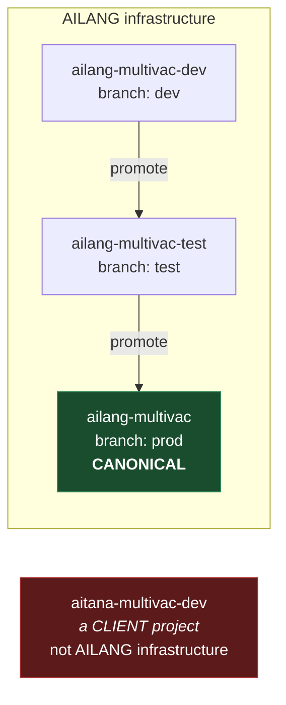
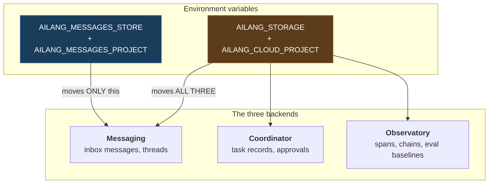

# The AILANG message plane: who talks to what

One page on where AILANG messages live, which switch moves them, and what each machine
is currently wired to. Written 2026-08-26 after a day in which real user feedback had
been sitting unread for weeks because every node was reading a different store.

## The one-paragraph version

There is **one canonical message store**: prod Firestore in project `ailang-multivac`.
Every node — the attended laptop, the voightkampff Studio, the Cloud Run coordinator —
reads and writes that same inbox. What nodes do **not** share is their *work state*:
task records and observability data stay local to whichever machine produced them.
The mail is common; the workbench is not.

## The projects



`aitana-multivac-dev` is a **client** project and has nothing to do with AILANG. It has
no `ailang-*` Pub/Sub topics. If you see it in an AILANG config, that is a bug — it
gets there because a machine's default `gcloud config get-value project` is `aitana`,
and a plist comment once advised matching that.

Branch → project mapping is enforced by Cloud Build triggers. Deploys are branch-based:
push to `dev`/`test`/`prod` and the matching project is built and rolled.

## Three backends, two switches — the thing that confuses everyone

`ailang storage status` reports `Mode: local` **even when your inbox is on the cloud
store.** That is correct and not a contradiction: they are different switches.



| Switch | Scope | Safe to export globally? |
|---|---|---|
| `AILANG_MESSAGES_STORE` | messaging only | **Yes** — this is why it exists |
| `AILANG_STORAGE` | coordinator + messaging + observatory | **No** — it also moves eval banking and `ailang chains` |

`AILANG_MESSAGES_PROJECT` overrides `AILANG_CLOUD_PROJECT` for messaging alone. It is
required in practice because `AILANG_CLOUD_PROJECT` is commonly pinned per-machine to a
`-dev` project, and a bare `AILANG_STORAGE=gcp` would then silently read a stale
graveyard. Note `GOOGLE_CLOUD_PROJECT` is **ignored** by all of this.

### Which code path reads which switch

This is the subtlety that bites: **the CLI and the daemons do not read the same switch.**

| Consumer | Reads | Consequence |
|---|---|---|
| `ailang messages …` (CLI) | `openStore` → `AILANG_MESSAGES_STORE` | scoped selector applies |
| notify daemon (`ailang daemon run`) | `storage.NewBackends` → `AILANG_STORAGE` | scoped selector does **not** apply |
| coordinator (`ailang coordinator start`) | `storage.NewBackends` → `AILANG_STORAGE` | scoped selector does **not** apply |
| Cloud Run coordinator | `AILANG_STORAGE=gcp` in its service env | all three in prod Firestore |

So setting `AILANG_MESSAGES_STORE` changes what **you** read. It does not move a local
daemon onto the shared inbox.

## The nodes


Laptop and Studio are **peers on the message plane, not the execution plane.** They see
the same inbox. They do not see each other's task records, so a task dispatched in the
cloud does not appear in a local `ailang coordinator list`.

## How package feedback actually flows

This is the pipeline that matters for the package ecosystem, and every hop is a place it
has silently failed before:

```mermaid
sequenceDiagram
  participant U as Reporter
  participant MCP as Public MCP
  participant FS as prod Firestore
  participant PS as Pub/Sub
  participant CO as Cloud Run coordinator
  participant JOB as Cloud Run Job

  U->>MCP: submit_feedback(package="sunholo/x")
  MCP->>FS: write InboxMessage to pkg:sunholo/x
  MCP->>PS: publish notification (attr inbox=pkg:sunholo/x)
  PS->>CO: push /pubsub/push
  CO->>FS: fetch message body by id
  CO->>CO: GetAgentForInbox("pkg:sunholo/x")
  alt agent resolves (exact or pattern)
    CO->>JOB: dispatch with AILANG_AGENT_ID=<agent>
    JOB->>FS: post completion to the agent's inbox
  else no agent registered
    CO->>CO: refuse; leave message UNREAD for triage
  end
```

Two failure modes this replaced, both of which looked like success:

- **Unrouted inbox → empty `AILANG_AGENT_ID`.** The job started, died on arrival, and the
  failure was posted to inbox `""` — unreachable by every `--inbox` query. 36 such
  messages in prod, 787 in dev.
- **Agent ID used as an inbox name.** These coincide for `sprint-executor` and diverge for
  package agents (`pkg-sunholo-auth` watches `pkg:sunholo/auth`), so replies went to an
  inbox nothing watched.

### Inbox naming

The registry spells packages with **underscores**; repo directories use **hyphens**:

| Registry package | Inbox | Directory |
|---|---|---|
| `sunholo/motoko_ext_abi` | `pkg:sunholo/motoko_ext_abi` | `packages/motoko-ext-abi` |

`FormatPackageInbox` applies no normalization and no existence check, so feedback filed
against the hyphen spelling mints an inbox nobody watches. Always use the **registry**
spelling.

Agents may claim a family with a trailing `*` (`pkg:sunholo/motoko_ext_*`). Precedence is
exact match, then longest matching prefix, then no dispatch. See
[cloud-coordinator-config.md](./cloud-coordinator-config.md).

## Current wiring (2026-08-26)

| Node | Messages | Coordinator / Observatory | Notes |
|---|---|---|---|
| Laptop | canonical (prod) ✅ | local | attended; `~/.zshenv` |
| Studio — CLI | canonical (prod) ✅ | local | `~/.zshenv` |
| Studio — notify daemon | primary **dev**, prod via `--also-subscribe` | dev | pings work; home store is dev |
| Studio — coordinator | local SQLite | local | ⚠️ points at `aitana-multivac-dev` |
| Cloud Run coordinator | prod ✅ | prod ✅ | the only fully-resident node |

### Known issues

1. **Studio coordinator names a client project.** `dev.ailang.coordinator.plist` sets
   `AILANG_CLOUD_PROJECT=aitana-multivac-dev`, which owns no `ailang-*` topics. With
   `AILANG_STORAGE` unset it also runs entirely on local SQLite. Net effect: **the Studio
   cannot claim any cloud-dispatched work.** Should be an AILANG project.
2. **Studio notify daemon's primary env is dev.** Prod was bolted on as
   `--also-subscribe prod` rather than made primary (`.bak-pre-prod` shows this). Prod
   *messages* are watched with a correctly-scoped per-project client; prod *events* are
   not.

## The open design question: can the Studio take jobs?

The mechanism exists — M-COORD-MULTI-HOST-WORKERS (v0.24.0) lets a bare-metal host
advertise `worker_tags` so tag-routed messages on the shared topic are claimed only by a
host advertising the tag. That is the right shape for "send GPU work to the rig".

The obstacle is the switch granularity. Joining the shared **task** plane means
`AILANG_STORAGE=gcp`, which also moves the **observatory** — and the rig's
`observatory.db` is 350 MB of eval spans that has no business in prod Firestore.

Scoped to the coordinator process this is narrower than it sounds: the nightly-eval
launchd job sets no storage env, so eval banking stays local regardless. But the
coordinator's own span writes would move.

The clean answer mirrors what already exists for messaging: an `AILANG_COORDINATOR_STORE`
selector, so a node can join the shared task plane while keeping its observatory local —
the same way `AILANG_MESSAGES_STORE` lets it join the shared inbox without surrendering
`ailang chains`. That is a design doc, not an env var.

## Quick reference

```bash
# Canonical inbox (export these; safe, scoped to messaging)
export AILANG_MESSAGES_STORE=gcp
export AILANG_MESSAGES_PROJECT=ailang-multivac

ailang messages list --unread          # everything needing attention, all inboxes
ailang storage status                  # must still say Mode: local

AILANG_MESSAGES_STORE=local ailang messages list --unread   # this machine's private inbox
```

Listings against a non-local store print `store: gcp (Firestore, project …)` in the
header. Read it — an empty inbox and a read against the wrong project are otherwise
indistinguishable.
