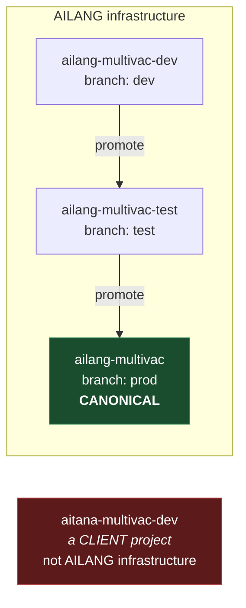
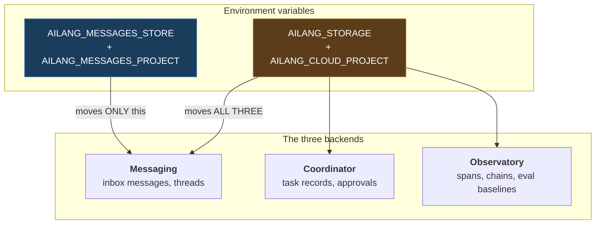
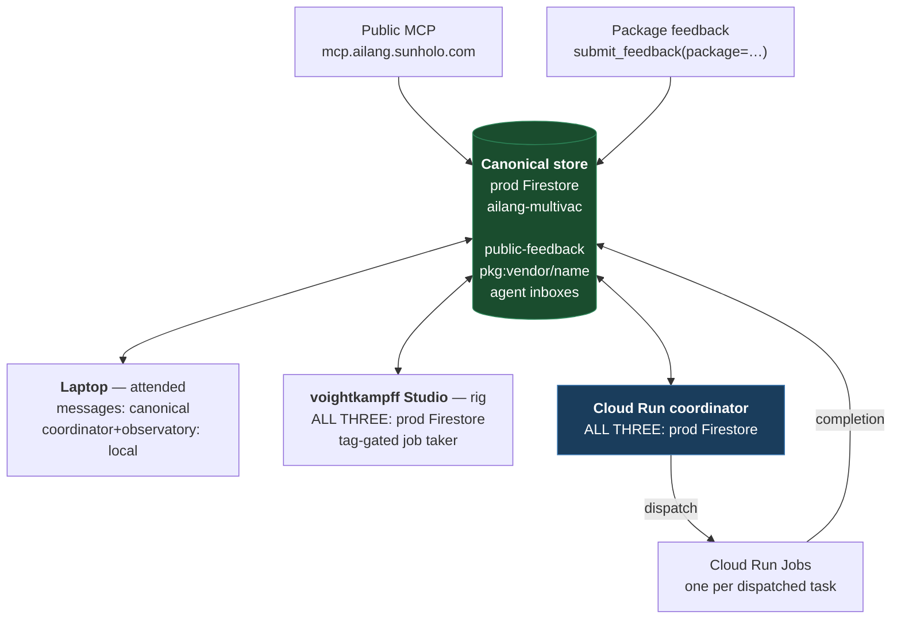

# The AILANG message plane: who talks to what

One page on where AILANG messages live, which switch moves them, and what each machine
is currently wired to. Written 2026-08-26 after a day in which real user feedback had
been sitting unread for weeks because every node was reading a different store.

## The one-paragraph version

There is **one canonical message store**: prod Firestore in project `ailang-multivac`.
Every node — the attended laptop, the voightkampff Studio, the Cloud Run coordinator —
reads and writes that same inbox. What nodes do **not** share is their *work state*:
task records and observability data stay local to whichever machine produced them.
The mail is common; the workbench is not.

## The projects



`aitana-multivac-dev` is a **client** project and has nothing to do with AILANG. It has
no `ailang-*` Pub/Sub topics. If you see it in an AILANG config, that is a bug — it
gets there because a machine's default `gcloud config get-value project` is `aitana`,
and a plist comment once advised matching that.

Branch → project mapping is enforced by Cloud Build triggers. Deploys are branch-based:
push to `dev`/`test`/`prod` and the matching project is built and rolled.

## Three backends, two switches — the thing that confuses everyone

`ailang storage status` reports `Mode: local` **even when your inbox is on the cloud
store.** That is correct and not a contradiction: they are different switches.



| Switch | Scope | Safe to export globally? |
|---|---|---|
| `AILANG_MESSAGES_STORE` | messaging only | **Yes** — this is why it exists |
| `AILANG_STORAGE` | coordinator + messaging + observatory | **No** — it also moves eval banking and `ailang chains` |

`AILANG_MESSAGES_PROJECT` overrides `AILANG_CLOUD_PROJECT` for messaging alone. It is
required in practice because `AILANG_CLOUD_PROJECT` is commonly pinned per-machine to a
`-dev` project, and a bare `AILANG_STORAGE=gcp` would then silently read a stale
graveyard. Note `GOOGLE_CLOUD_PROJECT` is **ignored** by all of this.

### Which code path reads which switch

This is the subtlety that bites: **the CLI and the daemons do not read the same switch.**

| Consumer | Reads | Consequence |
|---|---|---|
| `ailang messages …` (CLI) | `openStore` → `AILANG_MESSAGES_STORE` | scoped selector applies |
| notify daemon (`ailang daemon run`) | `storage.NewBackends` → `AILANG_STORAGE` | scoped selector does **not** apply |
| coordinator (`ailang coordinator start`) | `storage.NewBackends` → `AILANG_STORAGE` | scoped selector does **not** apply |
| Cloud Run coordinator | `AILANG_STORAGE=gcp` in its service env | all three in prod Firestore |

So setting `AILANG_MESSAGES_STORE` changes what **you** read. It does not move a local
daemon onto the shared inbox.

## The nodes



The **Cloud Run coordinator and the Studio are both on the execution plane** — both hold
all three backends in prod, both claim work, the Studio only what its tags match. The
**laptop is on the message plane only**: same inbox, its own local workbench, and it never
takes jobs.

## How package feedback actually flows

This is the pipeline that matters for the package ecosystem, and every hop is a place it
has silently failed before:

```mermaid
sequenceDiagram
  participant U as Reporter
  participant MCP as Public MCP
  participant FS as prod Firestore
  participant PS as Pub/Sub
  participant CO as Cloud Run coordinator
  participant JOB as Cloud Run Job

  U->>MCP: submit_feedback(package="sunholo/x")
  MCP->>FS: write InboxMessage to pkg:sunholo/x
  MCP->>PS: publish notification (attr inbox=pkg:sunholo/x)
  PS->>CO: push /pubsub/push
  CO->>FS: fetch message body by id
  CO->>CO: GetAgentForInbox("pkg:sunholo/x")
  alt agent resolves (exact or pattern)
    CO->>JOB: dispatch with AILANG_AGENT_ID=<agent>
    JOB->>FS: post completion to the agent's inbox
  else no agent registered
    CO->>CO: refuse; leave message UNREAD for triage
  end
```

Two failure modes this replaced, both of which looked like success:

- **Unrouted inbox → empty `AILANG_AGENT_ID`.** The job started, died on arrival, and the
  failure was posted to inbox `""` — unreachable by every `--inbox` query. 36 such
  messages in prod, 787 in dev.
- **Agent ID used as an inbox name.** These coincide for `sprint-executor` and diverge for
  package agents (`pkg-sunholo-auth` watches `pkg:sunholo/auth`), so replies went to an
  inbox nothing watched.

### Inbox naming

The registry spells packages with **underscores**; repo directories use **hyphens**:

| Registry package | Inbox | Directory |
|---|---|---|
| `sunholo/motoko_ext_abi` | `pkg:sunholo/motoko_ext_abi` | `packages/motoko-ext-abi` |

`FormatPackageInbox` applies no normalization and no existence check, so feedback filed
against the hyphen spelling mints an inbox nobody watches. Always use the **registry**
spelling.

The parser settles the rule: a hyphen in an import path parses as **subtraction** and
fails with `PAR_HYPHEN_IN_IMPORT`. So underscores are not a convention, they are the only
thing that compiles. Hyphens are legal in exactly one place — a repo directory name,
which is never an identity.

The teaching prompt shipped `import pkg/sunholo/gcp-auth/token` until 2026-08-26, so every
model taught from `ailang prompt` learned an external-package import that cannot parse.
Fixed in v0.16.6; frozen archives left as a record.

**Still open:** `submit_feedback` accepts any `package` string and mints an inbox from it
verbatim. Validating it against the registry at that boundary is what stops a phantom
inbox being created — this is how ten `pkg:sunholo/ailang-parse` tickets ended up
somewhere nothing watches.

Agents may claim a family with a trailing `*` (`pkg:sunholo/motoko_ext_*`). Precedence is
exact match, then longest matching prefix, then no dispatch. See
[cloud-coordinator-config.md](./cloud-coordinator-config.md).

## Current wiring (2026-08-26)

| Node | Messages | Coordinator / Observatory | Takes jobs |
|---|---|---|---|
| Cloud Run coordinator | prod | prod | yes — default lane |
| Studio — coordinator | prod | prod | yes — tag-gated |
| Studio — notify daemon | prod | prod | n/a (notifier) |
| Studio — CLI | prod | local | n/a |
| Laptop | prod | local | **no** — attended only |

**Everything operational is prod.** `ailang-multivac-dev` and `-test` exist to stage
infrastructure changes and nothing else. `aitana-multivac-dev` appears nowhere.

The laptop deliberately keeps `AILANG_MESSAGES_STORE` rather than `AILANG_STORAGE`: it
takes no jobs, and moving it wholesale would orphan 144 MB of `coordinator.db` and 73 MB
of `observatory.db` as the default view for nothing gained. Shared inbox, local
workbench. One line to flip if fleet-wide `chains`/`coordinator list` is ever wanted
there.

### How the rig receives work

The Studio runs **local mode over prod storage** — it polls the prod `eval-rig` inbox
every 30s. It deliberately does *not* set `COORDINATOR_MODE=cloud`: that path is
push-based (`POST /pubsub/push`), and a machine behind NAT cannot receive push. Polling
is the right shape for a bare-metal worker.

Which work it takes is gated by `worker_tags` + `worker_host_id` on the `eval-rig` agent
in its `~/.ailang/config.yaml`. An untagged worker cannot claim tag-routed work, so the
rig only picks up what asks for it:

```
studio.eval-rig   ollama:gemma4-26b-ailang, gpu:m4-max-40core, local-models,
                  claude:studio, agent:{opencode,codex,motoko,pi},
                  eval:{smoke,core,full}, voight-kampff
```

Verified end to end 2026-08-26: a message sent from the laptop to the prod `eval-rig`
inbox produced `Created task task-4067cd6a (agent: eval-rig)` on the Studio, with a
thread and execution chain.

### Two real limits

1. **Cross-host `workers list` does not work.** Heartbeats go to a local JSON file;
   `FileHeartbeatStore`'s own comment notes Firestore as a v0.25 roadmap item. Each host
   sees only itself. Dispatch is unaffected — claiming goes through the inbox/tag match,
   not the heartbeat.
2. **The feedback-gate classifier fails closed on the rig** — `ANTHROPIC_API_KEY` is not
   set there, so heuristic-flagged submissions are filed but never dispatched.

## Resolved: the Studio takes jobs

Settled 2026-08-26. The rig runs `AILANG_STORAGE=gcp` against `ailang-multivac` and is
gated by `worker_tags`. No scoped coordinator selector was needed — once everything
operational is prod, the granularity problem disappears.

The observatory concern turned out to be smaller than it looked. The rig's
`observatory.db` is 352 MB, but that is **92,230 spans over exactly 7 days** and
terraform already sets a 7-day TTL on `obs_spans`, so it is self-bounding rather than
growing. Realistically $1–2/month. The nightly-eval launchd job sets no storage env, so
eval banking stays local regardless — only the coordinator's own span writes moved.

Getting there needed one index nobody had built. A **local-mode coordinator on Firestore
storage** calls `ListUnread` with the collapse-duplicates filter
(`dup_of` + `status` + `to_inbox` + `created_at`). The Cloud Run coordinator never hits
it — in cloud mode it takes messages from Pub/Sub and never calls `ListUnread` — so prod
had worked for months with the index absent. The rig polled correctly every 30s and every
poll failed `FailedPrecondition` while a message sat unread in its inbox: registered,
tagged, alive, and silently claiming nothing.

## Quick reference

An **attended node** (reads the shared inbox, takes no work):

```bash
export AILANG_MESSAGES_STORE=gcp
export AILANG_MESSAGES_PROJECT=ailang-multivac

ailang messages list --unread          # everything needing attention, all inboxes
ailang storage status                  # must still say Mode: local

AILANG_MESSAGES_STORE=local ailang messages list --unread   # this machine's private inbox
```

A **job-taking node** (joins the execution plane; needs worker_tags to gate what it
claims):

```bash
export AILANG_STORAGE=gcp
export AILANG_CLOUD_PROJECT=ailang-multivac
# plus worker_tags + worker_host_id on its agent in ~/.ailang/config.yaml
```

Do NOT set `COORDINATOR_MODE=cloud` on a machine behind NAT — that path is push-based
and unreachable. Local mode over prod storage polls instead, which is what a bare-metal
worker wants.

Listings against a non-local store print `store: gcp (Firestore, project …)` in the
header. Read it — an empty inbox and a read against the wrong project are otherwise
indistinguishable.
